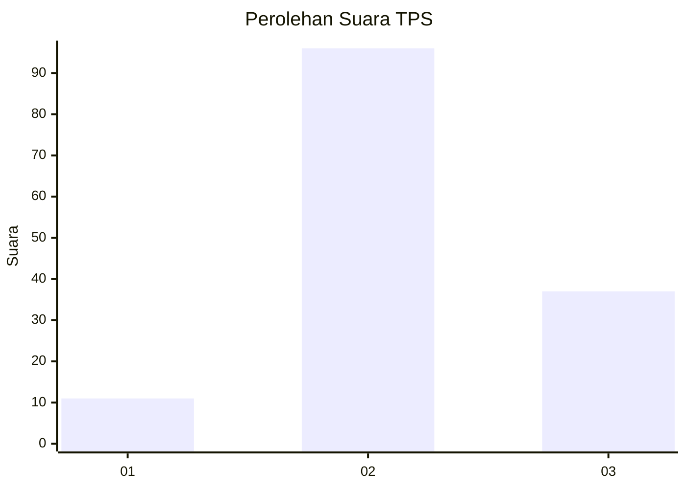
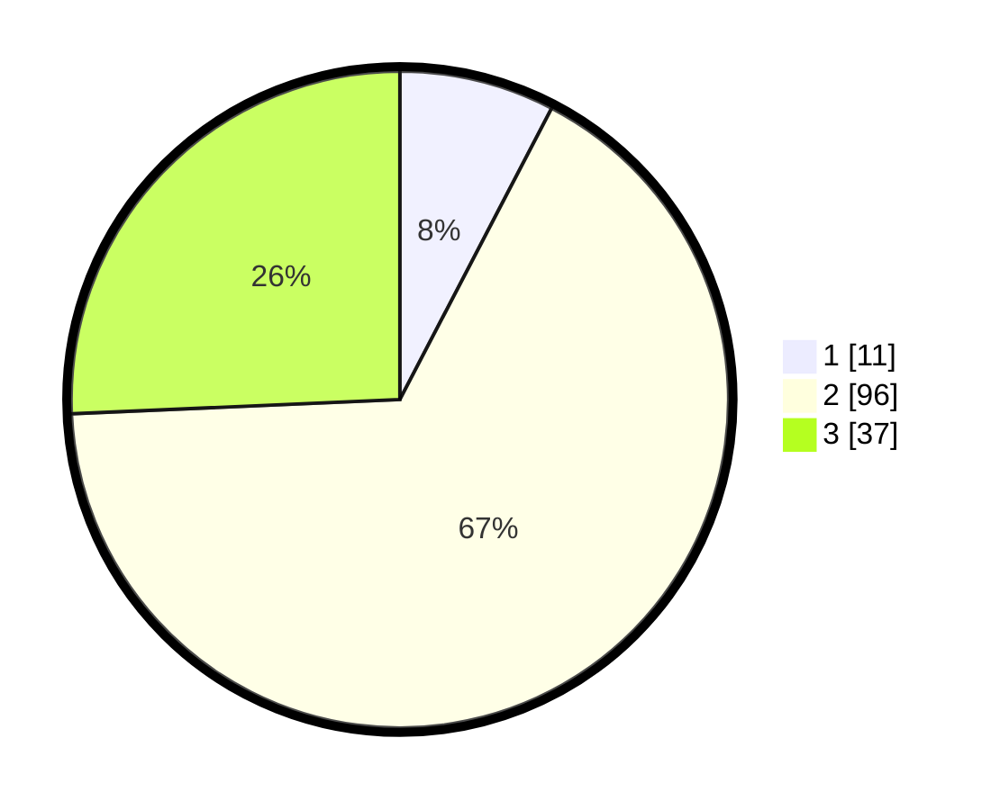

# Hasil

## Grafik

## Tabel

| No. | Nama Paslon    | Suara | Suara (raw) | Persentase |
|:--- |:-------------- | -----:| -----------:| ----------:|
| 1   | ANIES MUHAIMIN | 11    | [11][p-1]   | 7,64       |
| 2   | PRABOWO GIBRAN | 96    | [96][p-2]   | 66,67      |
| 3   | GANJAR MAHFUD  | 37    | [37][p-3]   | 25,69      |

[p-1]: https://github.com/gigit-pemilu/pemilu-2024/blob/main/pilpres/hitung-suara/sub/35-jawa-timur/sub/78-kota-surabaya/sub/06-sawahan/sub/1003-banyu-urip/sub/079-tps/sub/paslon-1.txt
[p-2]: https://github.com/gigit-pemilu/pemilu-2024/blob/main/pilpres/hitung-suara/sub/35-jawa-timur/sub/78-kota-surabaya/sub/06-sawahan/sub/1003-banyu-urip/sub/079-tps/sub/paslon-2.txt
[p-3]: https://github.com/gigit-pemilu/pemilu-2024/blob/main/pilpres/hitung-suara/sub/35-jawa-timur/sub/78-kota-surabaya/sub/06-sawahan/sub/1003-banyu-urip/sub/079-tps/sub/paslon-3.txt

## Foto C Plano

https://sirekap-obj-formc.kpu.go.id/36e9/pemilu/ppwp/35/78/06/10/03/3578061003079-20240219-110504--4af5dac9-c30b-4298-b9ae-4636307e7a45.jpg

https://sirekap-obj-formc.kpu.go.id/36e9/pemilu/ppwp/35/78/06/10/03/3578061003079-20240219-110538--ad4e70f1-ebd5-458a-a0e5-4ecfd88ecc74.jpg

https://sirekap-obj-formc.kpu.go.id/36e9/pemilu/ppwp/35/78/06/10/03/3578061003079-20240219-110628--55e789f9-12cf-405f-97fb-6657f87cb849.jpg

## Metadata

| Key        | Value               |
| ---------- | ------------------- |
| Time Stamp | 2024-02-24 22:31:28 |

