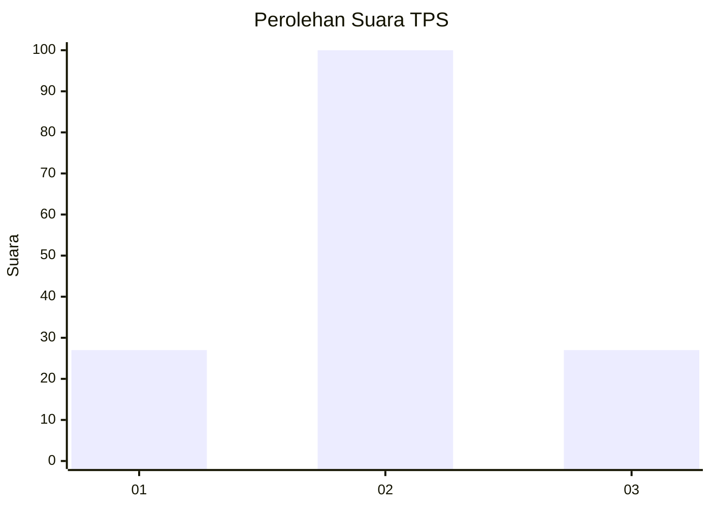
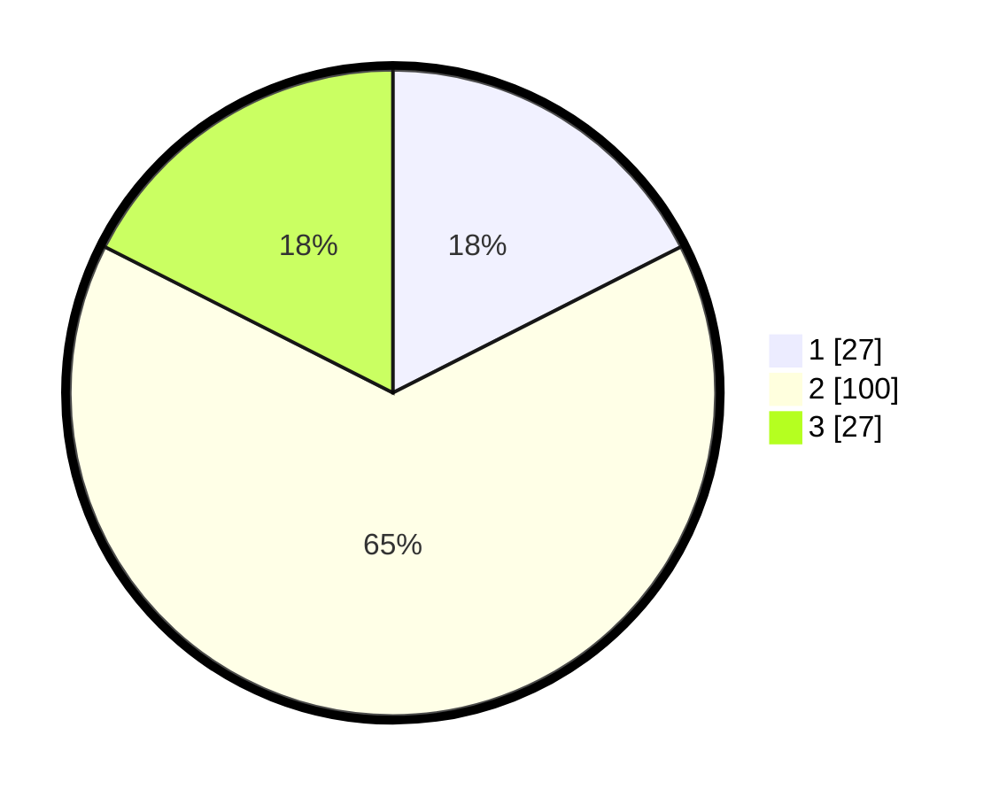

# Hasil

## Grafik

## Tabel

| No. | Nama Paslon    | Suara | Suara (raw) | Persentase |
|:--- |:-------------- | -----:| -----------:| ----------:|
| 1   | ANIES MUHAIMIN | 27    | [27][p-1]   | 17,53      |
| 2   | PRABOWO GIBRAN | 100   | [100][p-2]  | 64,94      |
| 3   | GANJAR MAHFUD  | 27    | [27][p-3]   | 17,53      |

[p-1]: https://github.com/gigit-pemilu/pemilu-2024/blob/main/pilpres/hitung-suara/sub/35-jawa-timur/sub/78-kota-surabaya/sub/06-sawahan/sub/1003-banyu-urip/sub/087-tps/sub/paslon-1.txt
[p-2]: https://github.com/gigit-pemilu/pemilu-2024/blob/main/pilpres/hitung-suara/sub/35-jawa-timur/sub/78-kota-surabaya/sub/06-sawahan/sub/1003-banyu-urip/sub/087-tps/sub/paslon-2.txt
[p-3]: https://github.com/gigit-pemilu/pemilu-2024/blob/main/pilpres/hitung-suara/sub/35-jawa-timur/sub/78-kota-surabaya/sub/06-sawahan/sub/1003-banyu-urip/sub/087-tps/sub/paslon-3.txt

## Foto C Plano

https://sirekap-obj-formc.kpu.go.id/0526/pemilu/ppwp/35/78/06/10/03/3578061003087-20240219-155307--e5cbb239-663f-4744-b40d-5fd943ea61e7.jpg

https://sirekap-obj-formc.kpu.go.id/0526/pemilu/ppwp/35/78/06/10/03/3578061003087-20240219-155340--0174d781-b13c-4cdc-af45-a13f601ba33c.jpg

https://sirekap-obj-formc.kpu.go.id/0526/pemilu/ppwp/35/78/06/10/03/3578061003087-20240219-155424--0431a070-8e2c-455e-b37c-af6e4bc2b56a.jpg

## Metadata

| Key        | Value               |
| ---------- | ------------------- |
| Time Stamp | 2024-02-26 14:00:00 |

