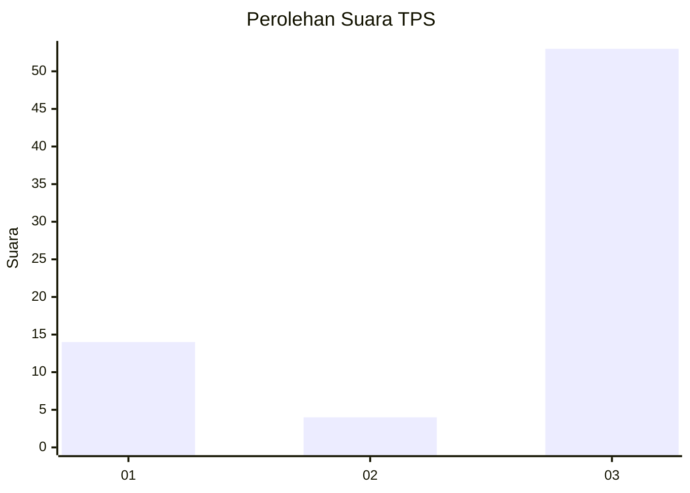
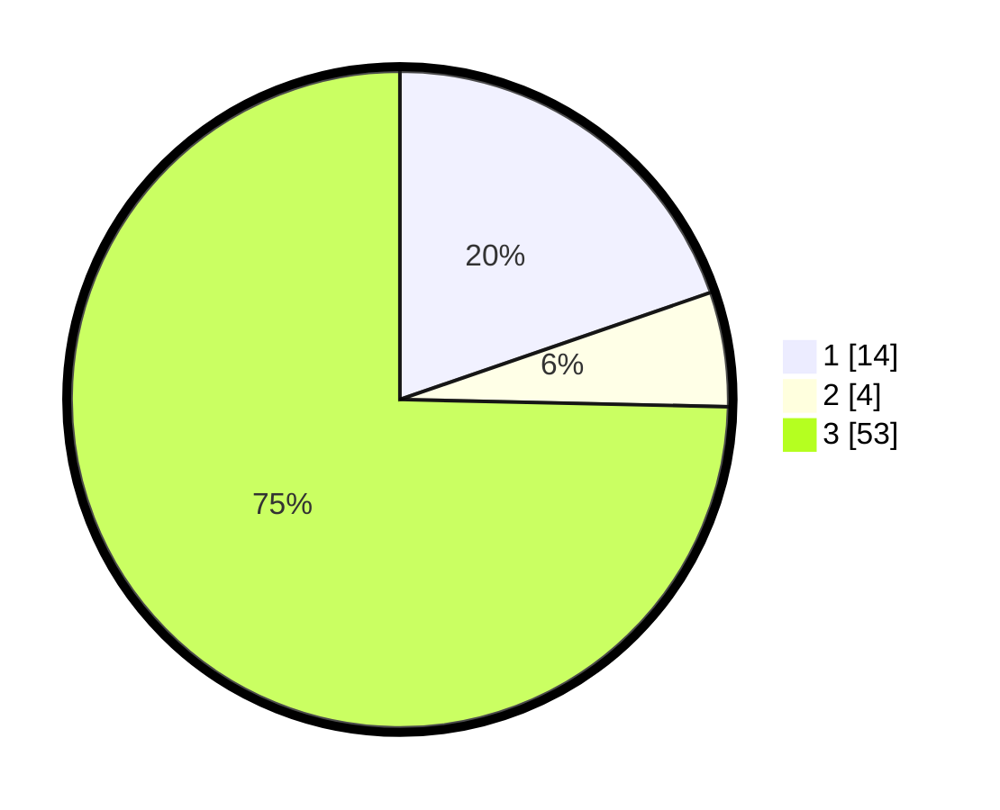

# Hasil

## Grafik

## Tabel

| No. | Nama Paslon    | Suara | Suara (raw) | Persentase |
|:--- |:-------------- | -----:| -----------:| ----------:|
| 1   | ANIES MUHAIMIN | 14    | [14][p-1]   | 19,72      |
| 2   | PRABOWO GIBRAN | 4     | [4][p-2]    | 5,63       |
| 3   | GANJAR MAHFUD  | 53    | [53][p-3]   | 74,65      |

[p-1]: https://github.com/gigit-pemilu/pemilu-2024-35-jawa-timur/blob/main/pilpres/hitung-suara/sub/35-jawa-timur/sub/78-kota-surabaya/sub/06-sawahan/sub/1004-putat-jaya/sub/029-tps/sub/paslon-1.txt
[p-2]: https://github.com/gigit-pemilu/pemilu-2024-35-jawa-timur/blob/main/pilpres/hitung-suara/sub/35-jawa-timur/sub/78-kota-surabaya/sub/06-sawahan/sub/1004-putat-jaya/sub/029-tps/sub/paslon-2.txt
[p-3]: https://github.com/gigit-pemilu/pemilu-2024-35-jawa-timur/blob/main/pilpres/hitung-suara/sub/35-jawa-timur/sub/78-kota-surabaya/sub/06-sawahan/sub/1004-putat-jaya/sub/029-tps/sub/paslon-3.txt

## Foto C Plano

https://sirekap-obj-formc.kpu.go.id/caf0/pemilu/ppwp/35/78/06/10/04/3578061004029-20240215-044620--0e054cb9-b583-44c2-bb0e-a9065840ddcd.jpg

https://sirekap-obj-formc.kpu.go.id/caf0/pemilu/ppwp/35/78/06/10/04/3578061004029-20240215-044722--0db70b85-1688-4c6d-9989-8cdf7f2870cd.jpg

https://sirekap-obj-formc.kpu.go.id/caf0/pemilu/ppwp/35/78/06/10/04/3578061004029-20240215-044818--bb27ebcc-5258-4b89-9282-32c4e5c44fcc.jpg

## Metadata

| Key        | Value               |
| ---------- | ------------------- |
| Time Stamp | 2024-02-25 19:00:00 |

