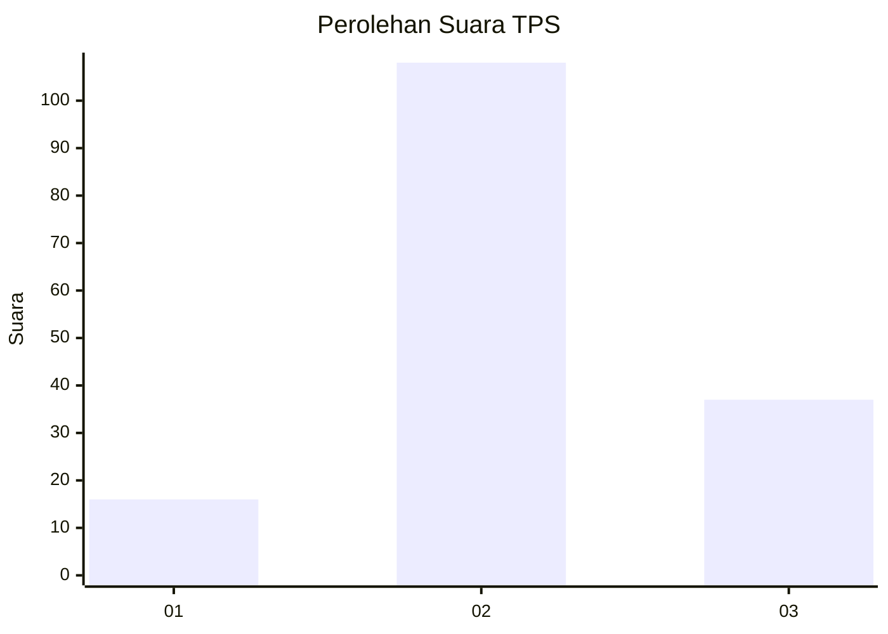
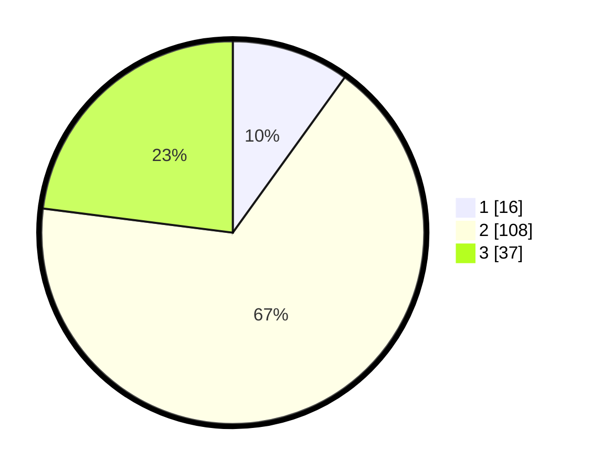

# Hasil

## Grafik

## Tabel

| No. | Nama Paslon    | Suara | Suara (raw) | Persentase |
|:--- |:-------------- | -----:| -----------:| ----------:|
| 1   | ANIES MUHAIMIN | 16    | [16][p-1]   | 9,94       |
| 2   | PRABOWO GIBRAN | 108   | [108][p-2]  | 67,08      |
| 3   | GANJAR MAHFUD  | 37    | [37][p-3]   | 22,98      |

[p-1]: https://github.com/gigit-pemilu/pemilu-2024/blob/main/pilpres/hitung-suara/sub/35-jawa-timur/sub/78-kota-surabaya/sub/06-sawahan/sub/1004-putat-jaya/sub/045-tps/sub/paslon-1.txt
[p-2]: https://github.com/gigit-pemilu/pemilu-2024/blob/main/pilpres/hitung-suara/sub/35-jawa-timur/sub/78-kota-surabaya/sub/06-sawahan/sub/1004-putat-jaya/sub/045-tps/sub/paslon-2.txt
[p-3]: https://github.com/gigit-pemilu/pemilu-2024/blob/main/pilpres/hitung-suara/sub/35-jawa-timur/sub/78-kota-surabaya/sub/06-sawahan/sub/1004-putat-jaya/sub/045-tps/sub/paslon-3.txt

## Foto C Plano

https://sirekap-obj-formc.kpu.go.id/1045/pemilu/ppwp/35/78/06/10/04/3578061004045-20240215-032507--0dd538c8-ae9e-441e-abe6-3e6ed752c2a5.jpg

https://sirekap-obj-formc.kpu.go.id/1045/pemilu/ppwp/35/78/06/10/04/3578061004045-20240215-032530--dc6997ca-cae8-4b90-9eab-1a75a737222b.jpg

https://sirekap-obj-formc.kpu.go.id/1045/pemilu/ppwp/35/78/06/10/04/3578061004045-20240215-032548--dfa76355-8616-4ed1-ae3f-8dda57aac1da.jpg

## Metadata

| Key        | Value               |
| ---------- | ------------------- |
| Time Stamp | 2024-02-26 12:00:00 |

