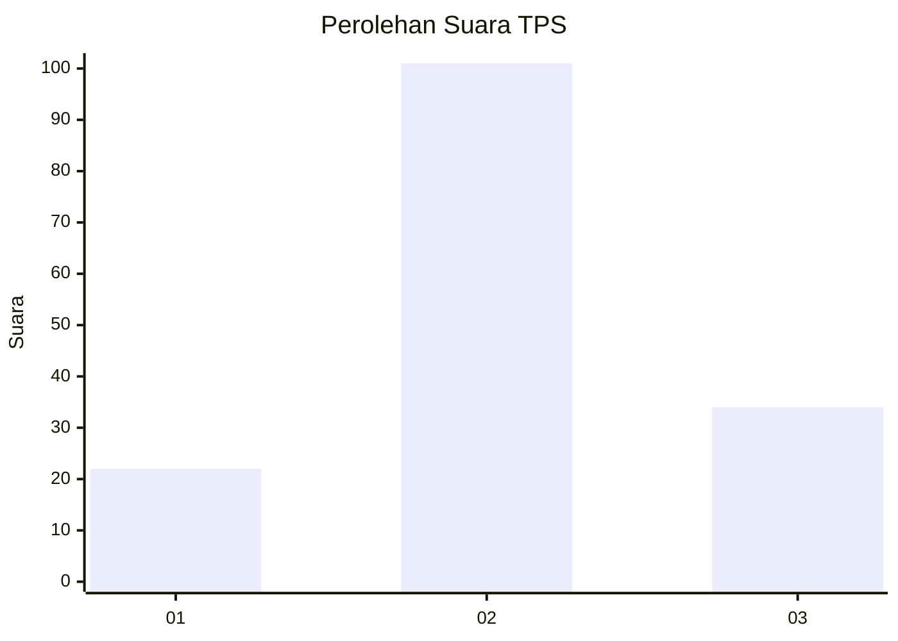
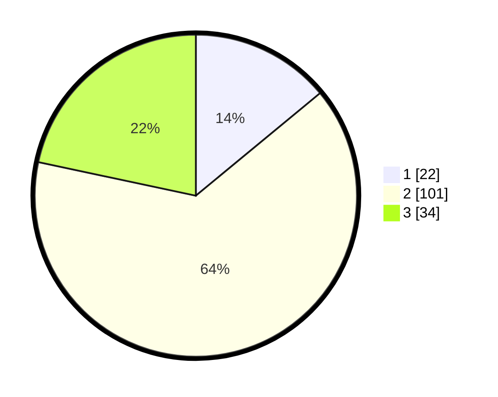

# Hasil

## Grafik

## Tabel

| No. | Nama Paslon    | Suara | Suara (raw) | Persentase |
|:--- |:-------------- | -----:| -----------:| ----------:|
| 1   | ANIES MUHAIMIN | 22    | [22][p-1]   | 14,01      |
| 2   | PRABOWO GIBRAN | 101   | [101][p-2]  | 64,33      |
| 3   | GANJAR MAHFUD  | 34    | [34][p-3]   | 21,66      |

[p-1]: https://github.com/gigit-pemilu/pemilu-2024-35-jawa-timur/blob/main/pilpres/hitung-suara/sub/35-jawa-timur/sub/78-kota-surabaya/sub/06-sawahan/sub/1004-putat-jaya/sub/060-tps/sub/paslon-1.txt
[p-2]: https://github.com/gigit-pemilu/pemilu-2024-35-jawa-timur/blob/main/pilpres/hitung-suara/sub/35-jawa-timur/sub/78-kota-surabaya/sub/06-sawahan/sub/1004-putat-jaya/sub/060-tps/sub/paslon-2.txt
[p-3]: https://github.com/gigit-pemilu/pemilu-2024-35-jawa-timur/blob/main/pilpres/hitung-suara/sub/35-jawa-timur/sub/78-kota-surabaya/sub/06-sawahan/sub/1004-putat-jaya/sub/060-tps/sub/paslon-3.txt

## Foto C Plano

https://sirekap-obj-formc.kpu.go.id/f44f/pemilu/ppwp/35/78/06/10/04/3578061004060-20240214-225442--22a6c855-3e97-45dc-b344-cae9155428b9.jpg

https://sirekap-obj-formc.kpu.go.id/f44f/pemilu/ppwp/35/78/06/10/04/3578061004060-20240214-225708--028516a4-84ed-4017-b4c4-b2d8e782f2e5.jpg

https://sirekap-obj-formc.kpu.go.id/f44f/pemilu/ppwp/35/78/06/10/04/3578061004060-20240214-225919--affef3cf-0a55-4af3-b4aa-304f1c7557ed.jpg

## Metadata

| Key        | Value               |
| ---------- | ------------------- |
| Time Stamp | 2024-02-25 12:00:00 |

