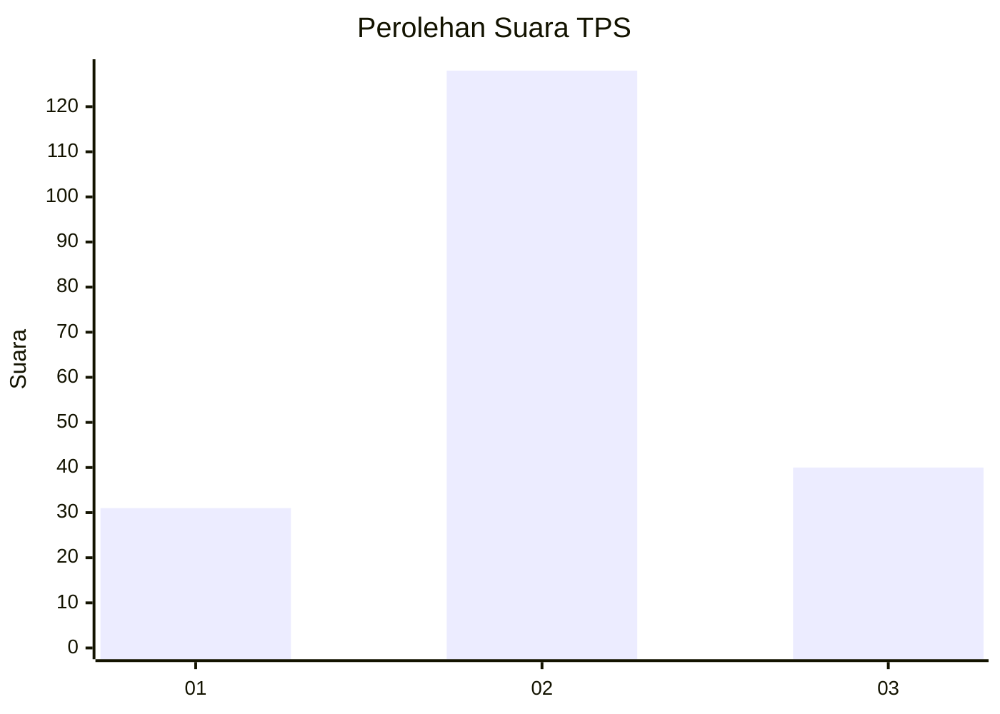
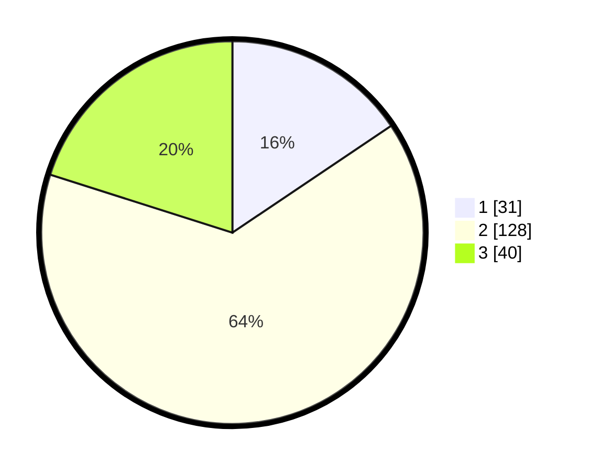

# Hasil

## Grafik

## Tabel

| No. | Nama Paslon    | Suara | Suara (raw) | Persentase |
|:--- |:-------------- | -----:| -----------:| ----------:|
| 1   | ANIES MUHAIMIN | 31    | [31][p-1]   | 15,58      |
| 2   | PRABOWO GIBRAN | 128   | [128][p-2]  | 64,32      |
| 3   | GANJAR MAHFUD  | 40    | [40][p-3]   | 20,10      |

[p-1]: https://github.com/gigit-pemilu/pemilu-2024-35-jawa-timur/blob/main/pilpres/hitung-suara/sub/35-jawa-timur/sub/78-kota-surabaya/sub/06-sawahan/sub/1004-putat-jaya/sub/124-tps/sub/paslon-1.txt
[p-2]: https://github.com/gigit-pemilu/pemilu-2024-35-jawa-timur/blob/main/pilpres/hitung-suara/sub/35-jawa-timur/sub/78-kota-surabaya/sub/06-sawahan/sub/1004-putat-jaya/sub/124-tps/sub/paslon-2.txt
[p-3]: https://github.com/gigit-pemilu/pemilu-2024-35-jawa-timur/blob/main/pilpres/hitung-suara/sub/35-jawa-timur/sub/78-kota-surabaya/sub/06-sawahan/sub/1004-putat-jaya/sub/124-tps/sub/paslon-3.txt

## Foto C Plano

https://sirekap-obj-formc.kpu.go.id/ea0a/pemilu/ppwp/35/78/06/10/04/3578061004124-20240220-214741--32285fd1-0026-421c-a4ca-70258d817ae1.jpg

https://sirekap-obj-formc.kpu.go.id/ea0a/pemilu/ppwp/35/78/06/10/04/3578061004124-20240220-214922--b0e64b61-b0cd-4b0a-90c6-f2779942da66.jpg

https://sirekap-obj-formc.kpu.go.id/ea0a/pemilu/ppwp/35/78/06/10/04/3578061004124-20240220-214821--1588821e-c5da-4c4e-b6cf-813e7187de3e.jpg

## Metadata

| Key        | Value               |
| ---------- | ------------------- |
| Time Stamp | 2024-02-24 22:31:28 |

## DATA PEMILIH TETAP

Jumlah pemilih dalam DPT: **7**.
 * L: **5**.
 * P: **50**.

## DATA PENGGUNA HAK PILIH

Jumlah pengguna hak pilih dalam DPT: **610**.
 * L: **777**.
 * P: **707**.

Jumlah pengguna hak pilih dalam DPTb: **10**.
 * L: **700**.
 * P: **71**.

Jumlah pengguna hak pilih dalam DPK: **20**.
 * L: **777**.
 * P: **540**.

Jumlah pengguna hak pilih: **991**.
 * L: **777**.
 * P: **540**.

## JUMLAH SUARA SAH DAN TIDAK SAH

JUMLAH SELURUH SUARA SAH: **199**.

JUMLAH SUARA TIDAK SAH: **4**.

JUMLAH SELURUH SUARA SAH DAN SUARA TIDAK SAH: **203**.

