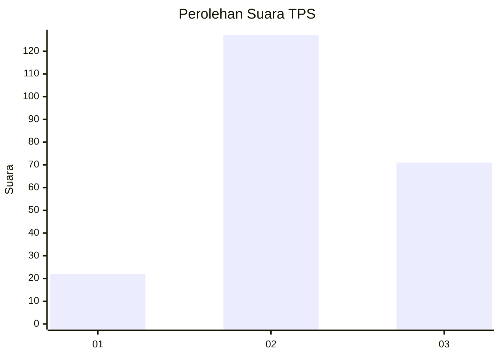
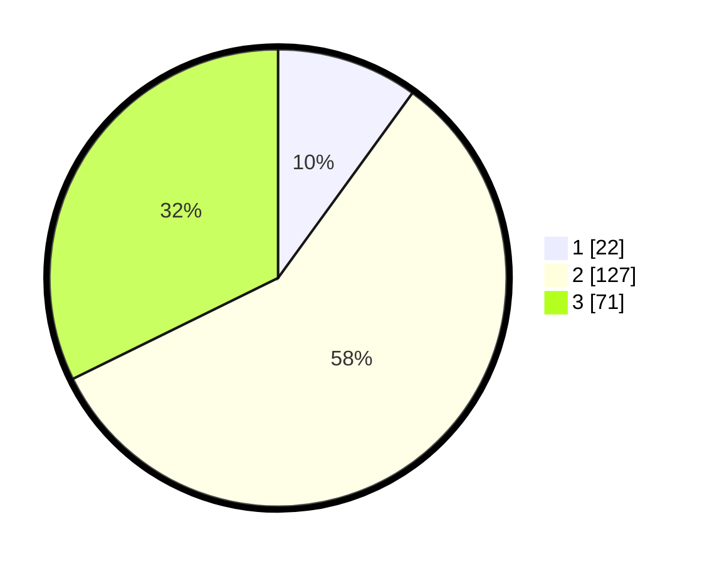

# Hasil

## Grafik

## Tabel

| No. | Nama Paslon    | Suara | Suara (raw) | Persentase |
|:--- |:-------------- | -----:| -----------:| ----------:|
| 1   | ANIES MUHAIMIN | 22    | [22][p-1]   | 10,00      |
| 2   | PRABOWO GIBRAN | 127   | [127][p-2]  | 57,73      |
| 3   | GANJAR MAHFUD  | 71    | [71][p-3]   | 32,27      |

[p-1]: https://github.com/gigit-pemilu/pemilu-2024/blob/main/pilpres/hitung-suara/sub/35-jawa-timur/sub/78-kota-surabaya/sub/06-sawahan/sub/1005-kupang-krajan/sub/004-tps/sub/paslon-1.txt
[p-2]: https://github.com/gigit-pemilu/pemilu-2024/blob/main/pilpres/hitung-suara/sub/35-jawa-timur/sub/78-kota-surabaya/sub/06-sawahan/sub/1005-kupang-krajan/sub/004-tps/sub/paslon-2.txt
[p-3]: https://github.com/gigit-pemilu/pemilu-2024/blob/main/pilpres/hitung-suara/sub/35-jawa-timur/sub/78-kota-surabaya/sub/06-sawahan/sub/1005-kupang-krajan/sub/004-tps/sub/paslon-3.txt

## Foto C Plano

https://sirekap-obj-formc.kpu.go.id/36d9/pemilu/ppwp/35/78/06/10/05/3578061005004-20240223-011030--46c2639d-3911-44e1-935b-9d3fe5c4b116.jpg

https://sirekap-obj-formc.kpu.go.id/36d9/pemilu/ppwp/35/78/06/10/05/3578061005004-20240220-003143--0349d278-98fe-4ed3-adfe-57365c9ae036.jpg

https://sirekap-obj-formc.kpu.go.id/36d9/pemilu/ppwp/35/78/06/10/05/3578061005004-20240220-003226--6ccd6f42-a4cf-43d8-b123-e7d63b2e24eb.jpg

## Metadata

| Key        | Value               |
| ---------- | ------------------- |
| Time Stamp | 2024-02-25 16:00:00 |

