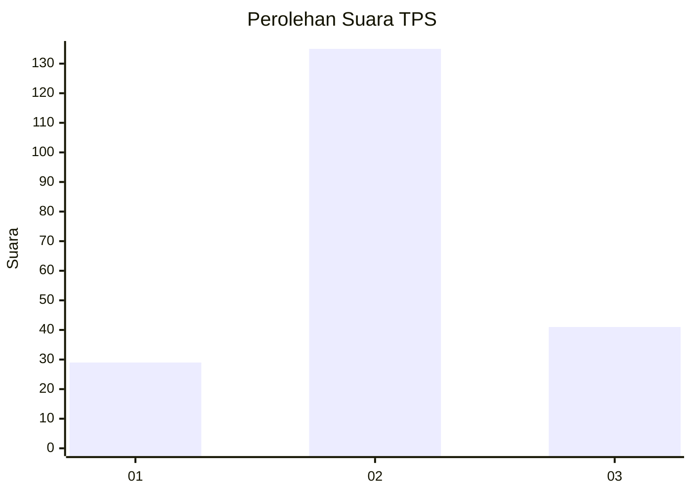
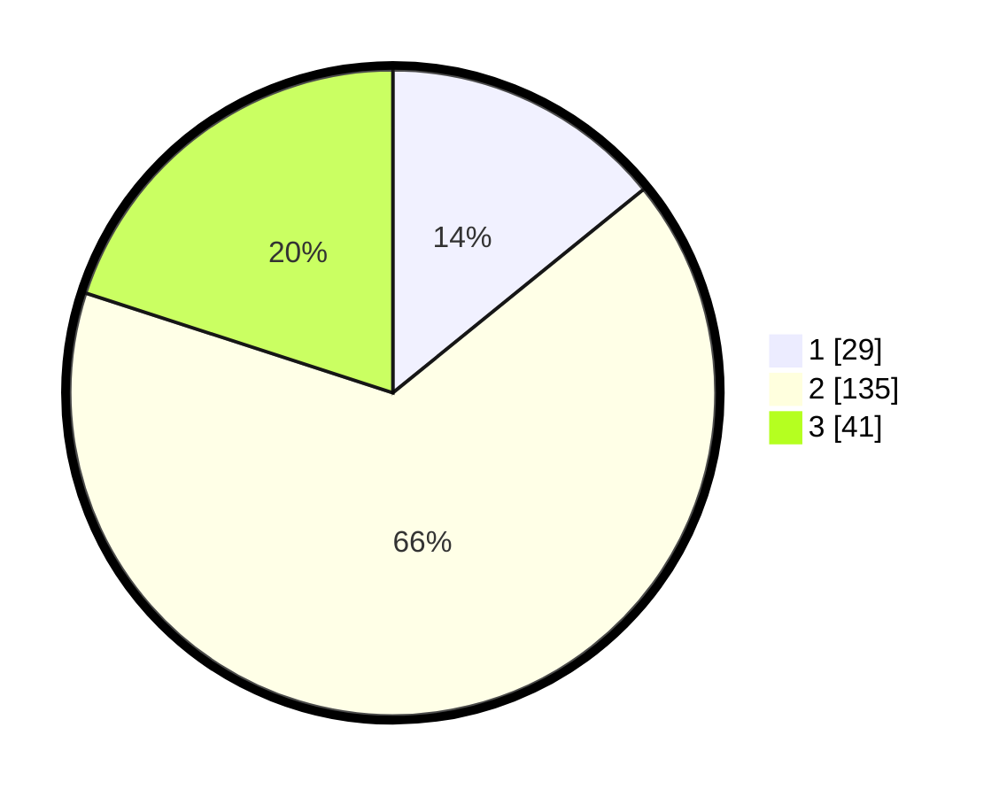

# Hasil

## Grafik

## Tabel

| No. | Nama Paslon    | Suara | Suara (raw) | Persentase |
|:--- |:-------------- | -----:| -----------:| ----------:|
| 1   | ANIES MUHAIMIN | 29    | [29][p-1]   | 14,15      |
| 2   | PRABOWO GIBRAN | 135   | [135][p-2]  | 65,85      |
| 3   | GANJAR MAHFUD  | 41    | [41][p-3]   | 20,00      |

[p-1]: https://github.com/gigit-pemilu/pemilu-2024/blob/main/pilpres/hitung-suara/sub/35-jawa-timur/sub/78-kota-surabaya/sub/06-sawahan/sub/1006-pakis/sub/003-tps/sub/paslon-1.txt
[p-2]: https://github.com/gigit-pemilu/pemilu-2024/blob/main/pilpres/hitung-suara/sub/35-jawa-timur/sub/78-kota-surabaya/sub/06-sawahan/sub/1006-pakis/sub/003-tps/sub/paslon-2.txt
[p-3]: https://github.com/gigit-pemilu/pemilu-2024/blob/main/pilpres/hitung-suara/sub/35-jawa-timur/sub/78-kota-surabaya/sub/06-sawahan/sub/1006-pakis/sub/003-tps/sub/paslon-3.txt

## Foto C Plano

https://sirekap-obj-formc.kpu.go.id/513e/pemilu/ppwp/35/78/06/10/06/3578061006003-20240219-131023--f69158d3-f91c-41a4-8eef-0116711baf83.jpg

https://sirekap-obj-formc.kpu.go.id/513e/pemilu/ppwp/35/78/06/10/06/3578061006003-20240219-131053--6016aed7-3828-4014-95c6-098f775691b5.jpg

https://sirekap-obj-formc.kpu.go.id/513e/pemilu/ppwp/35/78/06/10/06/3578061006003-20240219-131125--1225d011-d90f-47c2-b8e3-ed3182ba4188.jpg

## Metadata

| Key        | Value               |
| ---------- | ------------------- |
| Time Stamp | 2024-02-24 22:31:28 |

## DATA PEMILIH TETAP

Jumlah pemilih dalam DPT: **223**.
 * L: **337**.
 * P: **157**.

## DATA PENGGUNA HAK PILIH

Jumlah pengguna hak pilih dalam DPT: **202**.
 * L: **28**.
 * P: **124**.

Jumlah pengguna hak pilih dalam DPTb: **5**.
 * L: **0**.
 * P: **406**.

Jumlah pengguna hak pilih dalam DPK: **0**.
 * L: **0**.
 * P: **80**.

Jumlah pengguna hak pilih: **253**.
 * L: **47**.
 * P: **825**.

## JUMLAH SUARA SAH DAN TIDAK SAH

JUMLAH SELURUH SUARA SAH: **205**.

JUMLAH SUARA TIDAK SAH: **8**.

JUMLAH SELURUH SUARA SAH DAN SUARA TIDAK SAH: **213**.

