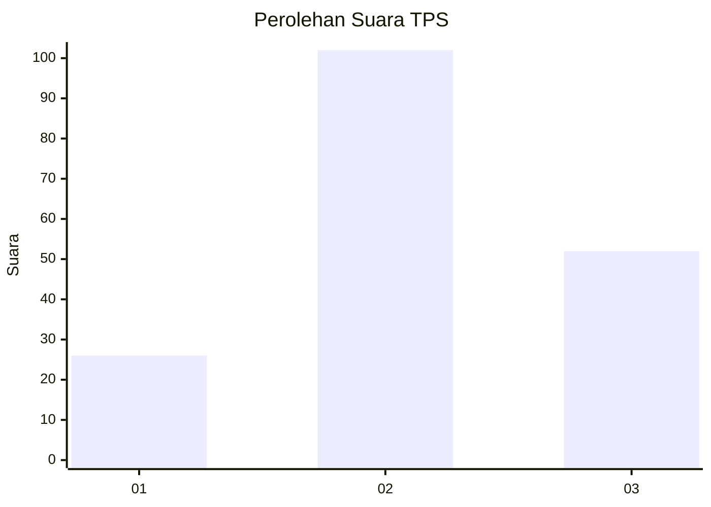
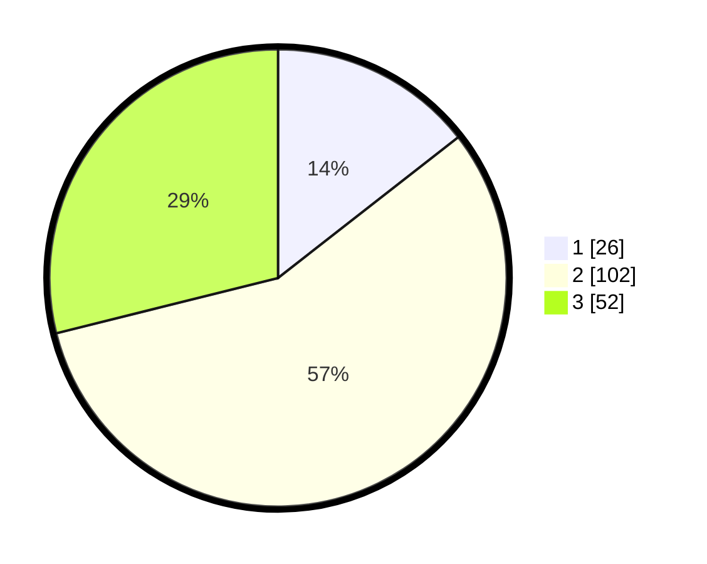

# Hasil

## Grafik

## Tabel

| No. | Nama Paslon    | Suara | Suara (raw) | Persentase |
|:--- |:-------------- | -----:| -----------:| ----------:|
| 1   | ANIES MUHAIMIN | 26    | [26][p-1]   | 14,44      |
| 2   | PRABOWO GIBRAN | 102   | [102][p-2]  | 56,67      |
| 3   | GANJAR MAHFUD  | 52    | [52][p-3]   | 28,89      |

[p-1]: https://github.com/gigit-pemilu/pemilu-2024-35-jawa-timur/blob/main/pilpres/hitung-suara/sub/35-jawa-timur/sub/78-kota-surabaya/sub/06-sawahan/sub/1006-pakis/sub/067-tps/sub/paslon-1.txt
[p-2]: https://github.com/gigit-pemilu/pemilu-2024-35-jawa-timur/blob/main/pilpres/hitung-suara/sub/35-jawa-timur/sub/78-kota-surabaya/sub/06-sawahan/sub/1006-pakis/sub/067-tps/sub/paslon-2.txt
[p-3]: https://github.com/gigit-pemilu/pemilu-2024-35-jawa-timur/blob/main/pilpres/hitung-suara/sub/35-jawa-timur/sub/78-kota-surabaya/sub/06-sawahan/sub/1006-pakis/sub/067-tps/sub/paslon-3.txt

## Foto C Plano

https://sirekap-obj-formc.kpu.go.id/e293/pemilu/ppwp/35/78/06/10/06/3578061006067-20240218-231421--72ddeb12-4750-40cb-9168-9e8cabb2ef66.jpg

https://sirekap-obj-formc.kpu.go.id/e293/pemilu/ppwp/35/78/06/10/06/3578061006067-20240218-231509--7cf4ca0a-a454-4061-9817-c4d849fd2852.jpg

https://sirekap-obj-formc.kpu.go.id/e293/pemilu/ppwp/35/78/06/10/06/3578061006067-20240218-231531--d7b4216c-050d-472c-8556-24f0f15764ed.jpg

## Metadata

| Key        | Value               |
| ---------- | ------------------- |
| Time Stamp | 2024-02-20 11:00:00 |

## DATA PEMILIH TETAP

Jumlah pemilih dalam DPT: **232**.
 * L: **647**.
 * P: **425**.

## DATA PENGGUNA HAK PILIH

Jumlah pengguna hak pilih dalam DPT: **687**.
 * L: **37**.
 * P: **30**.

Jumlah pengguna hak pilih dalam DPTb: **208**.
 * L: **601**.
 * P: **2**.

Jumlah pengguna hak pilih dalam DPK: **8**.
 * L: **2**.
 * P: **2**.

Jumlah pengguna hak pilih: **539**.
 * L: **39**.
 * P: **90**.

## JUMLAH SUARA SAH DAN TIDAK SAH

JUMLAH SELURUH SUARA SAH: **180**.

JUMLAH SUARA TIDAK SAH: **9**.

JUMLAH SELURUH SUARA SAH DAN SUARA TIDAK SAH: **189**.

