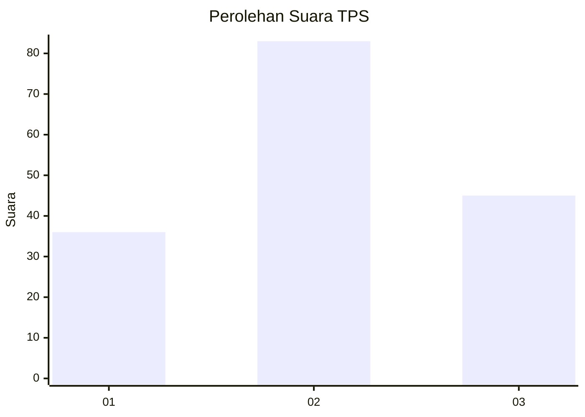
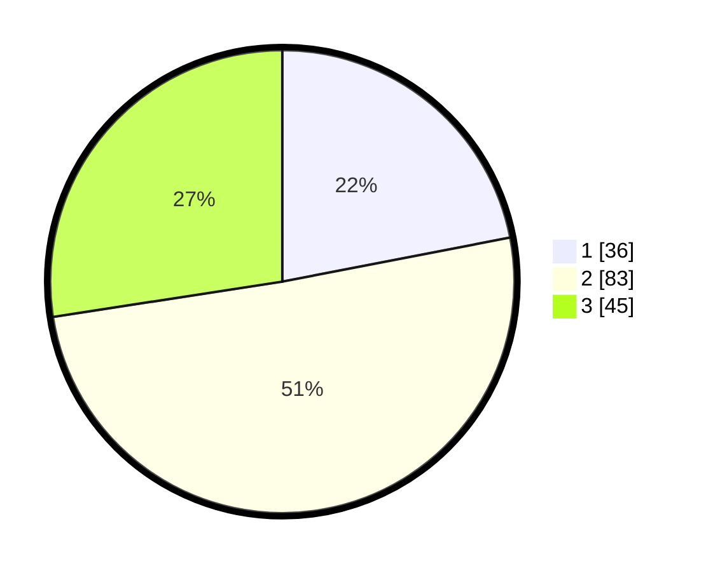

# Hasil

## Grafik

## Tabel

| No. | Nama Paslon    | Suara | Suara (raw) | Persentase |
|:--- |:-------------- | -----:| -----------:| ----------:|
| 1   | ANIES MUHAIMIN | 36    | [36][p-1]   | 21,95      |
| 2   | PRABOWO GIBRAN | 83    | [83][p-2]   | 50,61      |
| 3   | GANJAR MAHFUD  | 45    | [45][p-3]   | 27,44      |

[p-1]: https://github.com/gigit-pemilu/pemilu-2024-35-jawa-timur/blob/main/pilpres/hitung-suara/sub/35-jawa-timur/sub/78-kota-surabaya/sub/06-sawahan/sub/1006-pakis/sub/086-tps/sub/paslon-1.txt
[p-2]: https://github.com/gigit-pemilu/pemilu-2024-35-jawa-timur/blob/main/pilpres/hitung-suara/sub/35-jawa-timur/sub/78-kota-surabaya/sub/06-sawahan/sub/1006-pakis/sub/086-tps/sub/paslon-2.txt
[p-3]: https://github.com/gigit-pemilu/pemilu-2024-35-jawa-timur/blob/main/pilpres/hitung-suara/sub/35-jawa-timur/sub/78-kota-surabaya/sub/06-sawahan/sub/1006-pakis/sub/086-tps/sub/paslon-3.txt

## Foto C Plano

https://sirekap-obj-formc.kpu.go.id/50e9/pemilu/ppwp/35/78/06/10/06/3578061006086-20240215-003047--c057a45d-4d15-4993-9994-abd43e050957.jpg

https://sirekap-obj-formc.kpu.go.id/50e9/pemilu/ppwp/35/78/06/10/06/3578061006086-20240215-003203--ee79ceb7-750d-4078-b2cb-f52e6d456161.jpg

https://sirekap-obj-formc.kpu.go.id/50e9/pemilu/ppwp/35/78/06/10/06/3578061006086-20240215-003340--f3df3133-e2ed-45e5-9013-2481f159c5f1.jpg

## Metadata

| Key        | Value               |
| ---------- | ------------------- |
| Time Stamp | 2024-02-25 13:00:00 |

