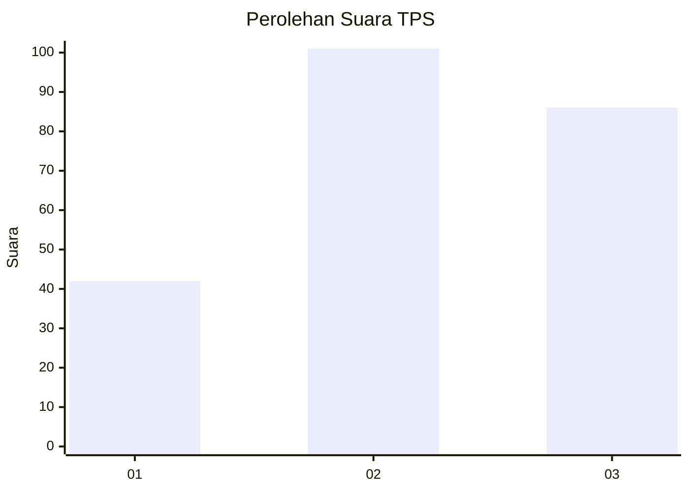
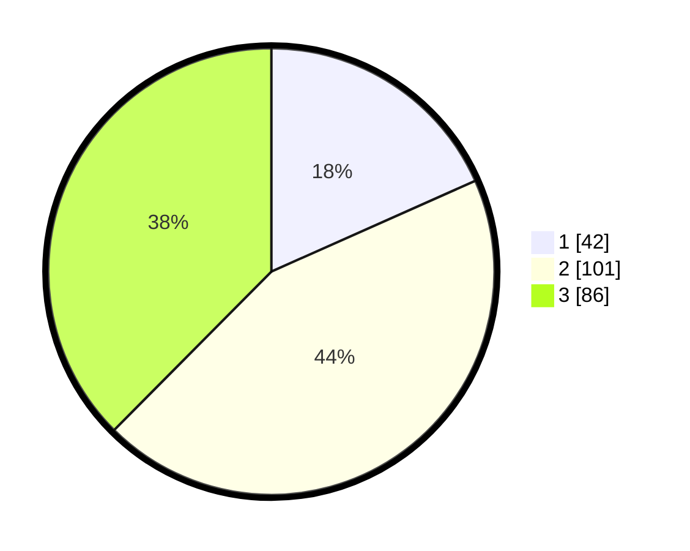

# Hasil

## Grafik

## Tabel

| No. | Nama Paslon    | Suara | Suara (raw) | Persentase |
|:--- |:-------------- | -----:| -----------:| ----------:|
| 1   | ANIES MUHAIMIN | 42    | [42][p-1]   | 18,34      |
| 2   | PRABOWO GIBRAN | 101   | [101][p-2]  | 44,10      |
| 3   | GANJAR MAHFUD  | 86    | [86][p-3]   | 37,55      |

[p-1]: https://github.com/gigit-pemilu/pemilu-2024-35-jawa-timur/blob/main/pilpres/hitung-suara/sub/35-jawa-timur/sub/78-kota-surabaya/sub/06-sawahan/sub/1006-pakis/sub/094-tps/sub/paslon-1.txt
[p-2]: https://github.com/gigit-pemilu/pemilu-2024-35-jawa-timur/blob/main/pilpres/hitung-suara/sub/35-jawa-timur/sub/78-kota-surabaya/sub/06-sawahan/sub/1006-pakis/sub/094-tps/sub/paslon-2.txt
[p-3]: https://github.com/gigit-pemilu/pemilu-2024-35-jawa-timur/blob/main/pilpres/hitung-suara/sub/35-jawa-timur/sub/78-kota-surabaya/sub/06-sawahan/sub/1006-pakis/sub/094-tps/sub/paslon-3.txt

## Foto C Plano

https://sirekap-obj-formc.kpu.go.id/3c89/pemilu/ppwp/35/78/06/10/06/3578061006094-20240215-002735--5d824681-6f2f-421c-83cf-f23cdb79f066.jpg

https://sirekap-obj-formc.kpu.go.id/3c89/pemilu/ppwp/35/78/06/10/06/3578061006094-20240215-002842--208e82d7-016f-4c43-be0e-deb515066eb2.jpg

https://sirekap-obj-formc.kpu.go.id/3c89/pemilu/ppwp/35/78/06/10/06/3578061006094-20240215-002947--e405d863-706c-4859-ab8d-7e845a9bf316.jpg

## Metadata

| Key        | Value               |
| ---------- | ------------------- |
| Time Stamp | 2024-02-24 22:31:28 |

