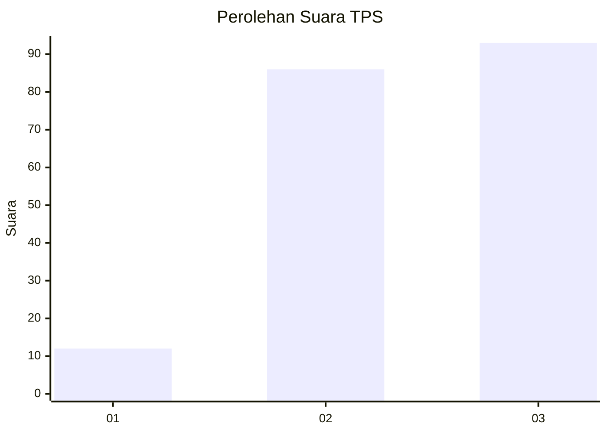
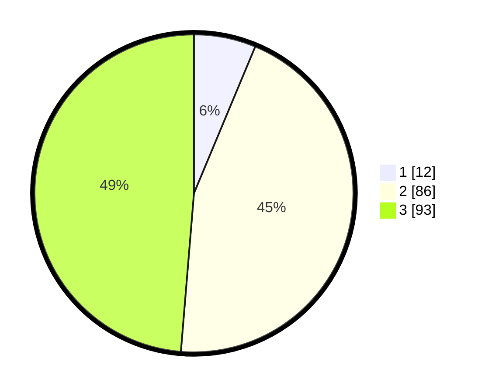

# Hasil

## Grafik

## Tabel

| No. | Nama Paslon    | Suara | Suara (raw) | Persentase |
|:--- |:-------------- | -----:| -----------:| ----------:|
| 1   | ANIES MUHAIMIN | 12    | [12][p-1]   | 6,28       |
| 2   | PRABOWO GIBRAN | 86    | [86][p-2]   | 45,03      |
| 3   | GANJAR MAHFUD  | 93    | [93][p-3]   | 48,69      |

[p-1]: https://github.com/gigit-pemilu/pemilu-2024/blob/main/pilpres/hitung-suara/sub/35-jawa-timur/sub/78-kota-surabaya/sub/06-sawahan/sub/1006-pakis/sub/096-tps/sub/paslon-1.txt
[p-2]: https://github.com/gigit-pemilu/pemilu-2024/blob/main/pilpres/hitung-suara/sub/35-jawa-timur/sub/78-kota-surabaya/sub/06-sawahan/sub/1006-pakis/sub/096-tps/sub/paslon-2.txt
[p-3]: https://github.com/gigit-pemilu/pemilu-2024/blob/main/pilpres/hitung-suara/sub/35-jawa-timur/sub/78-kota-surabaya/sub/06-sawahan/sub/1006-pakis/sub/096-tps/sub/paslon-3.txt

## Foto C Plano

https://sirekap-obj-formc.kpu.go.id/db73/pemilu/ppwp/35/78/06/10/06/3578061006096-20240215-035753--de76bdf6-2a1e-4575-b3ec-ec5868d8d899.jpg

https://sirekap-obj-formc.kpu.go.id/db73/pemilu/ppwp/35/78/06/10/06/3578061006096-20240215-035802--ccdddfe3-202f-4d40-9208-b41750d3af97.jpg

https://sirekap-obj-formc.kpu.go.id/db73/pemilu/ppwp/35/78/06/10/06/3578061006096-20240215-035809--76af71c1-ef87-4e97-9fff-b9a2bc533a7f.jpg

## Metadata

| Key        | Value               |
| ---------- | ------------------- |
| Time Stamp | 2024-02-24 22:31:28 |

