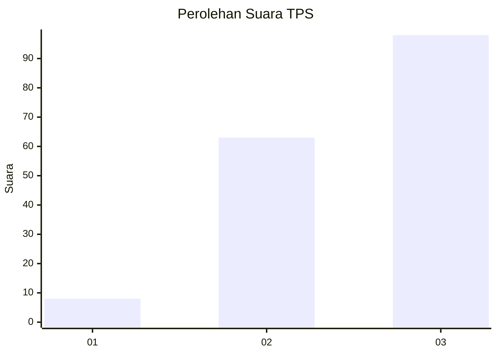
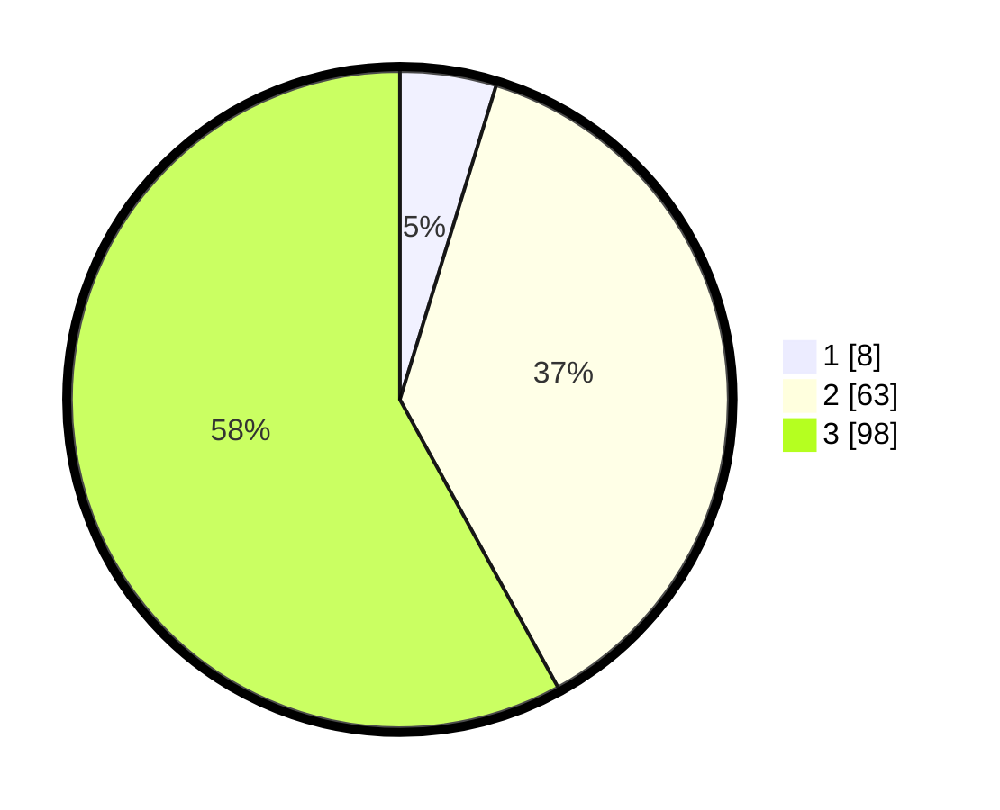

# Hasil

## Grafik

## Tabel

| No. | Nama Paslon    | Suara | Suara (raw) | Persentase |
|:--- |:-------------- | -----:| -----------:| ----------:|
| 1   | ANIES MUHAIMIN | 8     | [8][p-1]    | 4,73       |
| 2   | PRABOWO GIBRAN | 63    | [63][p-2]   | 37,28      |
| 3   | GANJAR MAHFUD  | 98    | [98][p-3]   | 57,99      |

[p-1]: https://github.com/gigit-pemilu/pemilu-2024/blob/main/pilpres/hitung-suara/sub/35-jawa-timur/sub/78-kota-surabaya/sub/06-sawahan/sub/1006-pakis/sub/097-tps/sub/paslon-1.txt
[p-2]: https://github.com/gigit-pemilu/pemilu-2024/blob/main/pilpres/hitung-suara/sub/35-jawa-timur/sub/78-kota-surabaya/sub/06-sawahan/sub/1006-pakis/sub/097-tps/sub/paslon-2.txt
[p-3]: https://github.com/gigit-pemilu/pemilu-2024/blob/main/pilpres/hitung-suara/sub/35-jawa-timur/sub/78-kota-surabaya/sub/06-sawahan/sub/1006-pakis/sub/097-tps/sub/paslon-3.txt

## Foto C Plano

https://sirekap-obj-formc.kpu.go.id/52db/pemilu/ppwp/35/78/06/10/06/3578061006097-20240214-213959--d40103d1-8dda-4778-b482-a4e1054eb3f1.jpg

https://sirekap-obj-formc.kpu.go.id/52db/pemilu/ppwp/35/78/06/10/06/3578061006097-20240214-214159--eac7a92f-6f19-45b9-9a42-2ce8021c7fb5.jpg

https://sirekap-obj-formc.kpu.go.id/52db/pemilu/ppwp/35/78/06/10/06/3578061006097-20240214-214330--f4b2a40e-4bef-4201-90e3-cff318f500e5.jpg

## Metadata

| Key        | Value               |
| ---------- | ------------------- |
| Time Stamp | 2024-02-25 11:00:00 |

