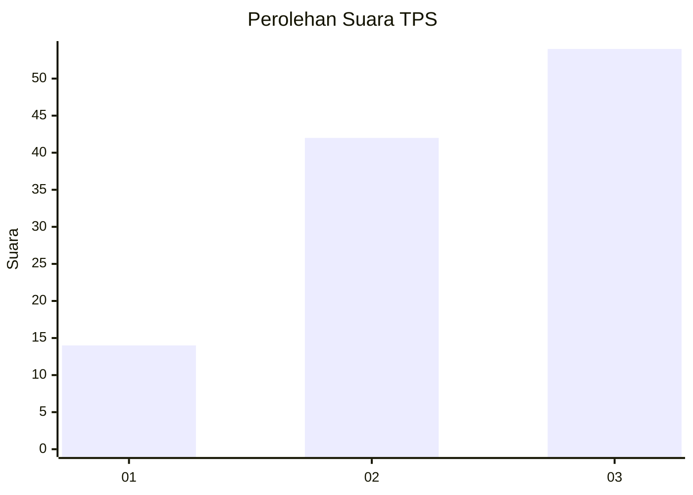
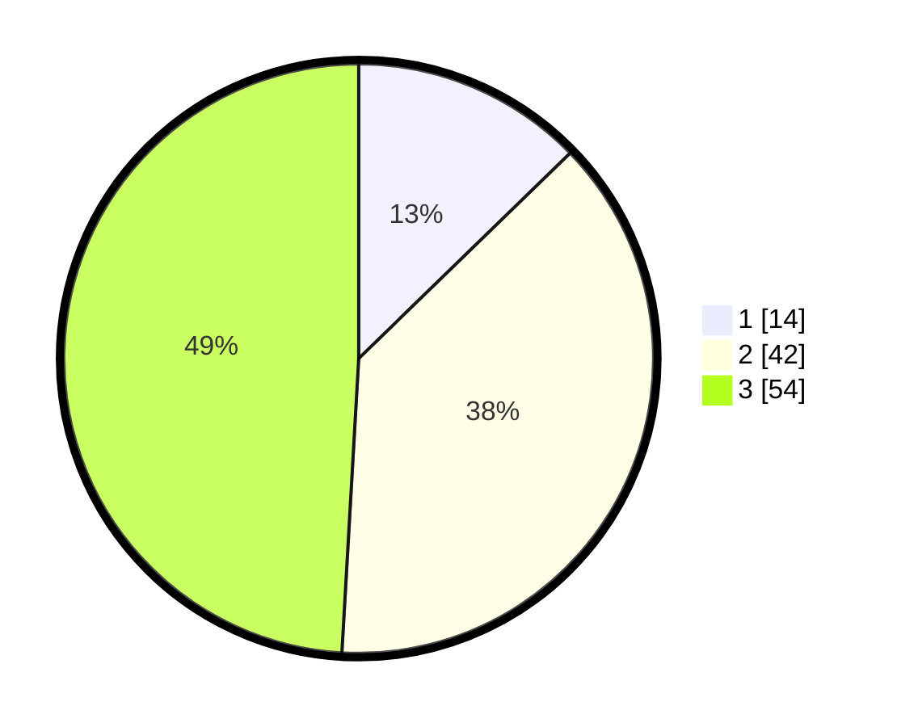

# Hasil

## Grafik

## Tabel

| No. | Nama Paslon    | Suara | Suara (raw) | Persentase |
|:--- |:-------------- | -----:| -----------:| ----------:|
| 1   | ANIES MUHAIMIN | 14    | [14][p-1]   | 12,73      |
| 2   | PRABOWO GIBRAN | 42    | [42][p-2]   | 38,18      |
| 3   | GANJAR MAHFUD  | 54    | [54][p-3]   | 49,09      |

[p-1]: https://github.com/gigit-pemilu/pemilu-2024-35-jawa-timur/blob/main/pilpres/hitung-suara/sub/35-jawa-timur/sub/78-kota-surabaya/sub/07-genteng/sub/1001-embong-kaliasin/sub/002-tps/sub/paslon-1.txt
[p-2]: https://github.com/gigit-pemilu/pemilu-2024-35-jawa-timur/blob/main/pilpres/hitung-suara/sub/35-jawa-timur/sub/78-kota-surabaya/sub/07-genteng/sub/1001-embong-kaliasin/sub/002-tps/sub/paslon-2.txt
[p-3]: https://github.com/gigit-pemilu/pemilu-2024-35-jawa-timur/blob/main/pilpres/hitung-suara/sub/35-jawa-timur/sub/78-kota-surabaya/sub/07-genteng/sub/1001-embong-kaliasin/sub/002-tps/sub/paslon-3.txt

## Foto C Plano

https://sirekap-obj-formc.kpu.go.id/1b91/pemilu/ppwp/35/78/07/10/01/3578071001002-20240220-095157--4c16a14e-ddd4-4dcd-814b-0db33fc51d33.jpg

https://sirekap-obj-formc.kpu.go.id/1b91/pemilu/ppwp/35/78/07/10/01/3578071001002-20240220-094955--f80141da-08c8-4022-bdba-345d1e87cbb8.jpg

https://sirekap-obj-formc.kpu.go.id/1b91/pemilu/ppwp/35/78/07/10/01/3578071001002-20240220-095031--e3fe3fd9-56a5-46dc-911d-aa091aeb0186.jpg

## Metadata

| Key        | Value               |
| ---------- | ------------------- |
| Time Stamp | 2024-02-20 11:00:00 |

## DATA PEMILIH TETAP

Jumlah pemilih dalam DPT: **284**.
 * L: **505**.
 * P: **123**.

## DATA PENGGUNA HAK PILIH

Jumlah pengguna hak pilih dalam DPT: **145**.
 * L: **69**.
 * P: **470**.

Jumlah pengguna hak pilih dalam DPTb: **8**.
 * L: **85**.
 * P: **3**.

Jumlah pengguna hak pilih dalam DPK: **4**.
 * L: **881**.
 * P: **883**.

Jumlah pengguna hak pilih: **557**.
 * L: **835**.
 * P: **82**.

## JUMLAH SUARA SAH DAN TIDAK SAH

JUMLAH SELURUH SUARA SAH: **154**.

JUMLAH SUARA TIDAK SAH: **275**.

JUMLAH SELURUH SUARA SAH DAN SUARA TIDAK SAH: **757**.

