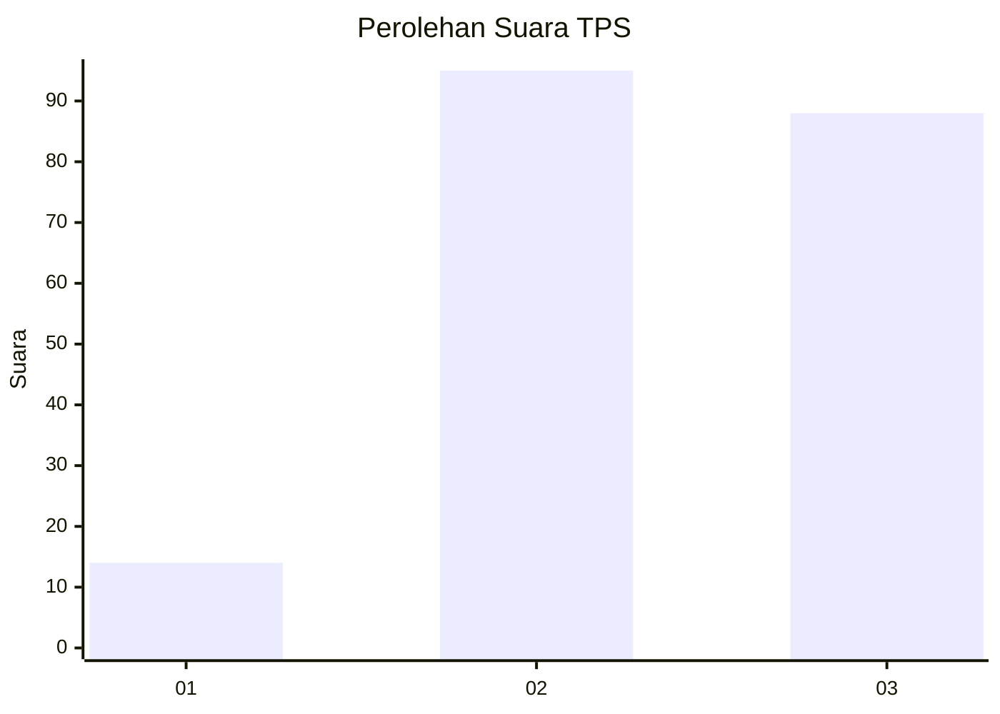
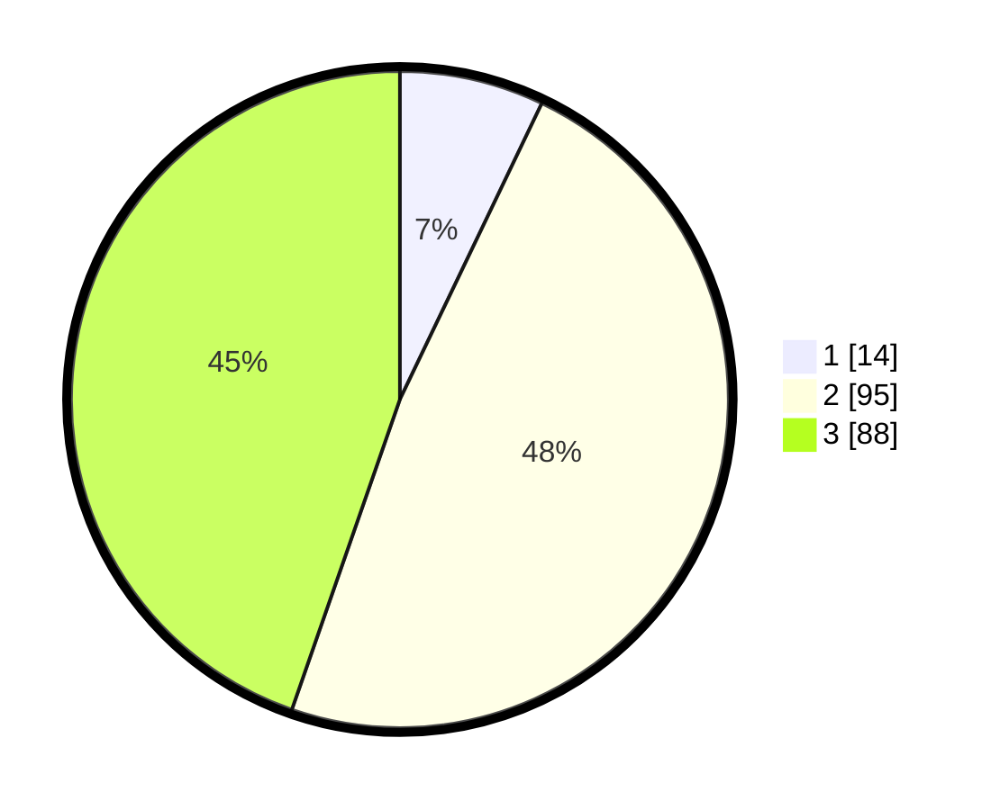

# Hasil

## Grafik

## Tabel

| No. | Nama Paslon    | Suara | Suara (raw) | Persentase |
|:--- |:-------------- | -----:| -----------:| ----------:|
| 1   | ANIES MUHAIMIN | 14    | [14][p-1]   | 7,11       |
| 2   | PRABOWO GIBRAN | 95    | [95][p-2]   | 48,22      |
| 3   | GANJAR MAHFUD  | 88    | [88][p-3]   | 44,67      |

[p-1]: https://github.com/gigit-pemilu/pemilu-2024/blob/main/pilpres/hitung-suara/sub/35-jawa-timur/sub/78-kota-surabaya/sub/07-genteng/sub/1001-embong-kaliasin/sub/003-tps/sub/paslon-1.txt
[p-2]: https://github.com/gigit-pemilu/pemilu-2024/blob/main/pilpres/hitung-suara/sub/35-jawa-timur/sub/78-kota-surabaya/sub/07-genteng/sub/1001-embong-kaliasin/sub/003-tps/sub/paslon-2.txt
[p-3]: https://github.com/gigit-pemilu/pemilu-2024/blob/main/pilpres/hitung-suara/sub/35-jawa-timur/sub/78-kota-surabaya/sub/07-genteng/sub/1001-embong-kaliasin/sub/003-tps/sub/paslon-3.txt

## Foto C Plano

https://sirekap-obj-formc.kpu.go.id/c731/pemilu/ppwp/35/78/07/10/01/3578071001003-20240220-094952--b87208de-8ba2-4ff5-8bbb-f0a8a5aa5c63.jpg

https://sirekap-obj-formc.kpu.go.id/c731/pemilu/ppwp/35/78/07/10/01/3578071001003-20240214-205641--edc2780c-1548-4328-992e-ea9aba51b8bd.jpg

https://sirekap-obj-formc.kpu.go.id/c731/pemilu/ppwp/35/78/07/10/01/3578071001003-20240214-205827--dde291df-d3b6-4a81-90b1-072886380eeb.jpg

## Metadata

| Key        | Value               |
| ---------- | ------------------- |
| Time Stamp | 2024-02-25 11:00:00 |

## DATA PEMILIH TETAP

Jumlah pemilih dalam DPT: **278**.
 * L: **137**.
 * P: **141**.

## DATA PENGGUNA HAK PILIH

Jumlah pengguna hak pilih dalam DPT: **170**.
 * L: **44**.
 * P: **96**.

Jumlah pengguna hak pilih dalam DPTb: **15**.
 * L: **5**.
 * P: **70**.

Jumlah pengguna hak pilih dalam DPK: **5**.
 * L: **1**.
 * P: **5**.

Jumlah pengguna hak pilih: **201**.
 * L: **40**.
 * P: **151**.

## JUMLAH SUARA SAH DAN TIDAK SAH

JUMLAH SELURUH SUARA SAH: **197**.

JUMLAH SUARA TIDAK SAH: **4**.

JUMLAH SELURUH SUARA SAH DAN SUARA TIDAK SAH: **201**.

