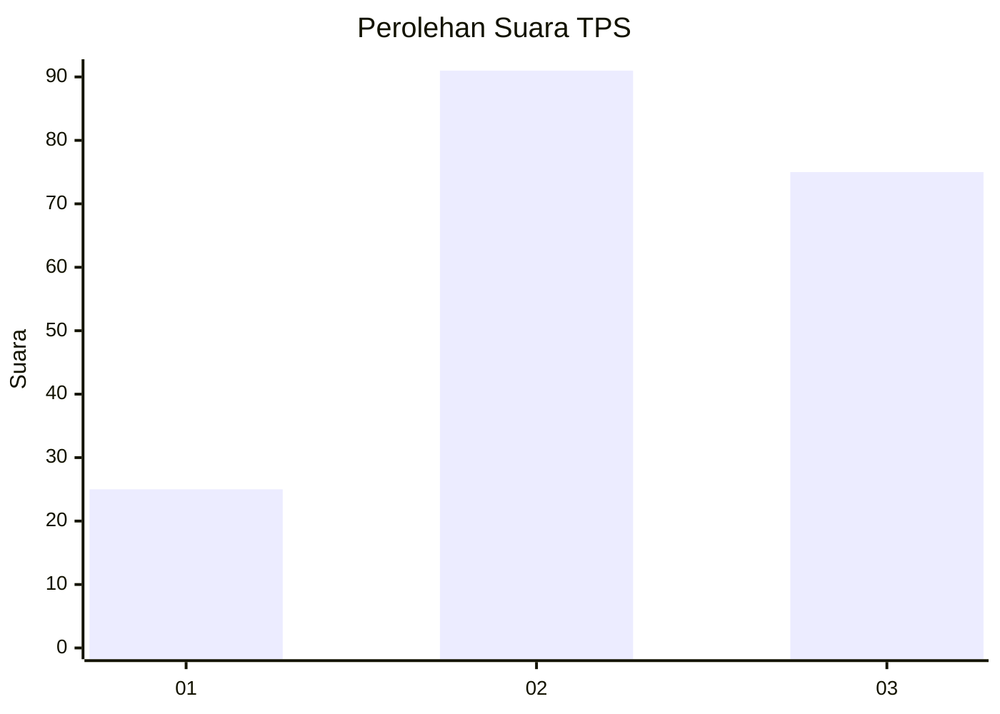
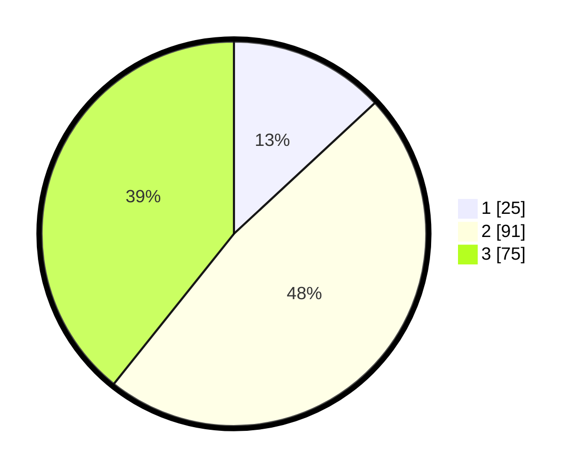

# Hasil

## Grafik

## Tabel

| No. | Nama Paslon    | Suara | Suara (raw) | Persentase |
|:--- |:-------------- | -----:| -----------:| ----------:|
| 1   | ANIES MUHAIMIN | 25    | [25][p-1]   | 13,09      |
| 2   | PRABOWO GIBRAN | 91    | [91][p-2]   | 47,64      |
| 3   | GANJAR MAHFUD  | 75    | [75][p-3]   | 39,27      |

[p-1]: https://github.com/gigit-pemilu/pemilu-2024-35-jawa-timur/blob/main/pilpres/hitung-suara/sub/35-jawa-timur/sub/78-kota-surabaya/sub/07-genteng/sub/1001-embong-kaliasin/sub/004-tps/sub/paslon-1.txt
[p-2]: https://github.com/gigit-pemilu/pemilu-2024-35-jawa-timur/blob/main/pilpres/hitung-suara/sub/35-jawa-timur/sub/78-kota-surabaya/sub/07-genteng/sub/1001-embong-kaliasin/sub/004-tps/sub/paslon-2.txt
[p-3]: https://github.com/gigit-pemilu/pemilu-2024-35-jawa-timur/blob/main/pilpres/hitung-suara/sub/35-jawa-timur/sub/78-kota-surabaya/sub/07-genteng/sub/1001-embong-kaliasin/sub/004-tps/sub/paslon-3.txt

## Foto C Plano

https://sirekap-obj-formc.kpu.go.id/38eb/pemilu/ppwp/35/78/07/10/01/3578071001004-20240220-110835--21087290-9544-43ad-b0b8-3b5c514f02d5.jpg

https://sirekap-obj-formc.kpu.go.id/38eb/pemilu/ppwp/35/78/07/10/01/3578071001004-20240220-101941--862291bf-6806-4d89-ab7d-7d48ed393f66.jpg

https://sirekap-obj-formc.kpu.go.id/38eb/pemilu/ppwp/35/78/07/10/01/3578071001004-20240220-104022--98b2da80-5f82-446c-bd72-f90194082cbc.jpg

## Metadata

| Key        | Value               |
| ---------- | ------------------- |
| Time Stamp | 2024-02-20 12:00:00 |

## DATA PEMILIH TETAP

Jumlah pemilih dalam DPT: **288**.
 * L: **624**.
 * P: **64**.

## DATA PENGGUNA HAK PILIH

Jumlah pengguna hak pilih dalam DPT: **626**.
 * L: **906**.
 * P: **800**.

Jumlah pengguna hak pilih dalam DPTb: **0**.
 * L: **700**.
 * P: **300**.

Jumlah pengguna hak pilih dalam DPK: **6**.
 * L: **2**.
 * P: **94**.

Jumlah pengguna hak pilih: **693**.
 * L: **983**.
 * P: **420**.

## JUMLAH SUARA SAH DAN TIDAK SAH

JUMLAH SELURUH SUARA SAH: **191**.

JUMLAH SUARA TIDAK SAH: **5**.

JUMLAH SELURUH SUARA SAH DAN SUARA TIDAK SAH: **196**.

