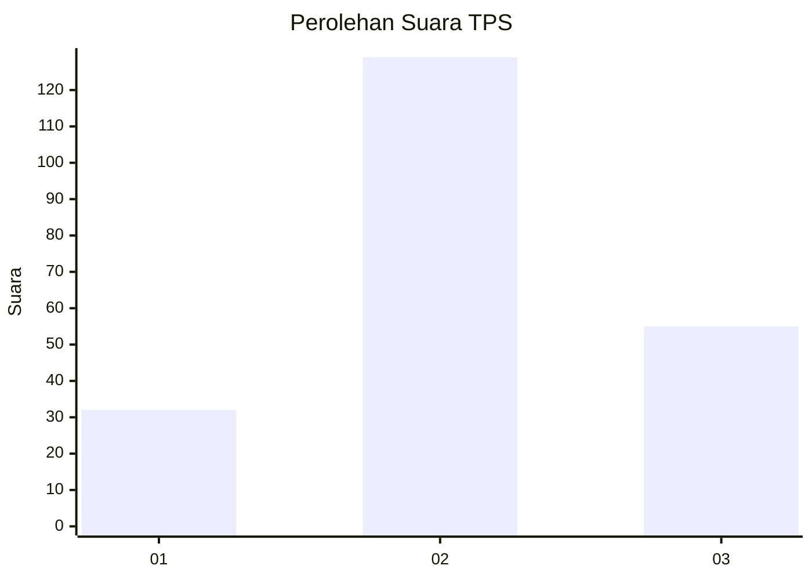
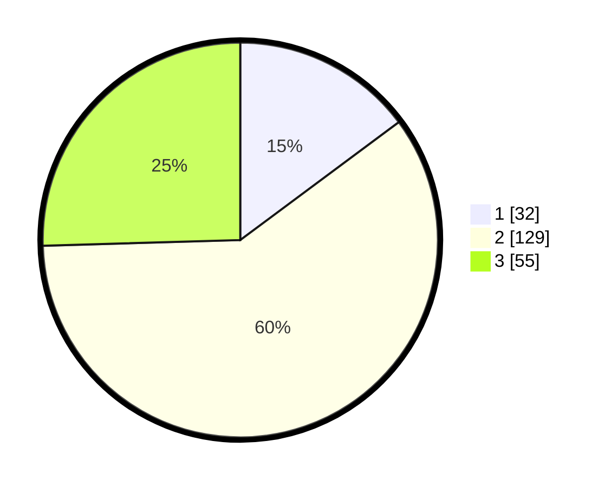

# Hasil

## Grafik

## Tabel

| No. | Nama Paslon    | Suara | Suara (raw) | Persentase |
|:--- |:-------------- | -----:| -----------:| ----------:|
| 1   | ANIES MUHAIMIN | 32    | [32][p-1]   | 14,81      |
| 2   | PRABOWO GIBRAN | 129   | [129][p-2]  | 59,72      |
| 3   | GANJAR MAHFUD  | 55    | [55][p-3]   | 25,46      |

[p-1]: https://github.com/gigit-pemilu/pemilu-2024/blob/main/pilpres/hitung-suara/sub/35-jawa-timur/sub/78-kota-surabaya/sub/07-genteng/sub/1001-embong-kaliasin/sub/005-tps/sub/paslon-1.txt
[p-2]: https://github.com/gigit-pemilu/pemilu-2024/blob/main/pilpres/hitung-suara/sub/35-jawa-timur/sub/78-kota-surabaya/sub/07-genteng/sub/1001-embong-kaliasin/sub/005-tps/sub/paslon-2.txt
[p-3]: https://github.com/gigit-pemilu/pemilu-2024/blob/main/pilpres/hitung-suara/sub/35-jawa-timur/sub/78-kota-surabaya/sub/07-genteng/sub/1001-embong-kaliasin/sub/005-tps/sub/paslon-3.txt

## Foto C Plano

https://sirekap-obj-formc.kpu.go.id/5b74/pemilu/ppwp/35/78/07/10/01/3578071001005-20240215-173731--d5766cc2-db6e-4437-8cac-99cec9633f17.jpg

https://sirekap-obj-formc.kpu.go.id/5b74/pemilu/ppwp/35/78/07/10/01/3578071001005-20240215-193030--088bed80-0f9e-472d-b6b3-5383a4e39a93.jpg

https://sirekap-obj-formc.kpu.go.id/5b74/pemilu/ppwp/35/78/07/10/01/3578071001005-20240215-193035--2a29289a-1fa7-4ea2-aaf0-806149e63766.jpg

## Metadata

| Key        | Value               |
| ---------- | ------------------- |
| Time Stamp | 2024-02-25 12:00:00 |

