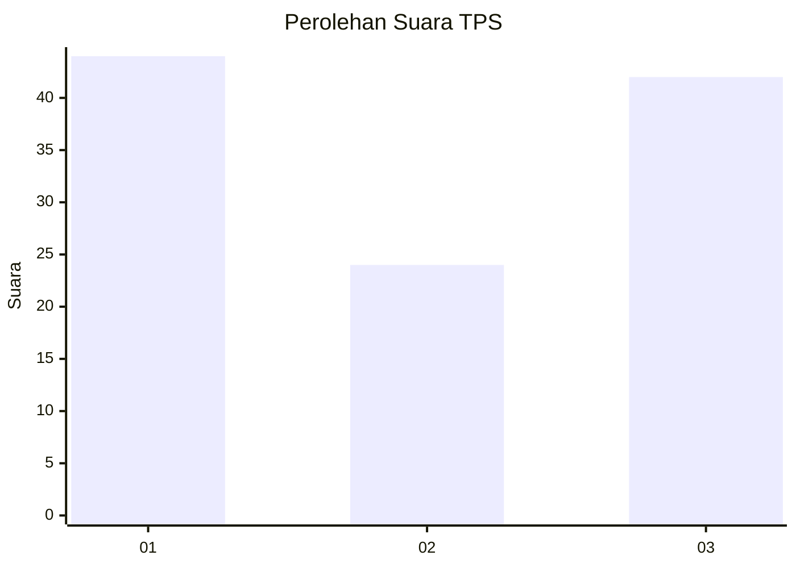
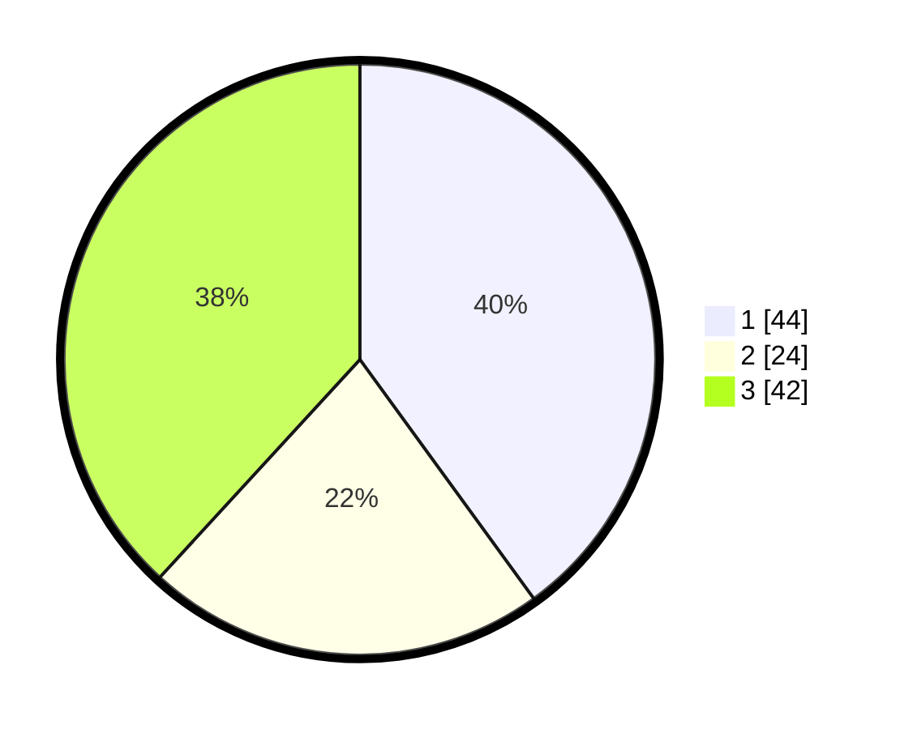

# Hasil

## Grafik

## Tabel

| No. | Nama Paslon    | Suara | Suara (raw) | Persentase |
|:--- |:-------------- | -----:| -----------:| ----------:|
| 1   | ANIES MUHAIMIN | 44    | [44][p-1]   | 40,00      |
| 2   | PRABOWO GIBRAN | 24    | [24][p-2]   | 21,82      |
| 3   | GANJAR MAHFUD  | 42    | [42][p-3]   | 38,18      |

[p-1]: https://github.com/gigit-pemilu/pemilu-2024-35-jawa-timur/blob/main/pilpres/hitung-suara/sub/35-jawa-timur/sub/78-kota-surabaya/sub/07-genteng/sub/1001-embong-kaliasin/sub/018-tps/sub/paslon-1.txt
[p-2]: https://github.com/gigit-pemilu/pemilu-2024-35-jawa-timur/blob/main/pilpres/hitung-suara/sub/35-jawa-timur/sub/78-kota-surabaya/sub/07-genteng/sub/1001-embong-kaliasin/sub/018-tps/sub/paslon-2.txt
[p-3]: https://github.com/gigit-pemilu/pemilu-2024-35-jawa-timur/blob/main/pilpres/hitung-suara/sub/35-jawa-timur/sub/78-kota-surabaya/sub/07-genteng/sub/1001-embong-kaliasin/sub/018-tps/sub/paslon-3.txt

## Foto C Plano

https://sirekap-obj-formc.kpu.go.id/b6a4/pemilu/ppwp/35/78/07/10/01/3578071001018-20240220-103619--b8414db3-f393-4194-9004-e5b43d83d757.jpg

https://sirekap-obj-formc.kpu.go.id/b6a4/pemilu/ppwp/35/78/07/10/01/3578071001018-20240220-103709--a6330aa2-9071-47c5-bfa4-771a9ec2686f.jpg

https://sirekap-obj-formc.kpu.go.id/b6a4/pemilu/ppwp/35/78/07/10/01/3578071001018-20240220-103802--1f3c0657-7c83-442f-8491-e9f2dc7cc8ec.jpg

## Metadata

| Key        | Value               |
| ---------- | ------------------- |
| Time Stamp | 2024-02-20 11:00:00 |

## DATA PEMILIH TETAP

Jumlah pemilih dalam DPT: **294**.
 * L: **142**.
 * P: **147**.

## DATA PENGGUNA HAK PILIH

Jumlah pengguna hak pilih dalam DPT: **210**.
 * L: **96**.
 * P: **414**.

Jumlah pengguna hak pilih dalam DPTb: **7**.
 * L: **807**.
 * P: **8**.

Jumlah pengguna hak pilih dalam DPK: **802**.
 * L: **81**.
 * P: **800**.

Jumlah pengguna hak pilih: **283**.
 * L: **98**.
 * P: **845**.

## JUMLAH SUARA SAH DAN TIDAK SAH

JUMLAH SELURUH SUARA SAH: **204**.

JUMLAH SUARA TIDAK SAH: **9**.

JUMLAH SELURUH SUARA SAH DAN SUARA TIDAK SAH: **243**.

