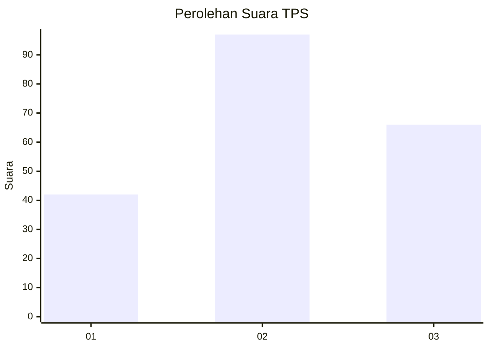
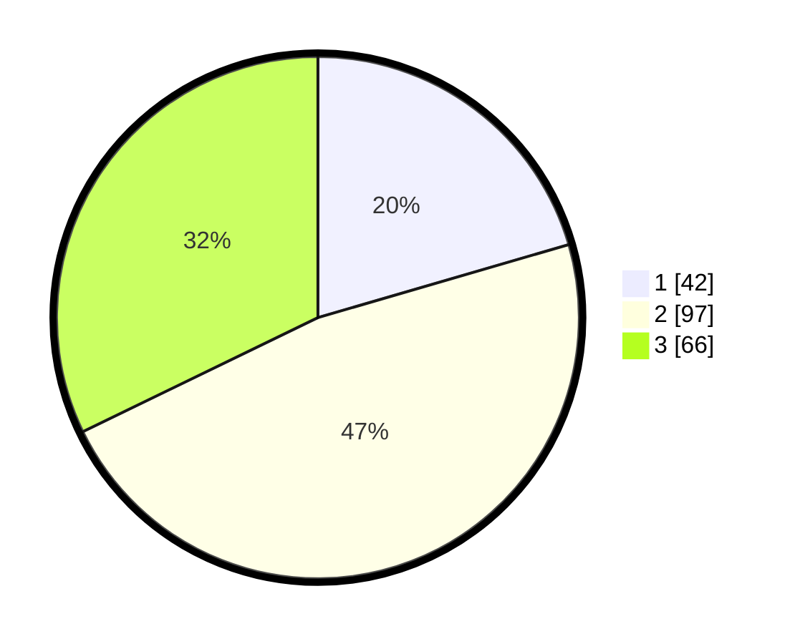

# Hasil

## Grafik

## Tabel

| No. | Nama Paslon    | Suara | Suara (raw) | Persentase |
|:--- |:-------------- | -----:| -----------:| ----------:|
| 1   | ANIES MUHAIMIN | 42    | [42][p-1]   | 20,49      |
| 2   | PRABOWO GIBRAN | 97    | [97][p-2]   | 47,32      |
| 3   | GANJAR MAHFUD  | 66    | [66][p-3]   | 32,20      |

[p-1]: https://github.com/gigit-pemilu/pemilu-2024/blob/main/pilpres/hitung-suara/sub/35-jawa-timur/sub/78-kota-surabaya/sub/07-genteng/sub/1002-genteng/sub/004-tps/sub/paslon-1.txt
[p-2]: https://github.com/gigit-pemilu/pemilu-2024/blob/main/pilpres/hitung-suara/sub/35-jawa-timur/sub/78-kota-surabaya/sub/07-genteng/sub/1002-genteng/sub/004-tps/sub/paslon-2.txt
[p-3]: https://github.com/gigit-pemilu/pemilu-2024/blob/main/pilpres/hitung-suara/sub/35-jawa-timur/sub/78-kota-surabaya/sub/07-genteng/sub/1002-genteng/sub/004-tps/sub/paslon-3.txt

## Foto C Plano

https://sirekap-obj-formc.kpu.go.id/a84d/pemilu/ppwp/35/78/07/10/02/3578071002004-20240219-185205--158c73ec-7669-4396-95fb-fbe483486c3a.jpg

https://sirekap-obj-formc.kpu.go.id/a84d/pemilu/ppwp/35/78/07/10/02/3578071002004-20240219-185251--ffde9ce4-9b84-4293-a6f5-132aeb3495e6.jpg

https://sirekap-obj-formc.kpu.go.id/a84d/pemilu/ppwp/35/78/07/10/02/3578071002004-20240219-185525--e48c4aae-ada9-4d6f-bcd6-c111ca631999.jpg

## Metadata

| Key        | Value               |
| ---------- | ------------------- |
| Time Stamp | 2024-02-19 19:00:00 |

## DATA PEMILIH TETAP

Jumlah pemilih dalam DPT: **242**.
 * L: **627**.
 * P: **136**.

## DATA PENGGUNA HAK PILIH

Jumlah pengguna hak pilih dalam DPT: **298**.
 * L: **95**.
 * P: **113**.

Jumlah pengguna hak pilih dalam DPTb: **488**.
 * L: **48**.
 * P: **0**.

Jumlah pengguna hak pilih dalam DPK: **84**.
 * L: **808**.
 * P: **28**.

Jumlah pengguna hak pilih: **208**.
 * L: **825**.
 * P: **113**.

## JUMLAH SUARA SAH DAN TIDAK SAH

JUMLAH SELURUH SUARA SAH: **202**.

JUMLAH SUARA TIDAK SAH: **5**.

JUMLAH SELURUH SUARA SAH DAN SUARA TIDAK SAH: **208**.

