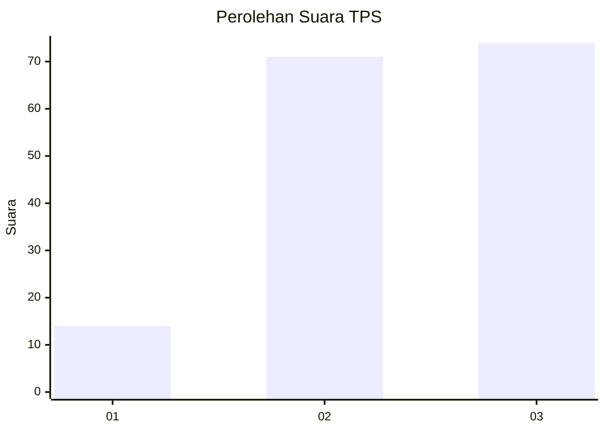
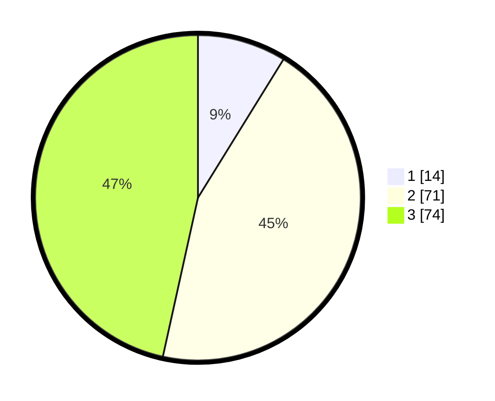

# Hasil

## Grafik

## Tabel

| No. | Nama Paslon    | Suara | Suara (raw) | Persentase |
|:--- |:-------------- | -----:| -----------:| ----------:|
| 1   | ANIES MUHAIMIN | 14    | [14][p-1]   | 8,81       |
| 2   | PRABOWO GIBRAN | 71    | [71][p-2]   | 44,65      |
| 3   | GANJAR MAHFUD  | 74    | [74][p-3]   | 46,54      |

[p-1]: https://github.com/gigit-pemilu/pemilu-2024/blob/main/pilpres/hitung-suara/sub/35-jawa-timur/sub/78-kota-surabaya/sub/07-genteng/sub/1005-peneleh/sub/023-tps/sub/paslon-1.txt
[p-2]: https://github.com/gigit-pemilu/pemilu-2024/blob/main/pilpres/hitung-suara/sub/35-jawa-timur/sub/78-kota-surabaya/sub/07-genteng/sub/1005-peneleh/sub/023-tps/sub/paslon-2.txt
[p-3]: https://github.com/gigit-pemilu/pemilu-2024/blob/main/pilpres/hitung-suara/sub/35-jawa-timur/sub/78-kota-surabaya/sub/07-genteng/sub/1005-peneleh/sub/023-tps/sub/paslon-3.txt

## Foto C Plano

https://sirekap-obj-formc.kpu.go.id/d906/pemilu/ppwp/35/78/07/10/05/3578071005023-20240214-235713--470fa61e-8980-49f5-9011-af1106a34f24.jpg

https://sirekap-obj-formc.kpu.go.id/d906/pemilu/ppwp/35/78/07/10/05/3578071005023-20240215-002759--61205f1f-15d2-4aad-8d5d-2dad342a7ccf.jpg

https://sirekap-obj-formc.kpu.go.id/d906/pemilu/ppwp/35/78/07/10/05/3578071005023-20240215-002801--ce793860-4a7d-4ec1-bd67-cecbfc66f506.jpg

## Metadata

| Key        | Value               |
| ---------- | ------------------- |
| Time Stamp | 2024-02-15 12:00:28 |

