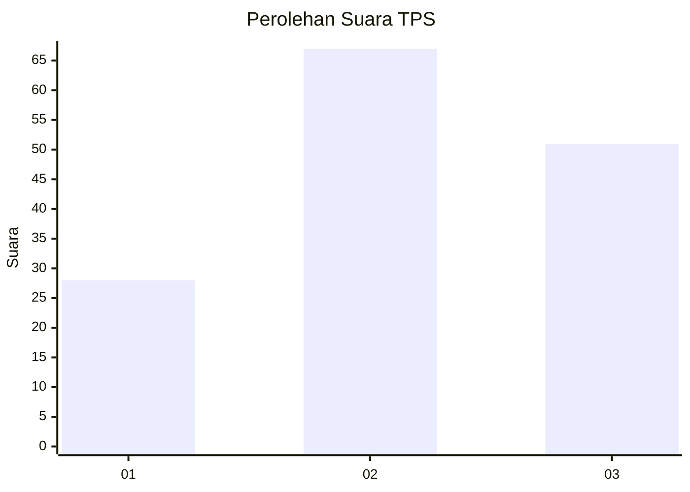
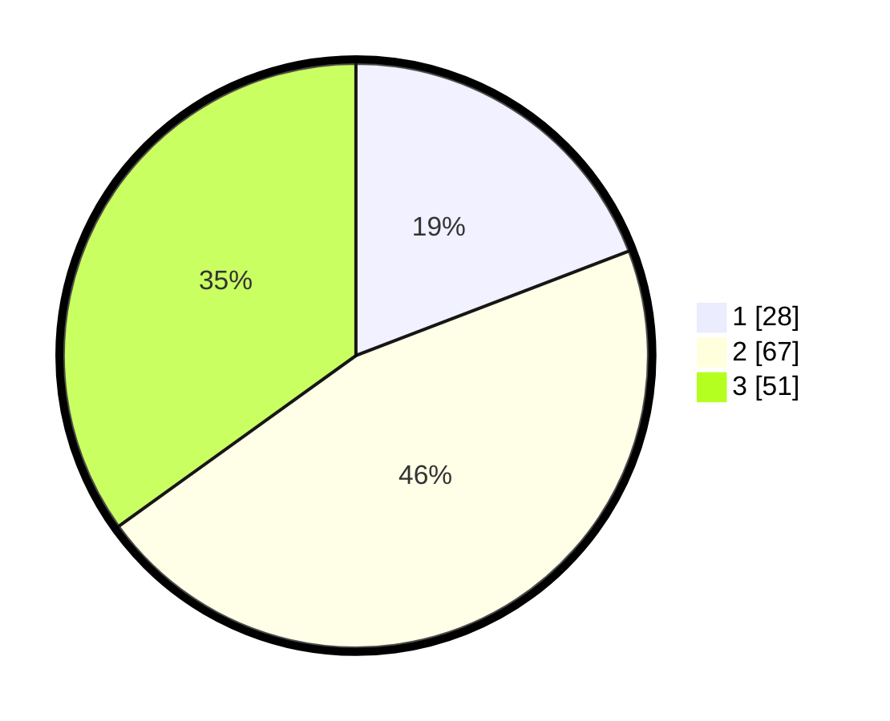

# Hasil

## Grafik

## Tabel

| No. | Nama Paslon    | Suara | Suara (raw) | Persentase |
|:--- |:-------------- | -----:| -----------:| ----------:|
| 1   | ANIES MUHAIMIN | 28    | [28][p-1]   | 19,18      |
| 2   | PRABOWO GIBRAN | 67    | [67][p-2]   | 45,89      |
| 3   | GANJAR MAHFUD  | 51    | [51][p-3]   | 34,93      |

[p-1]: https://github.com/gigit-pemilu/pemilu-2024-35-jawa-timur/blob/main/pilpres/hitung-suara/sub/35-jawa-timur/sub/78-kota-surabaya/sub/07-genteng/sub/1005-peneleh/sub/041-tps/sub/paslon-1.txt
[p-2]: https://github.com/gigit-pemilu/pemilu-2024-35-jawa-timur/blob/main/pilpres/hitung-suara/sub/35-jawa-timur/sub/78-kota-surabaya/sub/07-genteng/sub/1005-peneleh/sub/041-tps/sub/paslon-2.txt
[p-3]: https://github.com/gigit-pemilu/pemilu-2024-35-jawa-timur/blob/main/pilpres/hitung-suara/sub/35-jawa-timur/sub/78-kota-surabaya/sub/07-genteng/sub/1005-peneleh/sub/041-tps/sub/paslon-3.txt

## Foto C Plano

https://sirekap-obj-formc.kpu.go.id/f04e/pemilu/ppwp/35/78/07/10/05/3578071005041-20240219-214828--f115f8e3-1a8e-48b7-b309-ecbbeb6ea625.jpg

https://sirekap-obj-formc.kpu.go.id/f04e/pemilu/ppwp/35/78/07/10/05/3578071005041-20240219-204522--e9dbd6fc-ee7d-4034-8396-d1f71854d301.jpg

https://sirekap-obj-formc.kpu.go.id/f04e/pemilu/ppwp/35/78/07/10/05/3578071005041-20240219-204625--7261390a-e74e-4001-b105-d6a382ae27ca.jpg

## Metadata

| Key        | Value               |
| ---------- | ------------------- |
| Time Stamp | 2024-02-25 00:00:00 |

