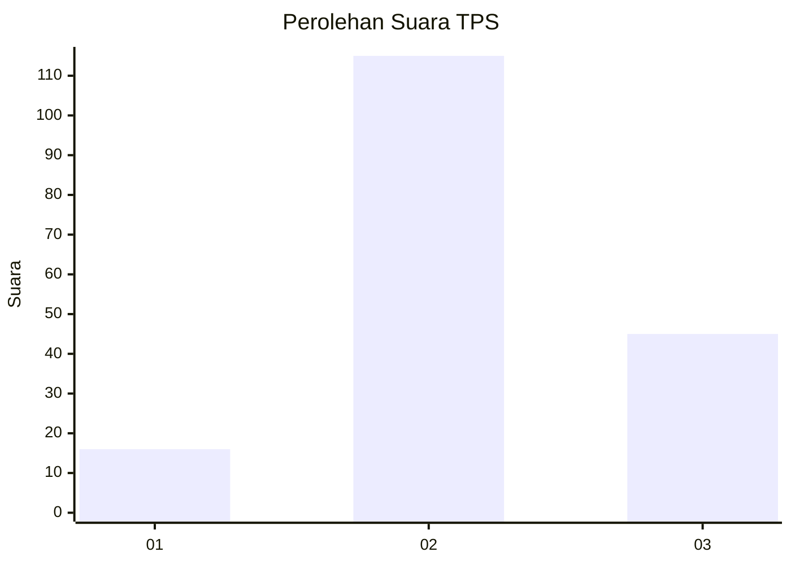
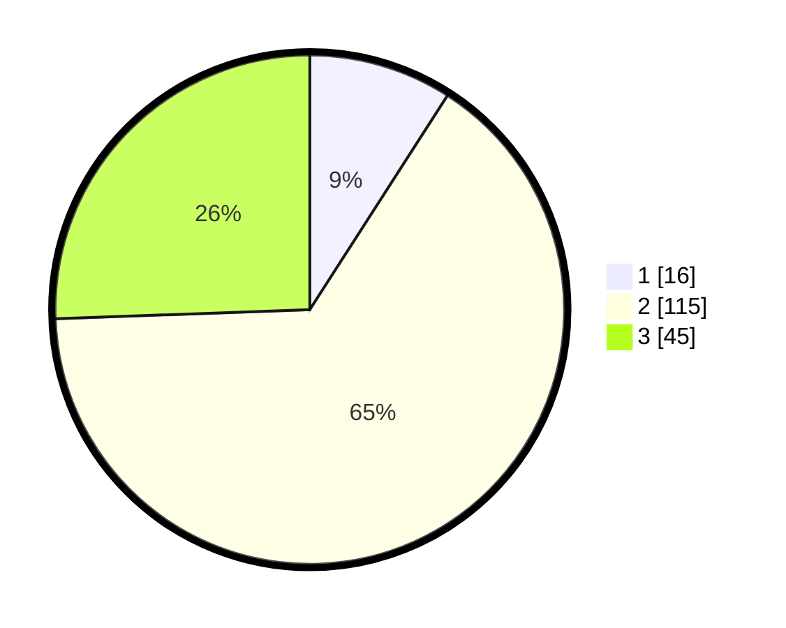

# Hasil

## Grafik

## Tabel

| No. | Nama Paslon    | Suara | Suara (raw) | Persentase |
|:--- |:-------------- | -----:| -----------:| ----------:|
| 1   | ANIES MUHAIMIN | 16    | [16][p-1]   | 9,09       |
| 2   | PRABOWO GIBRAN | 115   | [115][p-2]  | 65,34      |
| 3   | GANJAR MAHFUD  | 45    | [45][p-3]   | 25,57      |

[p-1]: https://github.com/gigit-pemilu/pemilu-2024/blob/main/pilpres/hitung-suara/sub/35-jawa-timur/sub/78-kota-surabaya/sub/08-gubeng/sub/1001-gubeng/sub/003-tps/sub/paslon-1.txt
[p-2]: https://github.com/gigit-pemilu/pemilu-2024/blob/main/pilpres/hitung-suara/sub/35-jawa-timur/sub/78-kota-surabaya/sub/08-gubeng/sub/1001-gubeng/sub/003-tps/sub/paslon-2.txt
[p-3]: https://github.com/gigit-pemilu/pemilu-2024/blob/main/pilpres/hitung-suara/sub/35-jawa-timur/sub/78-kota-surabaya/sub/08-gubeng/sub/1001-gubeng/sub/003-tps/sub/paslon-3.txt

## Foto C Plano

https://sirekap-obj-formc.kpu.go.id/9749/pemilu/ppwp/35/78/08/10/01/3578081001003-20240214-160058--aa7a7ac7-af25-45f2-aa7a-7b388c154347.jpg

https://sirekap-obj-formc.kpu.go.id/9749/pemilu/ppwp/35/78/08/10/01/3578081001003-20240214-155813--7022d6c0-d7b7-4840-b1e2-ed8e9fbeafc9.jpg

https://sirekap-obj-formc.kpu.go.id/9749/pemilu/ppwp/35/78/08/10/01/3578081001003-20240214-155907--e561920f-bf43-4fd9-a2bd-8eba6e6d040e.jpg

## Metadata

| Key        | Value               |
| ---------- | ------------------- |
| Time Stamp | 2024-02-15 23:29:50 |

