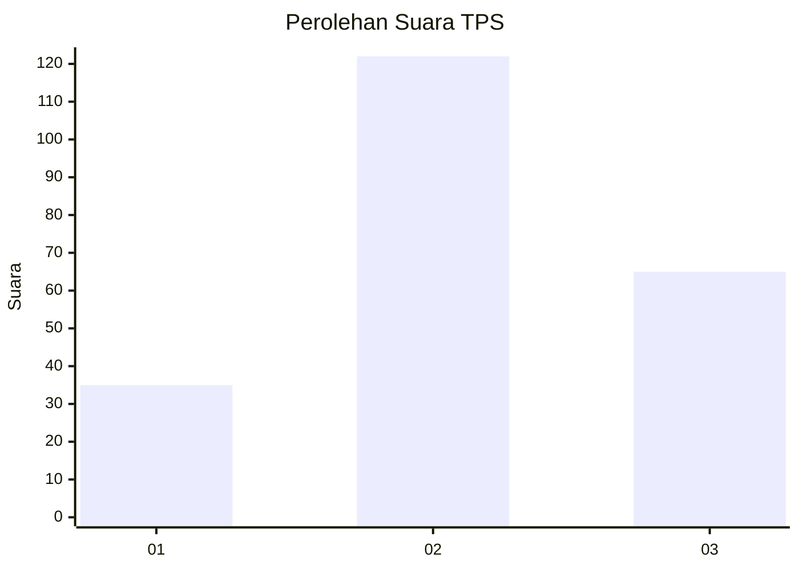
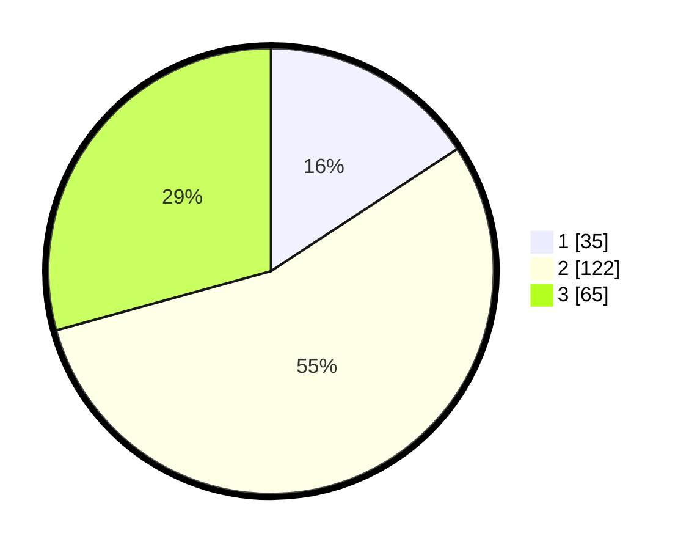

# Hasil

## Grafik

## Tabel

| No. | Nama Paslon    | Suara | Suara (raw) | Persentase |
|:--- |:-------------- | -----:| -----------:| ----------:|
| 1   | ANIES MUHAIMIN | 35    | [35][p-1]   | 15,77      |
| 2   | PRABOWO GIBRAN | 122   | [122][p-2]  | 54,95      |
| 3   | GANJAR MAHFUD  | 65    | [65][p-3]   | 29,28      |

[p-1]: https://github.com/gigit-pemilu/pemilu-2024/blob/main/pilpres/hitung-suara/sub/35-jawa-timur/sub/78-kota-surabaya/sub/08-gubeng/sub/1001-gubeng/sub/004-tps/sub/paslon-1.txt
[p-2]: https://github.com/gigit-pemilu/pemilu-2024/blob/main/pilpres/hitung-suara/sub/35-jawa-timur/sub/78-kota-surabaya/sub/08-gubeng/sub/1001-gubeng/sub/004-tps/sub/paslon-2.txt
[p-3]: https://github.com/gigit-pemilu/pemilu-2024/blob/main/pilpres/hitung-suara/sub/35-jawa-timur/sub/78-kota-surabaya/sub/08-gubeng/sub/1001-gubeng/sub/004-tps/sub/paslon-3.txt

## Foto C Plano

https://sirekap-obj-formc.kpu.go.id/62fc/pemilu/ppwp/35/78/08/10/01/3578081001004-20240215-023449--e2d8e7b4-21d4-4eb1-add9-bf69041abe63.jpg

https://sirekap-obj-formc.kpu.go.id/62fc/pemilu/ppwp/35/78/08/10/01/3578081001004-20240215-023536--765f7315-bf65-45e1-b45a-4f0838431b31.jpg

https://sirekap-obj-formc.kpu.go.id/62fc/pemilu/ppwp/35/78/08/10/01/3578081001004-20240215-015142--ab857c00-7103-4620-be07-3dc3b5851a36.jpg

## Metadata

| Key        | Value               |
| ---------- | ------------------- |
| Time Stamp | 2024-02-15 23:29:50 |

