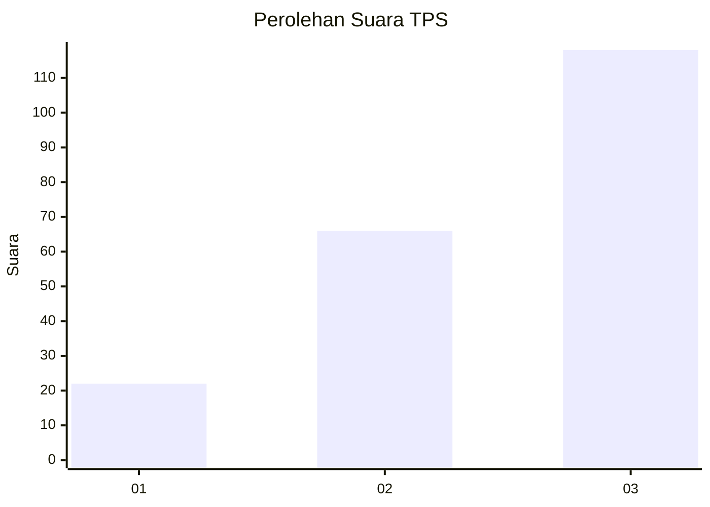
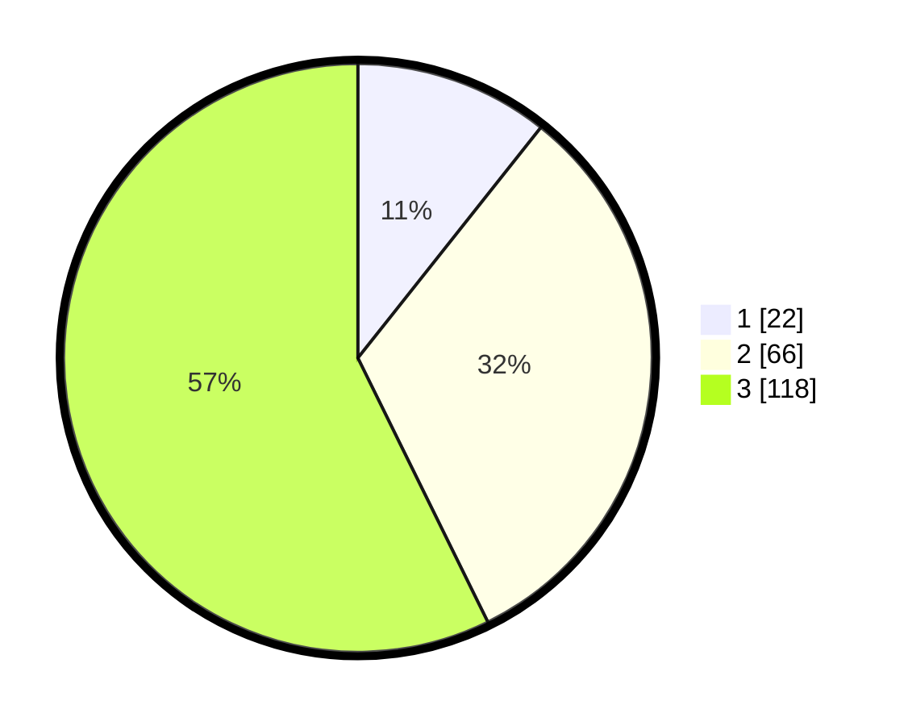

# Hasil

## Grafik

## Tabel

| No. | Nama Paslon    | Suara | Suara (raw) | Persentase |
|:--- |:-------------- | -----:| -----------:| ----------:|
| 1   | ANIES MUHAIMIN | 22    | [22][p-1]   | 10,68      |
| 2   | PRABOWO GIBRAN | 66    | [66][p-2]   | 32,04      |
| 3   | GANJAR MAHFUD  | 118   | [118][p-3]  | 57,28      |

[p-1]: https://github.com/gigit-pemilu/pemilu-2024-35-jawa-timur/blob/main/pilpres/hitung-suara/sub/35-jawa-timur/sub/78-kota-surabaya/sub/08-gubeng/sub/1002-mojo/sub/001-tps/sub/paslon-1.txt
[p-2]: https://github.com/gigit-pemilu/pemilu-2024-35-jawa-timur/blob/main/pilpres/hitung-suara/sub/35-jawa-timur/sub/78-kota-surabaya/sub/08-gubeng/sub/1002-mojo/sub/001-tps/sub/paslon-2.txt
[p-3]: https://github.com/gigit-pemilu/pemilu-2024-35-jawa-timur/blob/main/pilpres/hitung-suara/sub/35-jawa-timur/sub/78-kota-surabaya/sub/08-gubeng/sub/1002-mojo/sub/001-tps/sub/paslon-3.txt

## Foto C Plano

https://sirekap-obj-formc.kpu.go.id/3781/pemilu/ppwp/35/78/08/10/02/3578081002001-20240218-224513--198dbb4d-7060-4492-a5c7-b1f058c98bc6.jpg

https://sirekap-obj-formc.kpu.go.id/3781/pemilu/ppwp/35/78/08/10/02/3578081002001-20240218-224612--4831cf3a-9995-4ca3-bba8-d89502e4e50d.jpg

https://sirekap-obj-formc.kpu.go.id/3781/pemilu/ppwp/35/78/08/10/02/3578081002001-20240218-224733--bd88bf2e-3fb2-4969-bddb-e6fbc2cd461d.jpg

## Metadata

| Key        | Value               |
| ---------- | ------------------- |
| Time Stamp | 2024-02-25 11:00:00 |

