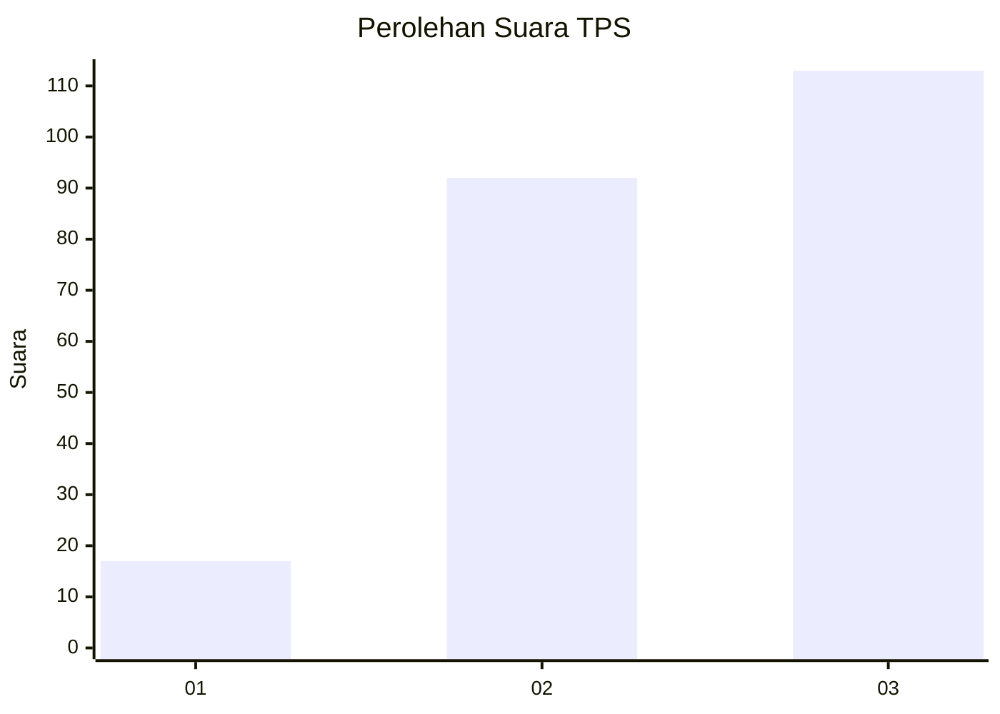
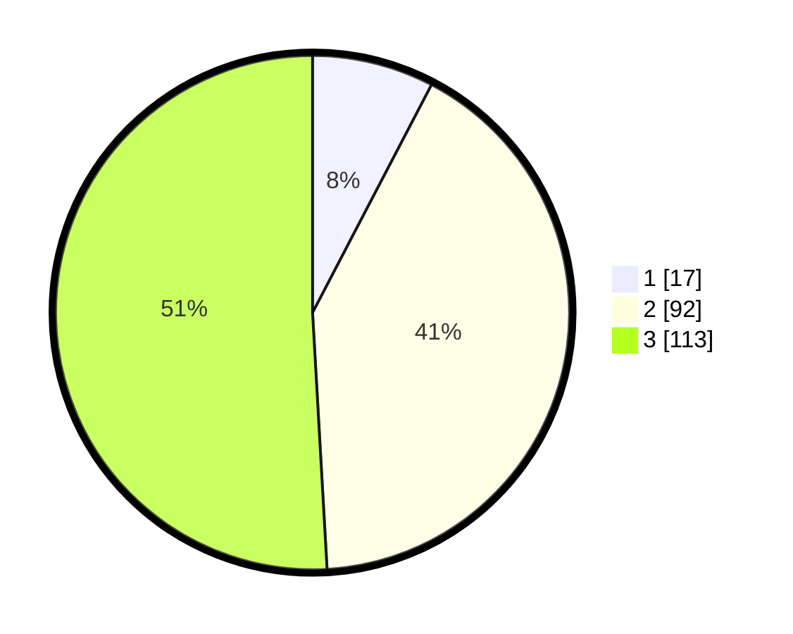

# Hasil

## Grafik

## Tabel

| No. | Nama Paslon    | Suara | Suara (raw) | Persentase |
|:--- |:-------------- | -----:| -----------:| ----------:|
| 1   | ANIES MUHAIMIN | 17    | [17][p-1]   | 7,66       |
| 2   | PRABOWO GIBRAN | 92    | [92][p-2]   | 41,44      |
| 3   | GANJAR MAHFUD  | 113   | [113][p-3]  | 50,90      |

[p-1]: https://github.com/gigit-pemilu/pemilu-2024-35-jawa-timur/blob/main/pilpres/hitung-suara/sub/35-jawa-timur/sub/78-kota-surabaya/sub/08-gubeng/sub/1002-mojo/sub/023-tps/sub/paslon-1.txt
[p-2]: https://github.com/gigit-pemilu/pemilu-2024-35-jawa-timur/blob/main/pilpres/hitung-suara/sub/35-jawa-timur/sub/78-kota-surabaya/sub/08-gubeng/sub/1002-mojo/sub/023-tps/sub/paslon-2.txt
[p-3]: https://github.com/gigit-pemilu/pemilu-2024-35-jawa-timur/blob/main/pilpres/hitung-suara/sub/35-jawa-timur/sub/78-kota-surabaya/sub/08-gubeng/sub/1002-mojo/sub/023-tps/sub/paslon-3.txt

## Foto C Plano

https://sirekap-obj-formc.kpu.go.id/36d8/pemilu/ppwp/35/78/08/10/02/3578081002023-20240219-195847--e8704f57-7c45-4089-a541-dbf5bf1fd1d3.jpg

https://sirekap-obj-formc.kpu.go.id/36d8/pemilu/ppwp/35/78/08/10/02/3578081002023-20240219-200644--ffb41f10-3acc-455f-bdb1-0d5c8771a0d7.jpg

https://sirekap-obj-formc.kpu.go.id/36d8/pemilu/ppwp/35/78/08/10/02/3578081002023-20240219-201006--0fc10966-1011-4c3c-95cc-248689e55c89.jpg

## Metadata

| Key        | Value               |
| ---------- | ------------------- |
| Time Stamp | 2024-02-24 22:31:28 |

