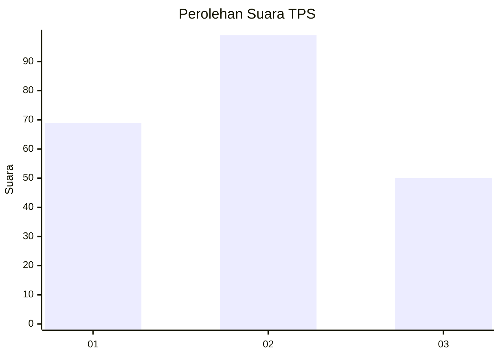
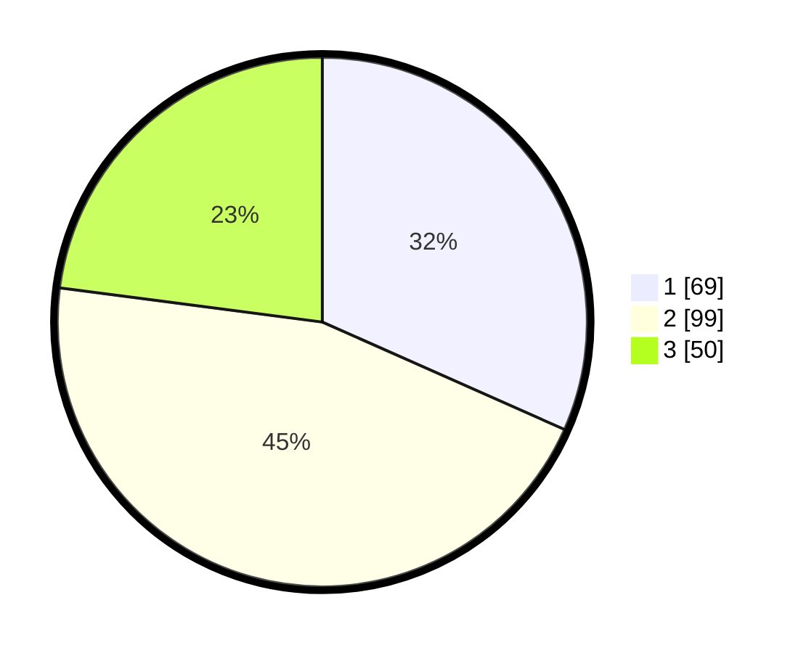

# Hasil

## Grafik

## Tabel

| No. | Nama Paslon    | Suara | Suara (raw) | Persentase |
|:--- |:-------------- | -----:| -----------:| ----------:|
| 1   | ANIES MUHAIMIN | 69    | [69][p-1]   | 31,65      |
| 2   | PRABOWO GIBRAN | 99    | [99][p-2]   | 45,41      |
| 3   | GANJAR MAHFUD  | 50    | [50][p-3]   | 22,94      |

[p-1]: https://github.com/gigit-pemilu/pemilu-2024/blob/main/pilpres/hitung-suara/sub/35-jawa-timur/sub/78-kota-surabaya/sub/08-gubeng/sub/1002-mojo/sub/060-tps/sub/paslon-1.txt
[p-2]: https://github.com/gigit-pemilu/pemilu-2024/blob/main/pilpres/hitung-suara/sub/35-jawa-timur/sub/78-kota-surabaya/sub/08-gubeng/sub/1002-mojo/sub/060-tps/sub/paslon-2.txt
[p-3]: https://github.com/gigit-pemilu/pemilu-2024/blob/main/pilpres/hitung-suara/sub/35-jawa-timur/sub/78-kota-surabaya/sub/08-gubeng/sub/1002-mojo/sub/060-tps/sub/paslon-3.txt

## Foto C Plano

https://sirekap-obj-formc.kpu.go.id/84f8/pemilu/ppwp/35/78/08/10/02/3578081002060-20240218-224355--76c13902-4ae3-4e63-9e30-66f58a61ca09.jpg

https://sirekap-obj-formc.kpu.go.id/84f8/pemilu/ppwp/35/78/08/10/02/3578081002060-20240215-202052--962c45ae-71b8-4ca7-8f0f-312e75b7d74f.jpg

https://sirekap-obj-formc.kpu.go.id/84f8/pemilu/ppwp/35/78/08/10/02/3578081002060-20240215-202449--36d976d4-6a0b-4985-9b1d-90eb3765f470.jpg

## Metadata

| Key        | Value               |
| ---------- | ------------------- |
| Time Stamp | 2024-02-26 12:00:00 |

