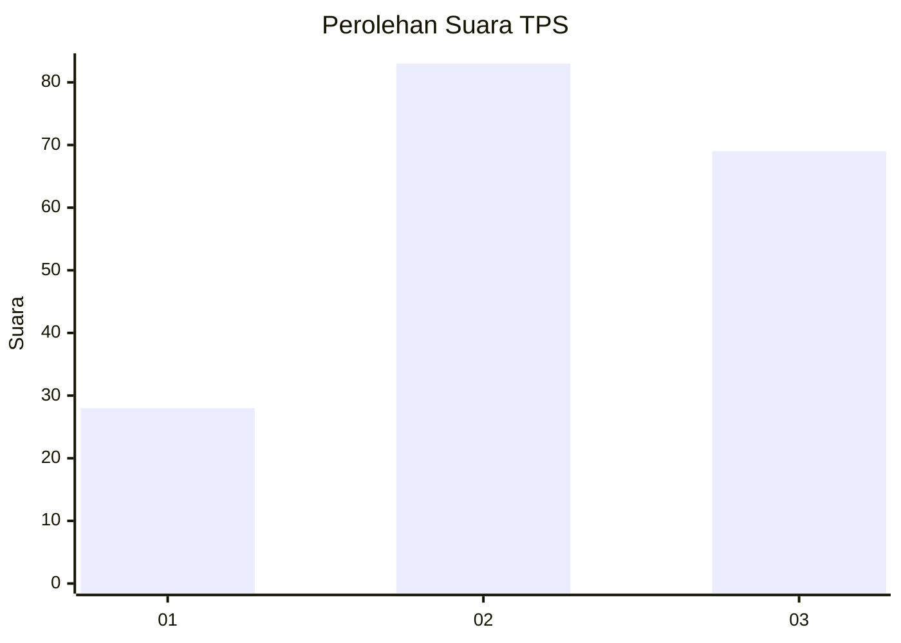
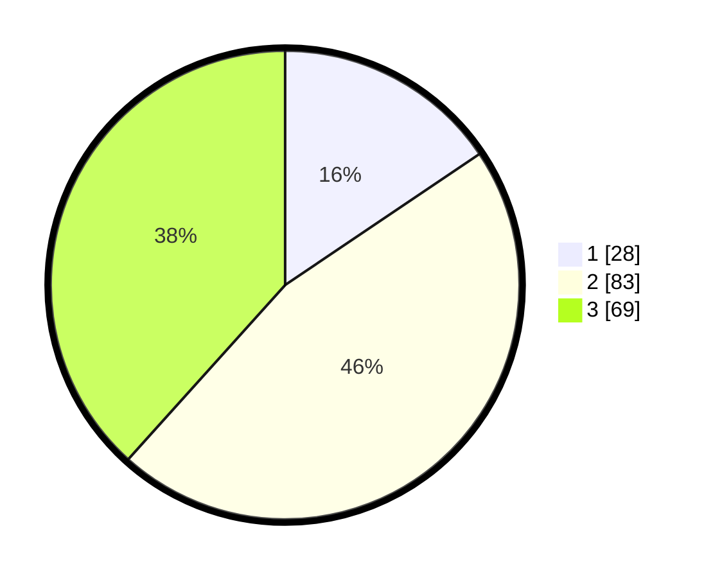

# Hasil

## Grafik

## Tabel

| No. | Nama Paslon    | Suara | Suara (raw) | Persentase |
|:--- |:-------------- | -----:| -----------:| ----------:|
| 1   | ANIES MUHAIMIN | 28    | [28][p-1]   | 15,56      |
| 2   | PRABOWO GIBRAN | 83    | [83][p-2]   | 46,11      |
| 3   | GANJAR MAHFUD  | 69    | [69][p-3]   | 38,33      |

[p-1]: https://github.com/gigit-pemilu/pemilu-2024/blob/main/pilpres/hitung-suara/sub/35-jawa-timur/sub/78-kota-surabaya/sub/08-gubeng/sub/1002-mojo/sub/097-tps/sub/paslon-1.txt
[p-2]: https://github.com/gigit-pemilu/pemilu-2024/blob/main/pilpres/hitung-suara/sub/35-jawa-timur/sub/78-kota-surabaya/sub/08-gubeng/sub/1002-mojo/sub/097-tps/sub/paslon-2.txt
[p-3]: https://github.com/gigit-pemilu/pemilu-2024/blob/main/pilpres/hitung-suara/sub/35-jawa-timur/sub/78-kota-surabaya/sub/08-gubeng/sub/1002-mojo/sub/097-tps/sub/paslon-3.txt

## Foto C Plano

https://sirekap-obj-formc.kpu.go.id/b2c7/pemilu/ppwp/35/78/08/10/02/3578081002097-20240214-232326--fbbd45c6-9b40-4944-9ede-239f46e93938.jpg

https://sirekap-obj-formc.kpu.go.id/b2c7/pemilu/ppwp/35/78/08/10/02/3578081002097-20240214-232648--bc5395ab-bef2-4ce1-8875-adba89d2cd00.jpg

https://sirekap-obj-formc.kpu.go.id/b2c7/pemilu/ppwp/35/78/08/10/02/3578081002097-20240214-232817--cd2de0c4-df30-46b1-ae9d-03e47950b9ef.jpg

## Metadata

| Key        | Value               |
| ---------- | ------------------- |
| Time Stamp | 2024-02-24 22:31:28 |

