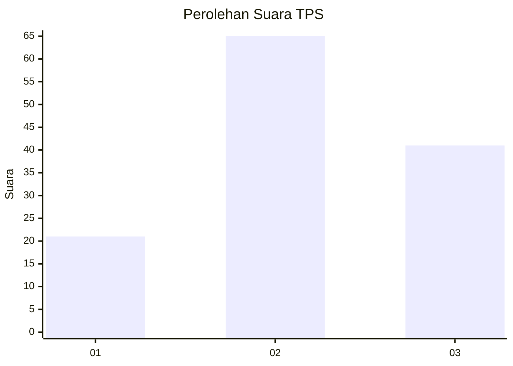
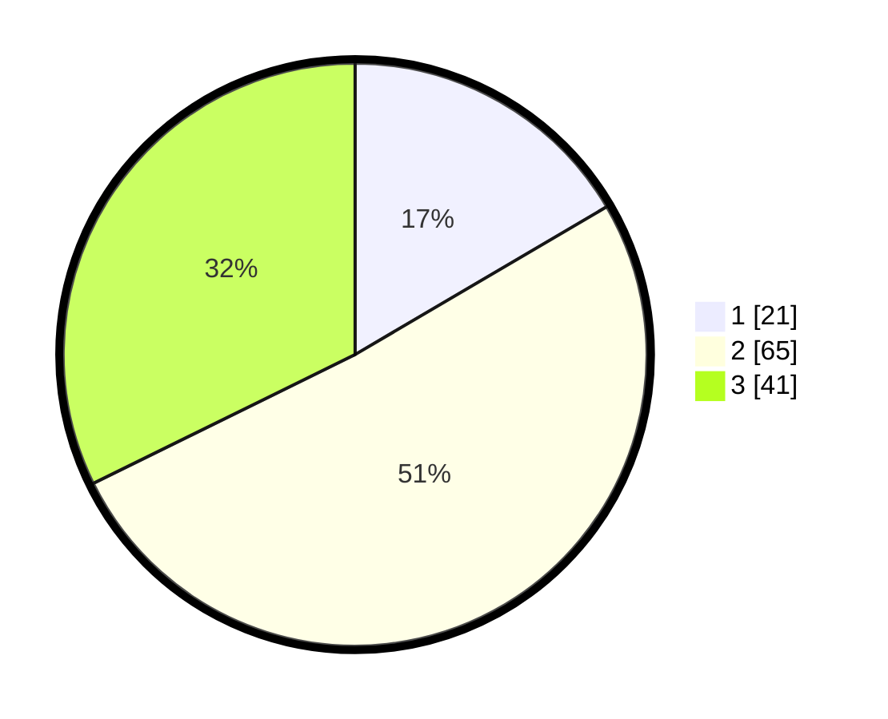

# Hasil

## Grafik

## Tabel

| No. | Nama Paslon    | Suara | Suara (raw) | Persentase |
|:--- |:-------------- | -----:| -----------:| ----------:|
| 1   | ANIES MUHAIMIN | 21    | [21][p-1]   | 16,54      |
| 2   | PRABOWO GIBRAN | 65    | [65][p-2]   | 51,18      |
| 3   | GANJAR MAHFUD  | 41    | [41][p-3]   | 32,28      |

[p-1]: https://github.com/gigit-pemilu/pemilu-2024/blob/main/pilpres/hitung-suara/sub/35-jawa-timur/sub/78-kota-surabaya/sub/08-gubeng/sub/1002-mojo/sub/098-tps/sub/paslon-1.txt
[p-2]: https://github.com/gigit-pemilu/pemilu-2024/blob/main/pilpres/hitung-suara/sub/35-jawa-timur/sub/78-kota-surabaya/sub/08-gubeng/sub/1002-mojo/sub/098-tps/sub/paslon-2.txt
[p-3]: https://github.com/gigit-pemilu/pemilu-2024/blob/main/pilpres/hitung-suara/sub/35-jawa-timur/sub/78-kota-surabaya/sub/08-gubeng/sub/1002-mojo/sub/098-tps/sub/paslon-3.txt

## Foto C Plano

https://sirekap-obj-formc.kpu.go.id/0af6/pemilu/ppwp/35/78/08/10/02/3578081002098-20240214-215915--b49abf8b-6faf-481e-9a23-6298526b9812.jpg

https://sirekap-obj-formc.kpu.go.id/0af6/pemilu/ppwp/35/78/08/10/02/3578081002098-20240214-215959--ca9c0244-e335-4d84-ab77-01882410b131.jpg

https://sirekap-obj-formc.kpu.go.id/0af6/pemilu/ppwp/35/78/08/10/02/3578081002098-20240214-220041--100f18a6-3d8f-41a4-9b58-307f482c2d1c.jpg

## Metadata

| Key        | Value               |
| ---------- | ------------------- |
| Time Stamp | 2024-02-24 22:31:28 |

