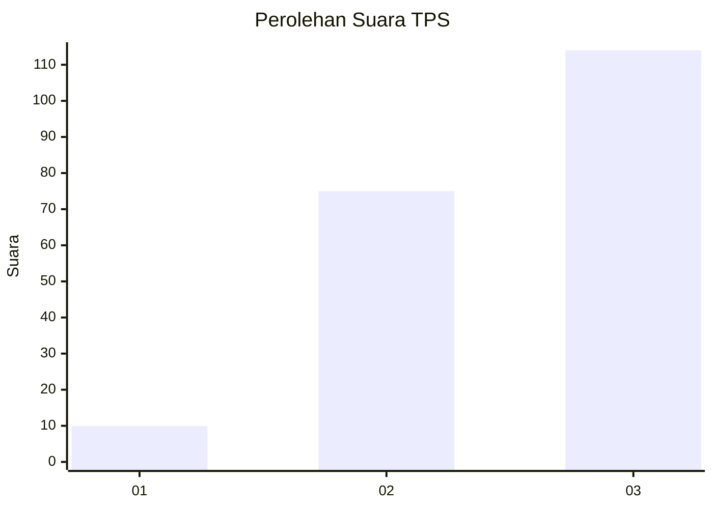
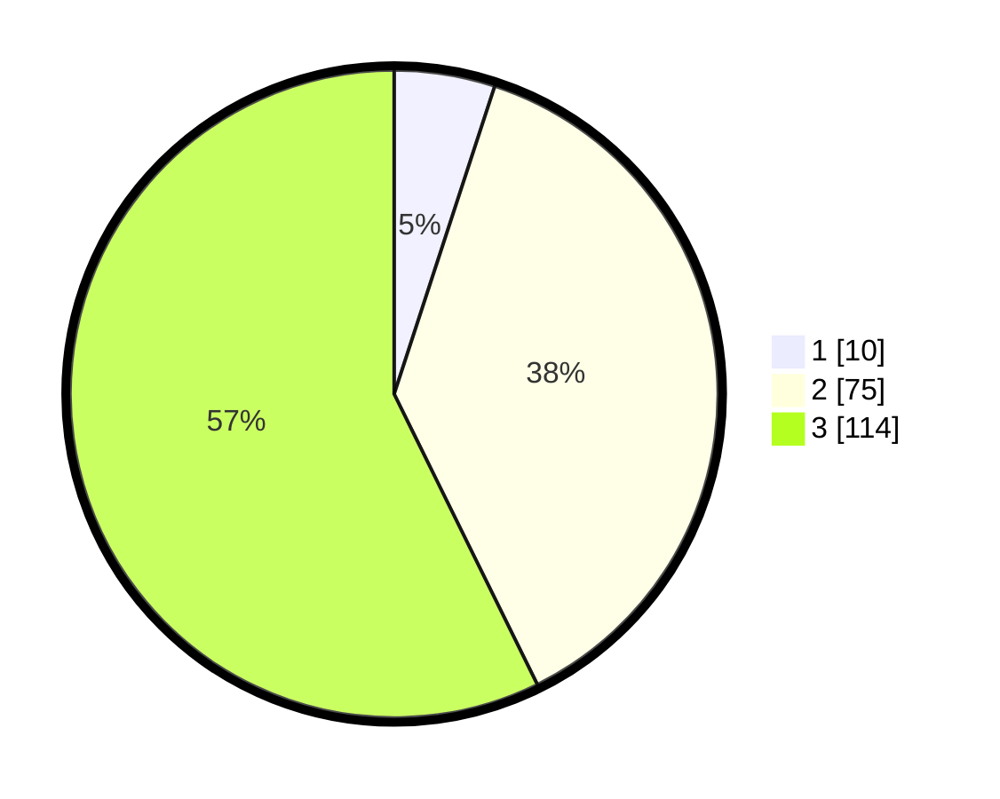

# Hasil

## Grafik

## Tabel

| No. | Nama Paslon    | Suara | Suara (raw) | Persentase |
|:--- |:-------------- | -----:| -----------:| ----------:|
| 1   | ANIES MUHAIMIN | 10    | [10][p-1]   | 5,03       |
| 2   | PRABOWO GIBRAN | 75    | [75][p-2]   | 37,69      |
| 3   | GANJAR MAHFUD  | 114   | [114][p-3]  | 57,29      |

[p-1]: https://github.com/gigit-pemilu/pemilu-2024-35-jawa-timur/blob/main/pilpres/hitung-suara/sub/35-jawa-timur/sub/78-kota-surabaya/sub/08-gubeng/sub/1002-mojo/sub/100-tps/sub/paslon-1.txt
[p-2]: https://github.com/gigit-pemilu/pemilu-2024-35-jawa-timur/blob/main/pilpres/hitung-suara/sub/35-jawa-timur/sub/78-kota-surabaya/sub/08-gubeng/sub/1002-mojo/sub/100-tps/sub/paslon-2.txt
[p-3]: https://github.com/gigit-pemilu/pemilu-2024-35-jawa-timur/blob/main/pilpres/hitung-suara/sub/35-jawa-timur/sub/78-kota-surabaya/sub/08-gubeng/sub/1002-mojo/sub/100-tps/sub/paslon-3.txt

## Foto C Plano

https://sirekap-obj-formc.kpu.go.id/6b1d/pemilu/ppwp/35/78/08/10/02/3578081002100-20240215-033250--7b57d185-ee1d-4d4a-954a-68bc253d5d58.jpg

https://sirekap-obj-formc.kpu.go.id/6b1d/pemilu/ppwp/35/78/08/10/02/3578081002100-20240215-033338--ebc89d8a-b9c2-427a-816e-8c190b9764da.jpg

https://sirekap-obj-formc.kpu.go.id/6b1d/pemilu/ppwp/35/78/08/10/02/3578081002100-20240215-033344--caa1741f-e720-4356-9769-cb0ef3e8fb1e.jpg

## Metadata

| Key        | Value               |
| ---------- | ------------------- |
| Time Stamp | 2024-02-24 22:31:28 |

