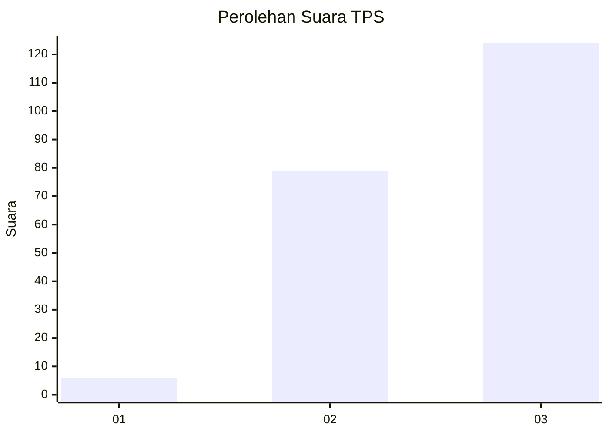
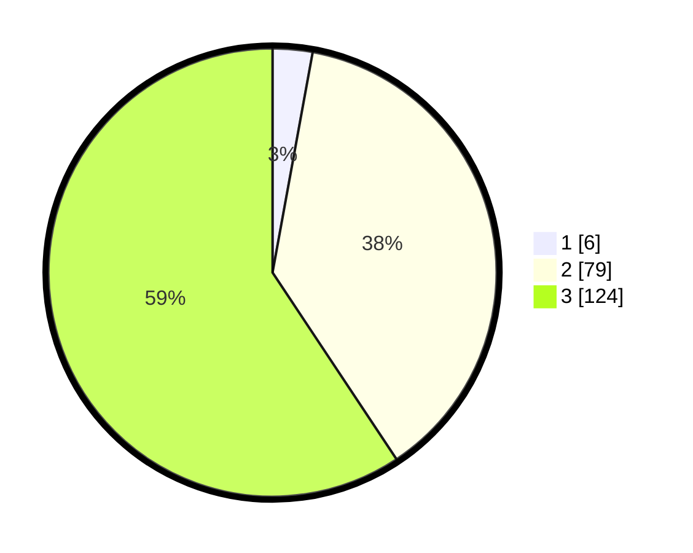

# Hasil

## Grafik

## Tabel

| No. | Nama Paslon    | Suara | Suara (raw) | Persentase |
|:--- |:-------------- | -----:| -----------:| ----------:|
| 1   | ANIES MUHAIMIN | 6     | [6][p-1]    | 2,87       |
| 2   | PRABOWO GIBRAN | 79    | [79][p-2]   | 37,80      |
| 3   | GANJAR MAHFUD  | 124   | [124][p-3]  | 59,33      |

[p-1]: https://github.com/gigit-pemilu/pemilu-2024/blob/main/pilpres/hitung-suara/sub/35-jawa-timur/sub/78-kota-surabaya/sub/08-gubeng/sub/1002-mojo/sub/101-tps/sub/paslon-1.txt
[p-2]: https://github.com/gigit-pemilu/pemilu-2024/blob/main/pilpres/hitung-suara/sub/35-jawa-timur/sub/78-kota-surabaya/sub/08-gubeng/sub/1002-mojo/sub/101-tps/sub/paslon-2.txt
[p-3]: https://github.com/gigit-pemilu/pemilu-2024/blob/main/pilpres/hitung-suara/sub/35-jawa-timur/sub/78-kota-surabaya/sub/08-gubeng/sub/1002-mojo/sub/101-tps/sub/paslon-3.txt

## Foto C Plano

https://sirekap-obj-formc.kpu.go.id/f6fd/pemilu/ppwp/35/78/08/10/02/3578081002101-20240214-234608--d2b53299-429d-45d8-bc76-2e2b0c506618.jpg

https://sirekap-obj-formc.kpu.go.id/f6fd/pemilu/ppwp/35/78/08/10/02/3578081002101-20240214-234610--4e8d1522-c9b3-497f-b286-2b4dcdc3dd9e.jpg

https://sirekap-obj-formc.kpu.go.id/f6fd/pemilu/ppwp/35/78/08/10/02/3578081002101-20240214-234614--9f2c5adb-29c7-46df-9f1c-e8dd034bdff7.jpg

## Metadata

| Key        | Value               |
| ---------- | ------------------- |
| Time Stamp | 2024-02-24 22:31:28 |

