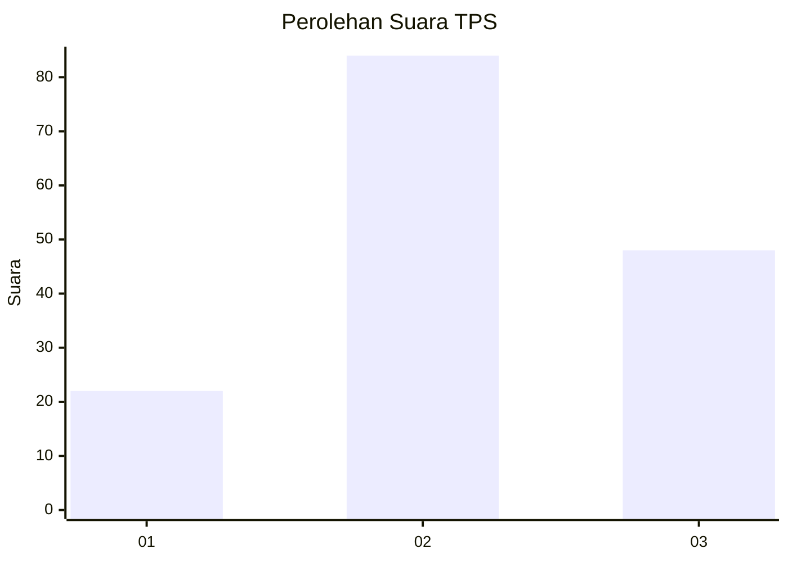
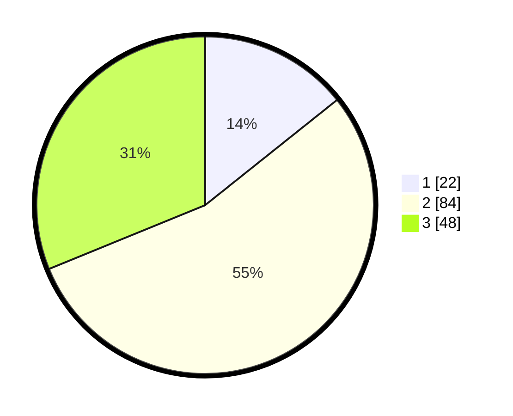

# Hasil

## Grafik

## Tabel

| No. | Nama Paslon    | Suara | Suara (raw) | Persentase |
|:--- |:-------------- | -----:| -----------:| ----------:|
| 1   | ANIES MUHAIMIN | 22    | [22][p-1]   | 14,29      |
| 2   | PRABOWO GIBRAN | 84    | [84][p-2]   | 54,55      |
| 3   | GANJAR MAHFUD  | 48    | [48][p-3]   | 31,17      |

[p-1]: https://github.com/gigit-pemilu/pemilu-2024-35-jawa-timur/blob/main/pilpres/hitung-suara/sub/35-jawa-timur/sub/78-kota-surabaya/sub/08-gubeng/sub/1002-mojo/sub/110-tps/sub/paslon-1.txt
[p-2]: https://github.com/gigit-pemilu/pemilu-2024-35-jawa-timur/blob/main/pilpres/hitung-suara/sub/35-jawa-timur/sub/78-kota-surabaya/sub/08-gubeng/sub/1002-mojo/sub/110-tps/sub/paslon-2.txt
[p-3]: https://github.com/gigit-pemilu/pemilu-2024-35-jawa-timur/blob/main/pilpres/hitung-suara/sub/35-jawa-timur/sub/78-kota-surabaya/sub/08-gubeng/sub/1002-mojo/sub/110-tps/sub/paslon-3.txt

## Foto C Plano

https://sirekap-obj-formc.kpu.go.id/5516/pemilu/ppwp/35/78/08/10/02/3578081002110-20240214-191059--c1874d96-62ec-4107-85fb-3a046c55f63f.jpg

https://sirekap-obj-formc.kpu.go.id/5516/pemilu/ppwp/35/78/08/10/02/3578081002110-20240214-191404--ca898ce3-c2e0-4a7f-8895-dcf447646c5c.jpg

https://sirekap-obj-formc.kpu.go.id/5516/pemilu/ppwp/35/78/08/10/02/3578081002110-20240214-191451--de424975-3da1-476d-a0f7-1e45d121a395.jpg

## Metadata

| Key        | Value               |
| ---------- | ------------------- |
| Time Stamp | 2024-02-24 22:31:28 |

