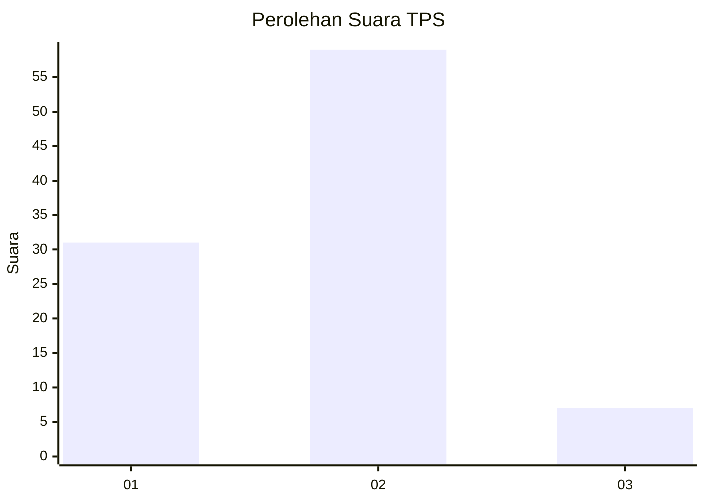
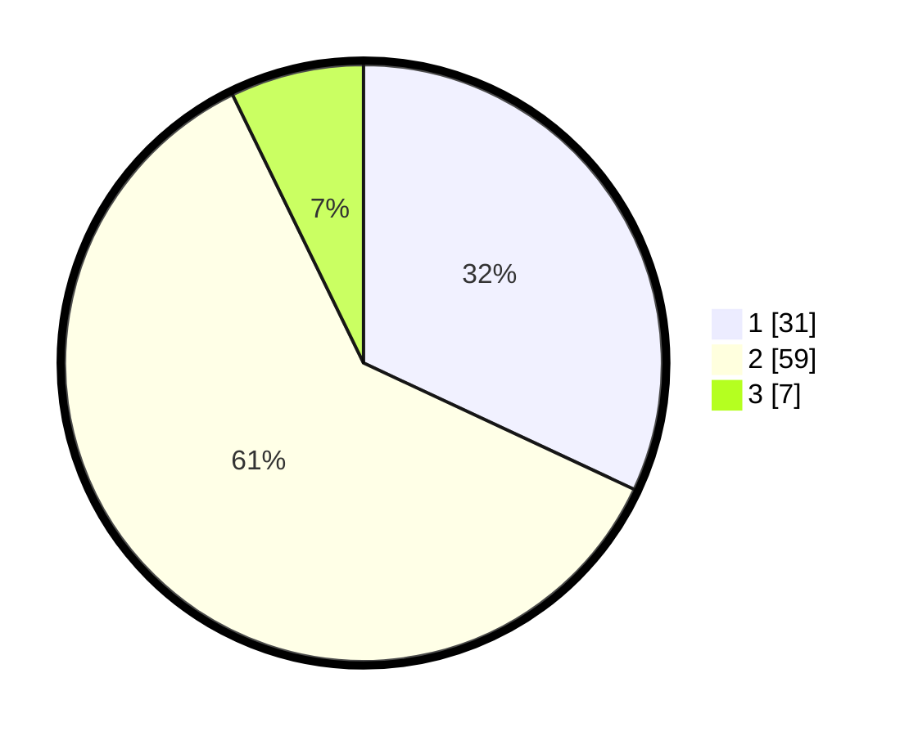

# Hasil

## Grafik

## Tabel

| No. | Nama Paslon    | Suara | Suara (raw) | Persentase |
|:--- |:-------------- | -----:| -----------:| ----------:|
| 1   | ANIES MUHAIMIN | 31    | [31][p-1]   | 31,96      |
| 2   | PRABOWO GIBRAN | 59    | [59][p-2]   | 60,82      |
| 3   | GANJAR MAHFUD  | 7     | [7][p-3]    | 7,22       |

[p-1]: https://github.com/gigit-pemilu/pemilu-2024/blob/main/pilpres/hitung-suara/sub/35-jawa-timur/sub/78-kota-surabaya/sub/08-gubeng/sub/1002-mojo/sub/129-tps/sub/paslon-1.txt
[p-2]: https://github.com/gigit-pemilu/pemilu-2024/blob/main/pilpres/hitung-suara/sub/35-jawa-timur/sub/78-kota-surabaya/sub/08-gubeng/sub/1002-mojo/sub/129-tps/sub/paslon-2.txt
[p-3]: https://github.com/gigit-pemilu/pemilu-2024/blob/main/pilpres/hitung-suara/sub/35-jawa-timur/sub/78-kota-surabaya/sub/08-gubeng/sub/1002-mojo/sub/129-tps/sub/paslon-3.txt

## Foto C Plano

https://sirekap-obj-formc.kpu.go.id/906c/pemilu/ppwp/35/78/08/10/02/3578081002129-20240219-121528--185277af-ce00-4098-9d31-2d30e78d6789.jpg

https://sirekap-obj-formc.kpu.go.id/906c/pemilu/ppwp/35/78/08/10/02/3578081002129-20240219-121618--af009911-5608-4665-aaa9-778081f49a91.jpg

https://sirekap-obj-formc.kpu.go.id/906c/pemilu/ppwp/35/78/08/10/02/3578081002129-20240214-211251--bb53ca5f-7bcc-4c61-94cf-2ef8465954a7.jpg

## Metadata

| Key        | Value               |
| ---------- | ------------------- |
| Time Stamp | 2024-02-25 16:00:00 |

