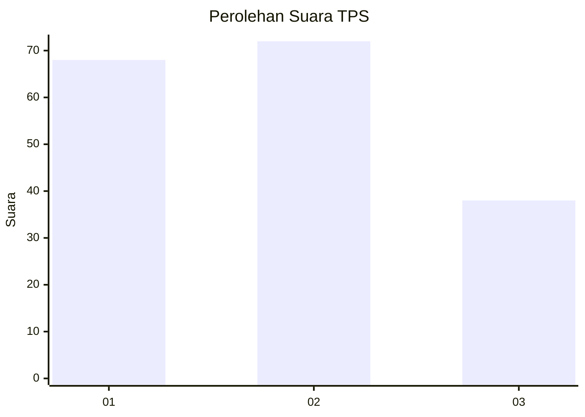
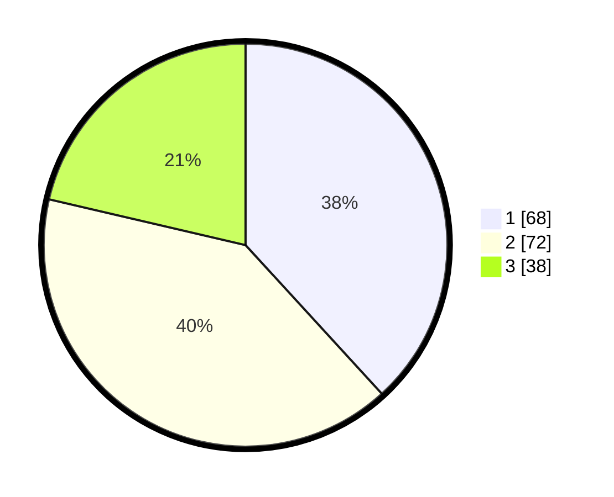

# Hasil

## Grafik

## Tabel

| No. | Nama Paslon    | Suara | Suara (raw) | Persentase |
|:--- |:-------------- | -----:| -----------:| ----------:|
| 1   | ANIES MUHAIMIN | 68    | [68][p-1]   | 38,20      |
| 2   | PRABOWO GIBRAN | 72    | [72][p-2]   | 40,45      |
| 3   | GANJAR MAHFUD  | 38    | [38][p-3]   | 21,35      |

[p-1]: https://github.com/gigit-pemilu/pemilu-2024/blob/main/pilpres/hitung-suara/sub/35-jawa-timur/sub/78-kota-surabaya/sub/08-gubeng/sub/1003-airlangga/sub/012-tps/sub/paslon-1.txt
[p-2]: https://github.com/gigit-pemilu/pemilu-2024/blob/main/pilpres/hitung-suara/sub/35-jawa-timur/sub/78-kota-surabaya/sub/08-gubeng/sub/1003-airlangga/sub/012-tps/sub/paslon-2.txt
[p-3]: https://github.com/gigit-pemilu/pemilu-2024/blob/main/pilpres/hitung-suara/sub/35-jawa-timur/sub/78-kota-surabaya/sub/08-gubeng/sub/1003-airlangga/sub/012-tps/sub/paslon-3.txt

## Foto C Plano

https://sirekap-obj-formc.kpu.go.id/fcb9/pemilu/ppwp/35/78/08/10/03/3578081003012-20240219-132333--5609b5be-a69e-42c1-a50c-95df3001cdc0.jpg

https://sirekap-obj-formc.kpu.go.id/fcb9/pemilu/ppwp/35/78/08/10/03/3578081003012-20240219-132535--561da64d-f23c-4f52-8198-b2feed088690.jpg

https://sirekap-obj-formc.kpu.go.id/fcb9/pemilu/ppwp/35/78/08/10/03/3578081003012-20240214-231126--86da86f2-d0bd-49b6-a524-a60468720d41.jpg

## Metadata

| Key        | Value               |
| ---------- | ------------------- |
| Time Stamp | 2024-02-25 15:00:00 |

