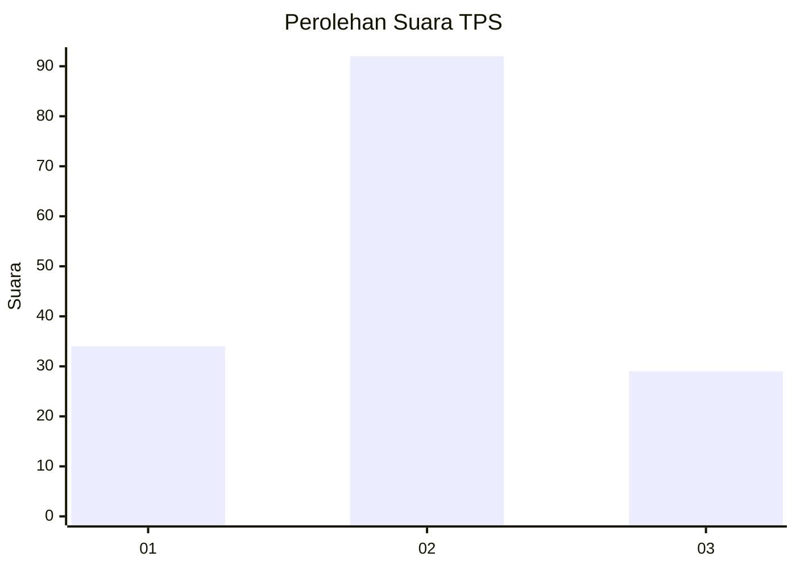
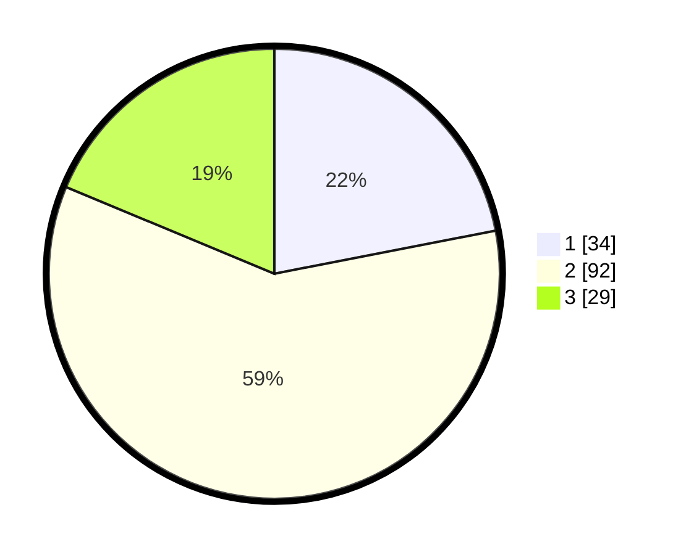

# Hasil

## Grafik

## Tabel

| No. | Nama Paslon    | Suara | Suara (raw) | Persentase |
|:--- |:-------------- | -----:| -----------:| ----------:|
| 1   | ANIES MUHAIMIN | 34    | [34][p-1]   | 21,94      |
| 2   | PRABOWO GIBRAN | 92    | [92][p-2]   | 59,35      |
| 3   | GANJAR MAHFUD  | 29    | [29][p-3]   | 18,71      |

[p-1]: https://github.com/gigit-pemilu/pemilu-2024/blob/main/pilpres/hitung-suara/sub/35-jawa-timur/sub/78-kota-surabaya/sub/08-gubeng/sub/1004-kertajaya/sub/022-tps/sub/paslon-1.txt
[p-2]: https://github.com/gigit-pemilu/pemilu-2024/blob/main/pilpres/hitung-suara/sub/35-jawa-timur/sub/78-kota-surabaya/sub/08-gubeng/sub/1004-kertajaya/sub/022-tps/sub/paslon-2.txt
[p-3]: https://github.com/gigit-pemilu/pemilu-2024/blob/main/pilpres/hitung-suara/sub/35-jawa-timur/sub/78-kota-surabaya/sub/08-gubeng/sub/1004-kertajaya/sub/022-tps/sub/paslon-3.txt

## Foto C Plano

https://sirekap-obj-formc.kpu.go.id/ad74/pemilu/ppwp/35/78/08/10/04/3578081004022-20240215-001701--dafea66d-d8c5-44a4-972b-d90cf2939937.jpg

https://sirekap-obj-formc.kpu.go.id/ad74/pemilu/ppwp/35/78/08/10/04/3578081004022-20240215-001834--34186b8f-90f1-452a-823e-d117863393c7.jpg

https://sirekap-obj-formc.kpu.go.id/ad74/pemilu/ppwp/35/78/08/10/04/3578081004022-20240215-001951--a3bd2e29-d470-4e05-b959-30bf5170502a.jpg

## Metadata

| Key        | Value               |
| ---------- | ------------------- |
| Time Stamp | 2024-02-24 22:31:28 |

