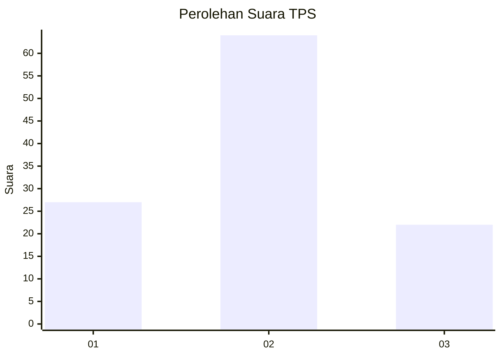
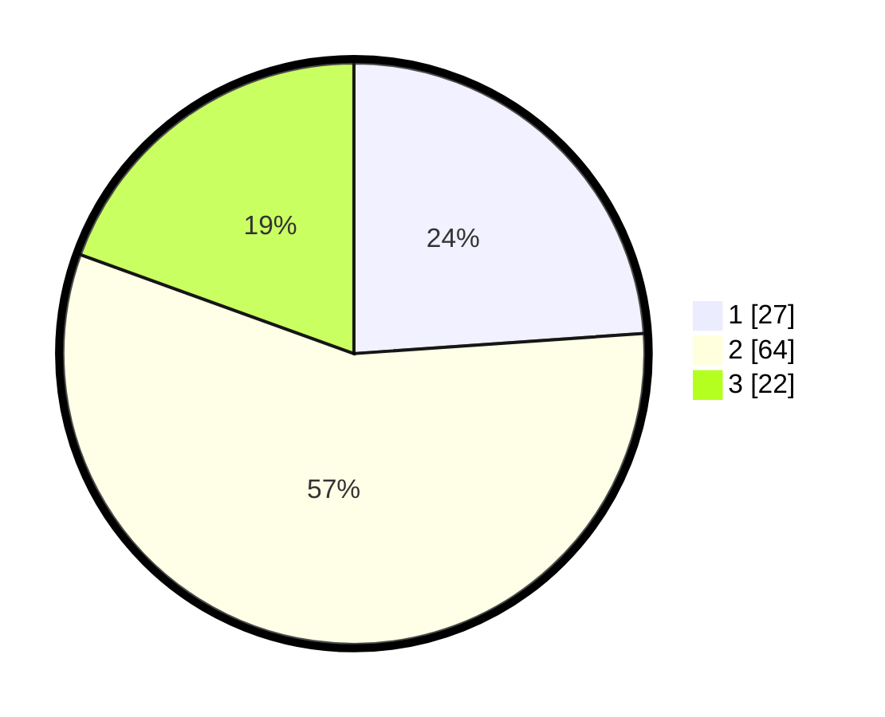

# Hasil

## Grafik

## Tabel

| No. | Nama Paslon    | Suara | Suara (raw) | Persentase |
|:--- |:-------------- | -----:| -----------:| ----------:|
| 1   | ANIES MUHAIMIN | 27    | [27][p-1]   | 23,89      |
| 2   | PRABOWO GIBRAN | 64    | [64][p-2]   | 56,64      |
| 3   | GANJAR MAHFUD  | 22    | [22][p-3]   | 19,47      |

[p-1]: https://github.com/gigit-pemilu/pemilu-2024/blob/main/pilpres/hitung-suara/sub/35-jawa-timur/sub/78-kota-surabaya/sub/08-gubeng/sub/1004-kertajaya/sub/042-tps/sub/paslon-1.txt
[p-2]: https://github.com/gigit-pemilu/pemilu-2024/blob/main/pilpres/hitung-suara/sub/35-jawa-timur/sub/78-kota-surabaya/sub/08-gubeng/sub/1004-kertajaya/sub/042-tps/sub/paslon-2.txt
[p-3]: https://github.com/gigit-pemilu/pemilu-2024/blob/main/pilpres/hitung-suara/sub/35-jawa-timur/sub/78-kota-surabaya/sub/08-gubeng/sub/1004-kertajaya/sub/042-tps/sub/paslon-3.txt

## Foto C Plano

https://sirekap-obj-formc.kpu.go.id/ca88/pemilu/ppwp/35/78/08/10/04/3578081004042-20240215-003248--f25ff906-4f7a-40f1-a29b-93d2427f7255.jpg

https://sirekap-obj-formc.kpu.go.id/ca88/pemilu/ppwp/35/78/08/10/04/3578081004042-20240215-003331--853ae06a-ee07-4dcf-a717-0a64fbf83cab.jpg

https://sirekap-obj-formc.kpu.go.id/ca88/pemilu/ppwp/35/78/08/10/04/3578081004042-20240215-003223--5ceab107-1903-4d02-b32b-ed78608b47cf.jpg

## Metadata

| Key        | Value               |
| ---------- | ------------------- |
| Time Stamp | 2024-03-01 22:00:00 |

