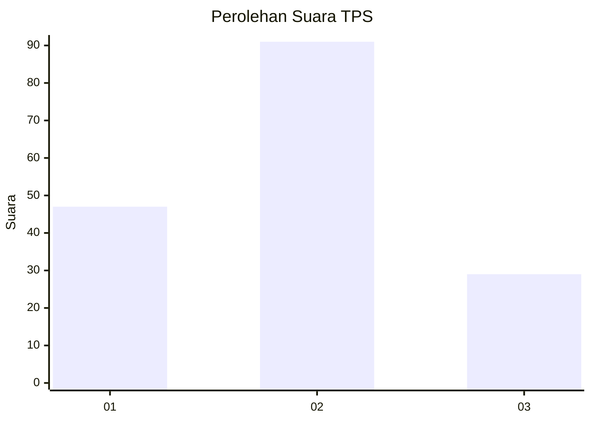
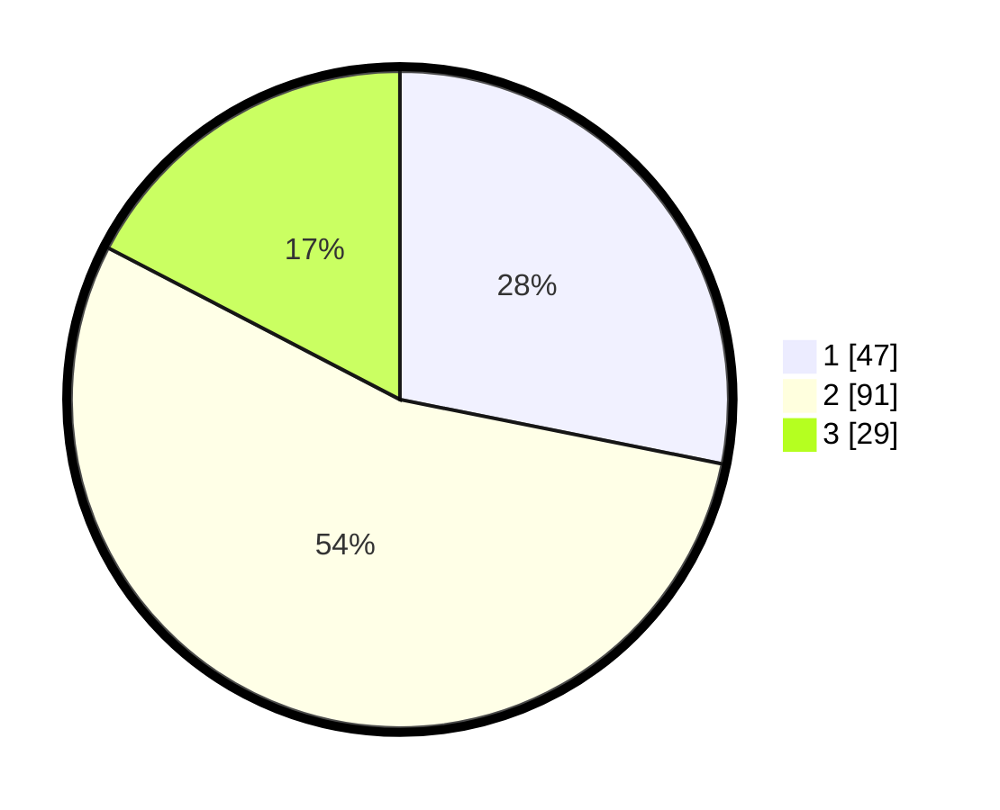

# Hasil

## Grafik

## Tabel

| No. | Nama Paslon    | Suara | Suara (raw) | Persentase |
|:--- |:-------------- | -----:| -----------:| ----------:|
| 1   | ANIES MUHAIMIN | 47    | [47][p-1]   | 28,14      |
| 2   | PRABOWO GIBRAN | 91    | [91][p-2]   | 54,49      |
| 3   | GANJAR MAHFUD  | 29    | [29][p-3]   | 17,37      |

[p-1]: https://github.com/gigit-pemilu/pemilu-2024/blob/main/pilpres/hitung-suara/sub/35-jawa-timur/sub/78-kota-surabaya/sub/08-gubeng/sub/1004-kertajaya/sub/049-tps/sub/paslon-1.txt
[p-2]: https://github.com/gigit-pemilu/pemilu-2024/blob/main/pilpres/hitung-suara/sub/35-jawa-timur/sub/78-kota-surabaya/sub/08-gubeng/sub/1004-kertajaya/sub/049-tps/sub/paslon-2.txt
[p-3]: https://github.com/gigit-pemilu/pemilu-2024/blob/main/pilpres/hitung-suara/sub/35-jawa-timur/sub/78-kota-surabaya/sub/08-gubeng/sub/1004-kertajaya/sub/049-tps/sub/paslon-3.txt

## Foto C Plano

https://sirekap-obj-formc.kpu.go.id/cd48/pemilu/ppwp/35/78/08/10/04/3578081004049-20240214-200243--abfa689e-39d8-413e-8146-75525d26d108.jpg

https://sirekap-obj-formc.kpu.go.id/cd48/pemilu/ppwp/35/78/08/10/04/3578081004049-20240214-200254--2dc6bc28-30e3-45c9-b8b2-25cb1fe8598f.jpg

https://sirekap-obj-formc.kpu.go.id/cd48/pemilu/ppwp/35/78/08/10/04/3578081004049-20240214-200314--92274134-5af7-4bd3-996f-dda3768bb3ac.jpg

## Metadata

| Key        | Value               |
| ---------- | ------------------- |
| Time Stamp | 2024-02-25 15:00:00 |

