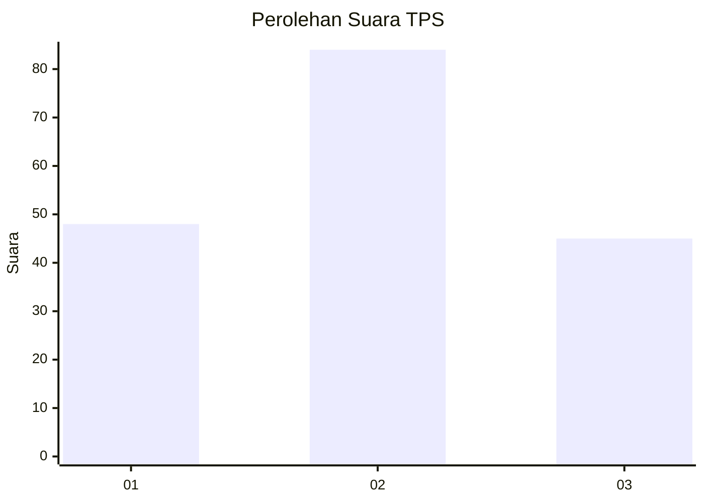
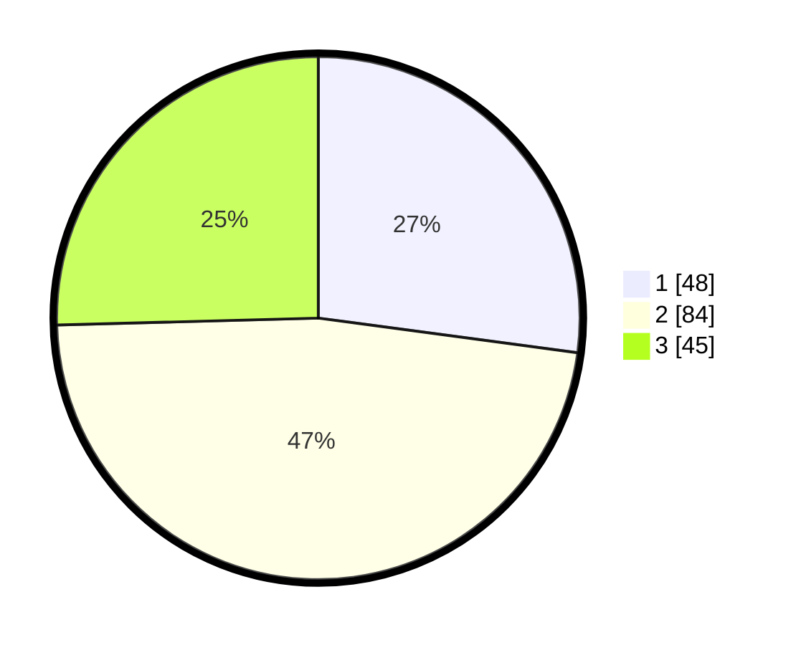

# Hasil

## Grafik

## Tabel

| No. | Nama Paslon    | Suara | Suara (raw) | Persentase |
|:--- |:-------------- | -----:| -----------:| ----------:|
| 1   | ANIES MUHAIMIN | 48    | [48][p-1]   | 27,12      |
| 2   | PRABOWO GIBRAN | 84    | [84][p-2]   | 47,46      |
| 3   | GANJAR MAHFUD  | 45    | [45][p-3]   | 25,42      |

[p-1]: https://github.com/gigit-pemilu/pemilu-2024/blob/main/pilpres/hitung-suara/sub/35-jawa-timur/sub/78-kota-surabaya/sub/08-gubeng/sub/1005-baratajaya/sub/024-tps/sub/paslon-1.txt
[p-2]: https://github.com/gigit-pemilu/pemilu-2024/blob/main/pilpres/hitung-suara/sub/35-jawa-timur/sub/78-kota-surabaya/sub/08-gubeng/sub/1005-baratajaya/sub/024-tps/sub/paslon-2.txt
[p-3]: https://github.com/gigit-pemilu/pemilu-2024/blob/main/pilpres/hitung-suara/sub/35-jawa-timur/sub/78-kota-surabaya/sub/08-gubeng/sub/1005-baratajaya/sub/024-tps/sub/paslon-3.txt

## Foto C Plano

https://sirekap-obj-formc.kpu.go.id/85b2/pemilu/ppwp/35/78/08/10/05/3578081005024-20240219-163320--8d548e9c-7c79-470a-8ce1-2259bb78894a.jpg

https://sirekap-obj-formc.kpu.go.id/85b2/pemilu/ppwp/35/78/08/10/05/3578081005024-20240219-162809--80ce38e3-b0bc-4f58-b87e-88e7dfa79d0a.jpg

https://sirekap-obj-formc.kpu.go.id/85b2/pemilu/ppwp/35/78/08/10/05/3578081005024-20240219-162905--aee199eb-93ff-4927-a907-cbe23f89f6dc.jpg

## Metadata

| Key        | Value               |
| ---------- | ------------------- |
| Time Stamp | 2024-02-25 17:00:00 |

