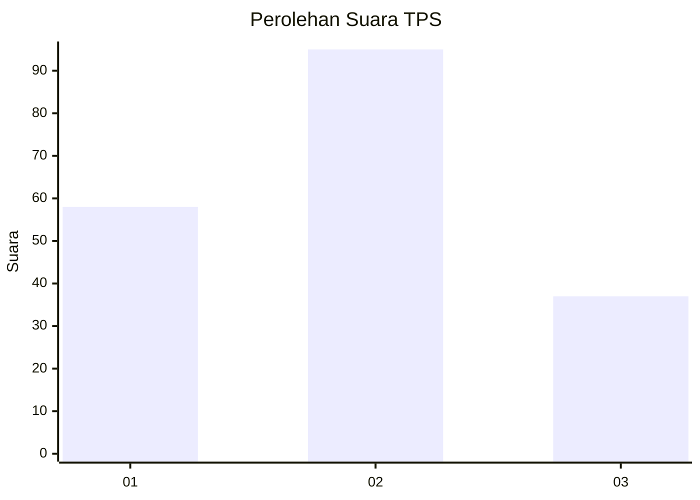
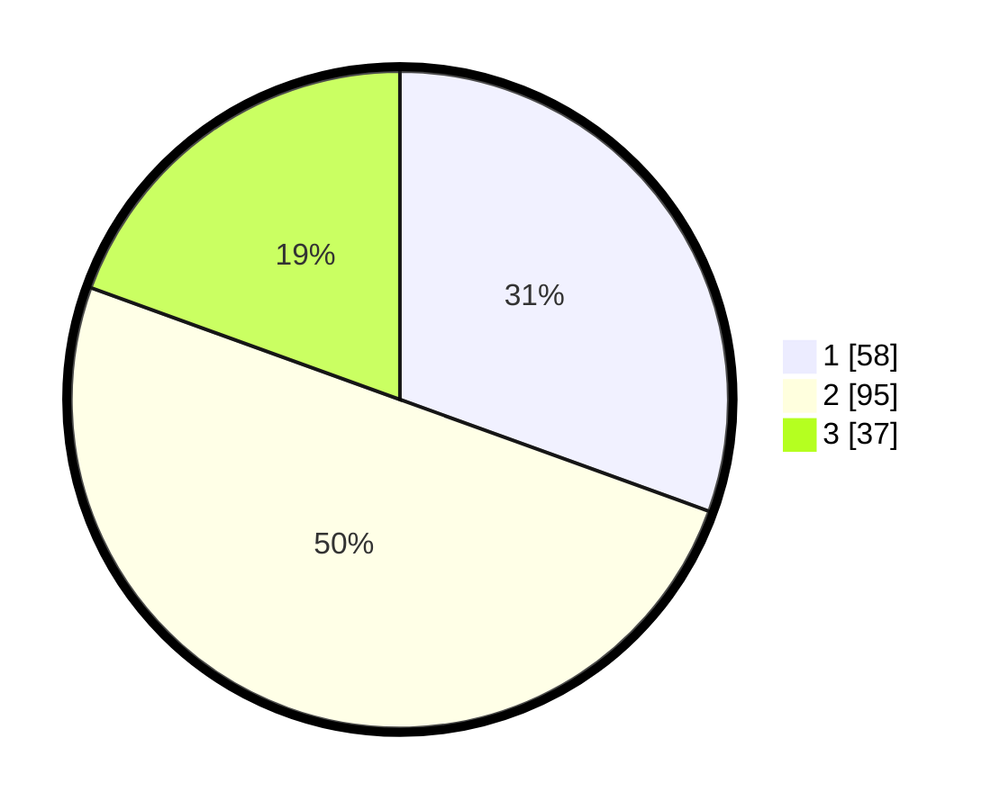

# Hasil

## Grafik

## Tabel

| No. | Nama Paslon    | Suara | Suara (raw) | Persentase |
|:--- |:-------------- | -----:| -----------:| ----------:|
| 1   | ANIES MUHAIMIN | 58    | [58][p-1]   | 30,53      |
| 2   | PRABOWO GIBRAN | 95    | [95][p-2]   | 50,00      |
| 3   | GANJAR MAHFUD  | 37    | [37][p-3]   | 19,47      |

[p-1]: https://github.com/gigit-pemilu/pemilu-2024-35-jawa-timur/blob/main/pilpres/hitung-suara/sub/35-jawa-timur/sub/78-kota-surabaya/sub/08-gubeng/sub/1005-baratajaya/sub/026-tps/sub/paslon-1.txt
[p-2]: https://github.com/gigit-pemilu/pemilu-2024-35-jawa-timur/blob/main/pilpres/hitung-suara/sub/35-jawa-timur/sub/78-kota-surabaya/sub/08-gubeng/sub/1005-baratajaya/sub/026-tps/sub/paslon-2.txt
[p-3]: https://github.com/gigit-pemilu/pemilu-2024-35-jawa-timur/blob/main/pilpres/hitung-suara/sub/35-jawa-timur/sub/78-kota-surabaya/sub/08-gubeng/sub/1005-baratajaya/sub/026-tps/sub/paslon-3.txt

## Foto C Plano

https://sirekap-obj-formc.kpu.go.id/fdef/pemilu/ppwp/35/78/08/10/05/3578081005026-20240214-210605--4f488dcc-23f8-4a38-ab3c-d74f4ce04d0a.jpg

https://sirekap-obj-formc.kpu.go.id/fdef/pemilu/ppwp/35/78/08/10/05/3578081005026-20240214-203047--04cd93c8-4a54-47e8-a923-7d123c4f96fe.jpg

https://sirekap-obj-formc.kpu.go.id/fdef/pemilu/ppwp/35/78/08/10/05/3578081005026-20240214-203156--12469795-6a94-483b-8173-d84a9efd2e52.jpg

## Metadata

| Key        | Value               |
| ---------- | ------------------- |
| Time Stamp | 2024-02-15 12:00:28 |

