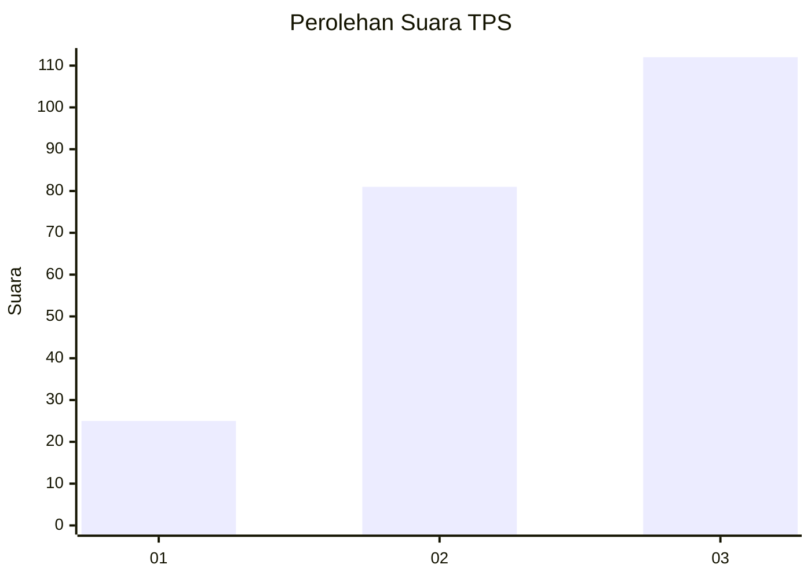
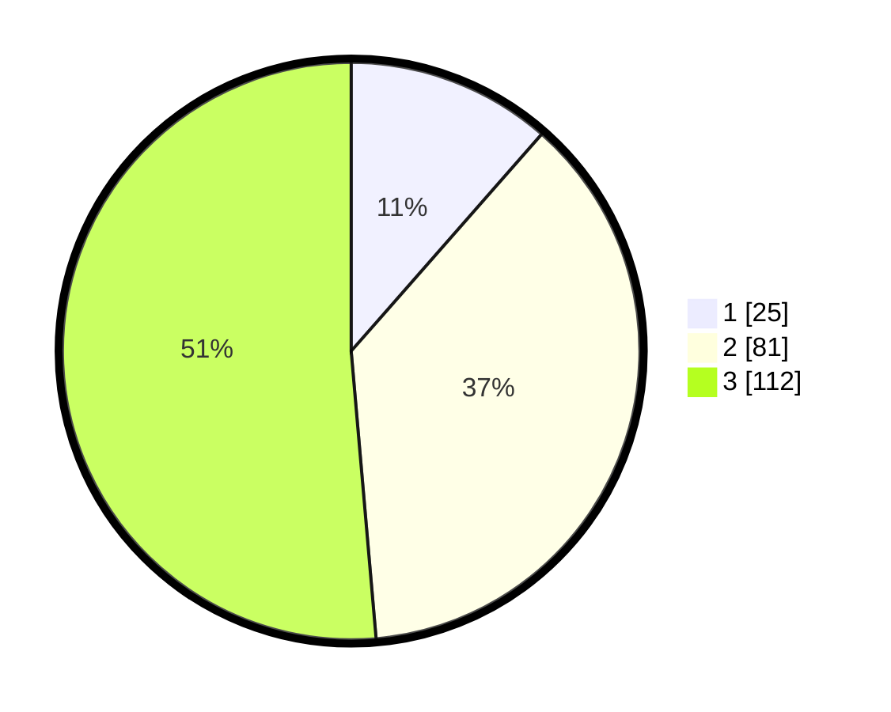

# Hasil

## Grafik

## Tabel

| No. | Nama Paslon    | Suara | Suara (raw) | Persentase |
|:--- |:-------------- | -----:| -----------:| ----------:|
| 1   | ANIES MUHAIMIN | 25    | [25][p-1]   | 11,47      |
| 2   | PRABOWO GIBRAN | 81    | [81][p-2]   | 37,16      |
| 3   | GANJAR MAHFUD  | 112   | [112][p-3]  | 51,38      |

[p-1]: https://github.com/gigit-pemilu/pemilu-2024-35-jawa-timur/blob/main/pilpres/hitung-suara/sub/35-jawa-timur/sub/78-kota-surabaya/sub/08-gubeng/sub/1006-pucang-sewu/sub/005-tps/sub/paslon-1.txt
[p-2]: https://github.com/gigit-pemilu/pemilu-2024-35-jawa-timur/blob/main/pilpres/hitung-suara/sub/35-jawa-timur/sub/78-kota-surabaya/sub/08-gubeng/sub/1006-pucang-sewu/sub/005-tps/sub/paslon-2.txt
[p-3]: https://github.com/gigit-pemilu/pemilu-2024-35-jawa-timur/blob/main/pilpres/hitung-suara/sub/35-jawa-timur/sub/78-kota-surabaya/sub/08-gubeng/sub/1006-pucang-sewu/sub/005-tps/sub/paslon-3.txt

## Foto C Plano

https://sirekap-obj-formc.kpu.go.id/f2bb/pemilu/ppwp/35/78/08/10/06/3578081006005-20240214-214924--18192d15-257c-453e-a4bb-4f3a9362723a.jpg

https://sirekap-obj-formc.kpu.go.id/f2bb/pemilu/ppwp/35/78/08/10/06/3578081006005-20240214-220530--10cd9638-bf45-4803-afcf-fca94185e4f7.jpg

https://sirekap-obj-formc.kpu.go.id/f2bb/pemilu/ppwp/35/78/08/10/06/3578081006005-20240214-215047--fdd6dbc0-bab4-42e7-a492-af10d9324ef6.jpg

## Metadata

| Key        | Value               |
| ---------- | ------------------- |
| Time Stamp | 2024-02-25 20:00:00 |

