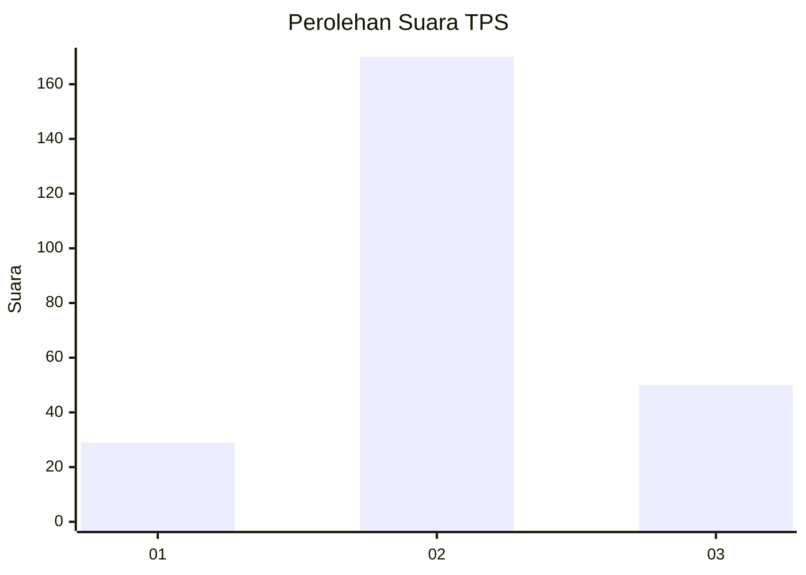
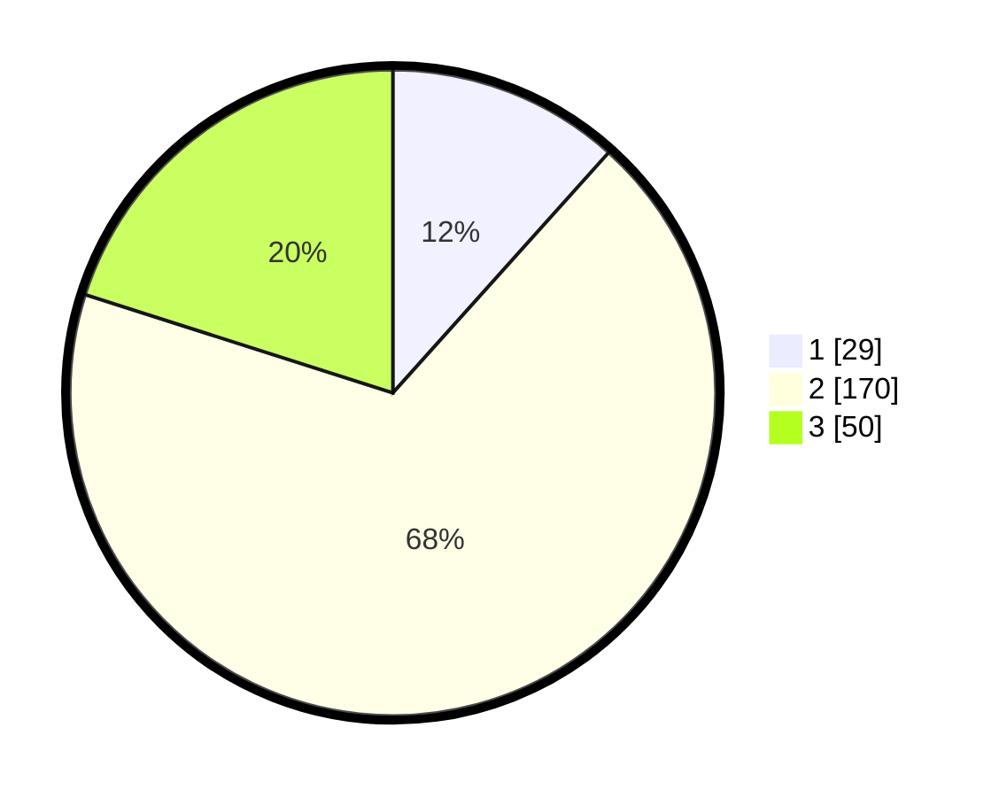

# Hasil

## Grafik

## Tabel

| No. | Nama Paslon    | Suara | Suara (raw) | Persentase |
|:--- |:-------------- | -----:| -----------:| ----------:|
| 1   | ANIES MUHAIMIN | 29    | [29][p-1]   | 11,65      |
| 2   | PRABOWO GIBRAN | 170   | [170][p-2]  | 68,27      |
| 3   | GANJAR MAHFUD  | 50    | [50][p-3]   | 20,08      |

[p-1]: https://github.com/gigit-pemilu/pemilu-2024/blob/main/pilpres/hitung-suara/sub/35-jawa-timur/sub/78-kota-surabaya/sub/09-sukolilo/sub/1001-keputih/sub/005-tps/sub/paslon-1.txt
[p-2]: https://github.com/gigit-pemilu/pemilu-2024/blob/main/pilpres/hitung-suara/sub/35-jawa-timur/sub/78-kota-surabaya/sub/09-sukolilo/sub/1001-keputih/sub/005-tps/sub/paslon-2.txt
[p-3]: https://github.com/gigit-pemilu/pemilu-2024/blob/main/pilpres/hitung-suara/sub/35-jawa-timur/sub/78-kota-surabaya/sub/09-sukolilo/sub/1001-keputih/sub/005-tps/sub/paslon-3.txt

## Foto C Plano

https://sirekap-obj-formc.kpu.go.id/69c9/pemilu/ppwp/35/78/09/10/01/3578091001005-20240215-011814--b5b01b3c-9ada-4198-9f06-3b974352a95b.jpg

https://sirekap-obj-formc.kpu.go.id/69c9/pemilu/ppwp/35/78/09/10/01/3578091001005-20240215-012005--45d048ab-8d4f-42cb-a05c-183df376a93c.jpg

https://sirekap-obj-formc.kpu.go.id/69c9/pemilu/ppwp/35/78/09/10/01/3578091001005-20240215-012121--175f8b49-ccc5-4656-8eb5-3658c8bb972f.jpg

## Metadata

| Key        | Value               |
| ---------- | ------------------- |
| Time Stamp | 2024-02-24 22:31:28 |

