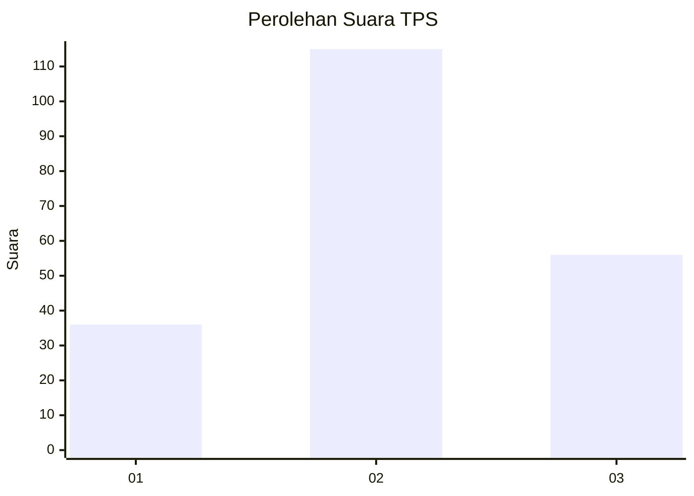
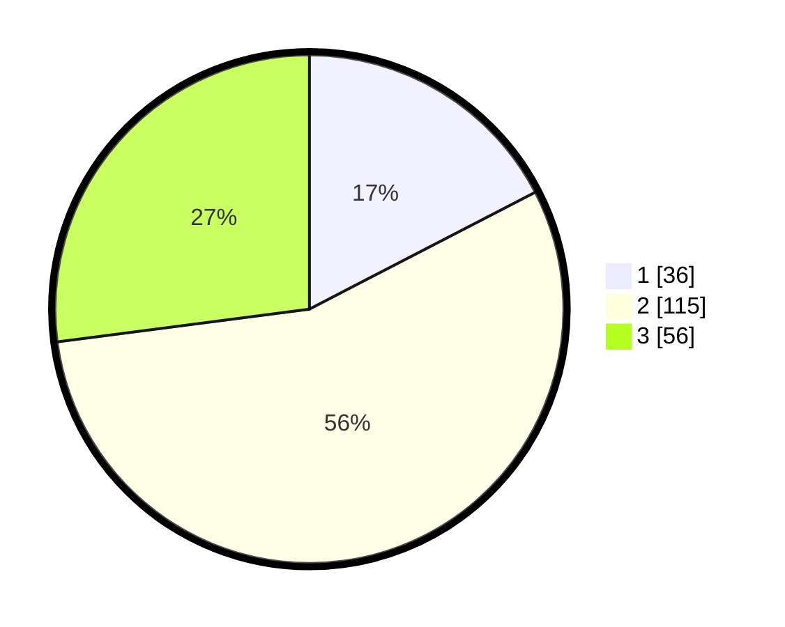

# Hasil

## Grafik

## Tabel

| No. | Nama Paslon    | Suara | Suara (raw) | Persentase |
|:--- |:-------------- | -----:| -----------:| ----------:|
| 1   | ANIES MUHAIMIN | 36    | [36][p-1]   | 17,39      |
| 2   | PRABOWO GIBRAN | 115   | [115][p-2]  | 55,56      |
| 3   | GANJAR MAHFUD  | 56    | [56][p-3]   | 27,05      |

[p-1]: https://github.com/gigit-pemilu/pemilu-2024/blob/main/pilpres/hitung-suara/sub/35-jawa-timur/sub/78-kota-surabaya/sub/09-sukolilo/sub/1001-keputih/sub/006-tps/sub/paslon-1.txt
[p-2]: https://github.com/gigit-pemilu/pemilu-2024/blob/main/pilpres/hitung-suara/sub/35-jawa-timur/sub/78-kota-surabaya/sub/09-sukolilo/sub/1001-keputih/sub/006-tps/sub/paslon-2.txt
[p-3]: https://github.com/gigit-pemilu/pemilu-2024/blob/main/pilpres/hitung-suara/sub/35-jawa-timur/sub/78-kota-surabaya/sub/09-sukolilo/sub/1001-keputih/sub/006-tps/sub/paslon-3.txt

## Foto C Plano

https://sirekap-obj-formc.kpu.go.id/b4f6/pemilu/ppwp/35/78/09/10/01/3578091001006-20240215-021113--32c8c0aa-fee4-4636-b530-186722dc03c3.jpg

https://sirekap-obj-formc.kpu.go.id/b4f6/pemilu/ppwp/35/78/09/10/01/3578091001006-20240215-024829--c1fc250c-9201-4d28-93c7-53ad62b581f6.jpg

https://sirekap-obj-formc.kpu.go.id/b4f6/pemilu/ppwp/35/78/09/10/01/3578091001006-20240215-024942--7fd8fee5-d061-4026-a804-63ce1dd587f0.jpg

## Metadata

| Key        | Value               |
| ---------- | ------------------- |
| Time Stamp | 2024-02-24 22:31:28 |

