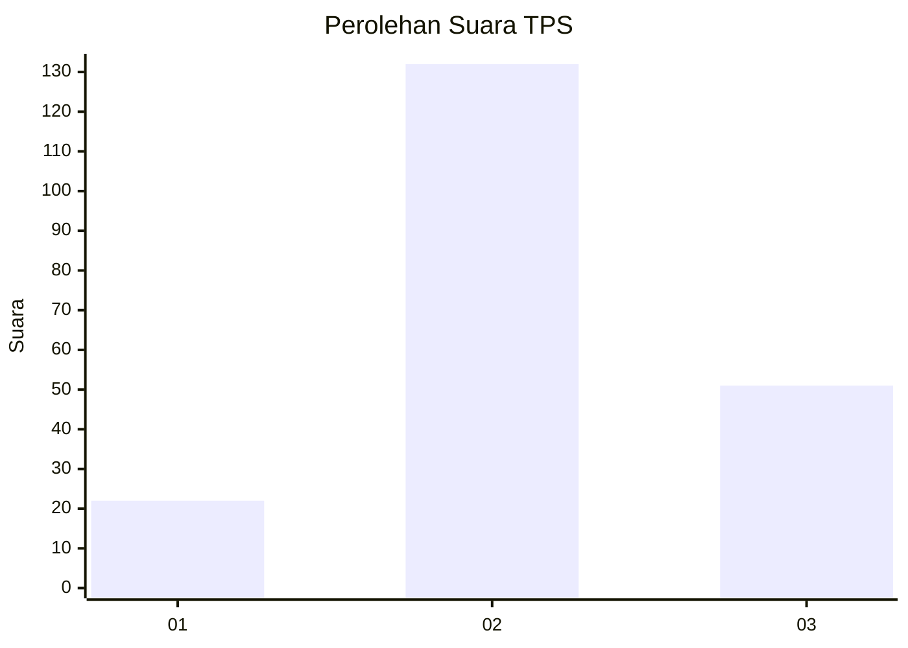
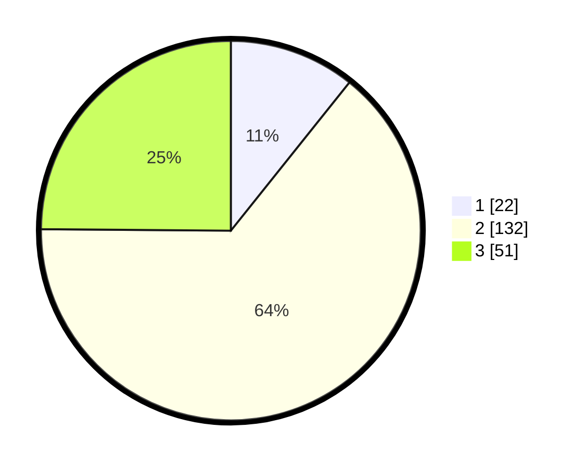

# Hasil

## Grafik

## Tabel

| No. | Nama Paslon    | Suara | Suara (raw) | Persentase |
|:--- |:-------------- | -----:| -----------:| ----------:|
| 1   | ANIES MUHAIMIN | 22    | [22][p-1]   | 10,73      |
| 2   | PRABOWO GIBRAN | 132   | [132][p-2]  | 64,39      |
| 3   | GANJAR MAHFUD  | 51    | [51][p-3]   | 24,88      |

[p-1]: https://github.com/gigit-pemilu/pemilu-2024-35-jawa-timur/blob/main/pilpres/hitung-suara/sub/35-jawa-timur/sub/78-kota-surabaya/sub/09-sukolilo/sub/1001-keputih/sub/008-tps/sub/paslon-1.txt
[p-2]: https://github.com/gigit-pemilu/pemilu-2024-35-jawa-timur/blob/main/pilpres/hitung-suara/sub/35-jawa-timur/sub/78-kota-surabaya/sub/09-sukolilo/sub/1001-keputih/sub/008-tps/sub/paslon-2.txt
[p-3]: https://github.com/gigit-pemilu/pemilu-2024-35-jawa-timur/blob/main/pilpres/hitung-suara/sub/35-jawa-timur/sub/78-kota-surabaya/sub/09-sukolilo/sub/1001-keputih/sub/008-tps/sub/paslon-3.txt

## Foto C Plano

https://sirekap-obj-formc.kpu.go.id/83ab/pemilu/ppwp/35/78/09/10/01/3578091001008-20240214-213012--f81680a9-24ef-4095-b440-8e5092a1a169.jpg

https://sirekap-obj-formc.kpu.go.id/83ab/pemilu/ppwp/35/78/09/10/01/3578091001008-20240214-213152--8957963c-abb6-4ce6-9374-b8cf53626acc.jpg

https://sirekap-obj-formc.kpu.go.id/83ab/pemilu/ppwp/35/78/09/10/01/3578091001008-20240214-213306--54098bf7-6c19-4797-95d3-672230659722.jpg

## Metadata

| Key        | Value               |
| ---------- | ------------------- |
| Time Stamp | 2024-02-25 11:00:00 |

