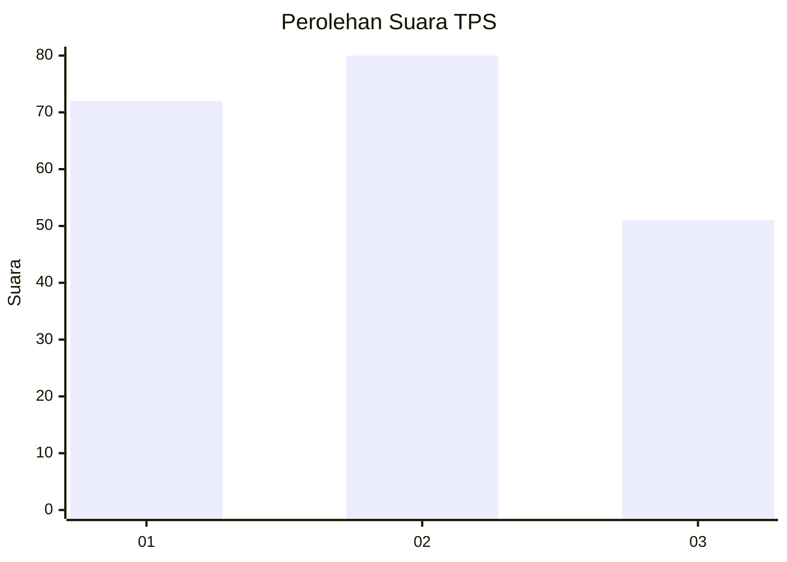
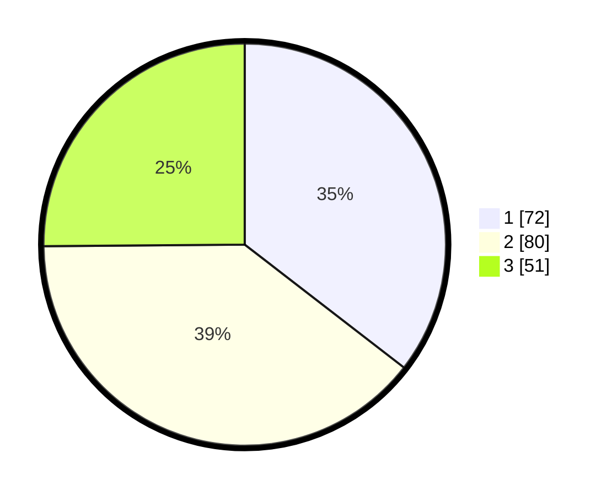

# Hasil

## Grafik

## Tabel

| No. | Nama Paslon    | Suara | Suara (raw) | Persentase |
|:--- |:-------------- | -----:| -----------:| ----------:|
| 1   | ANIES MUHAIMIN | 72    | [72][p-1]   | 35,47      |
| 2   | PRABOWO GIBRAN | 80    | [80][p-2]   | 39,41      |
| 3   | GANJAR MAHFUD  | 51    | [51][p-3]   | 25,12      |

[p-1]: https://github.com/gigit-pemilu/pemilu-2024-35-jawa-timur/blob/main/pilpres/hitung-suara/sub/35-jawa-timur/sub/78-kota-surabaya/sub/09-sukolilo/sub/1001-keputih/sub/010-tps/sub/paslon-1.txt
[p-2]: https://github.com/gigit-pemilu/pemilu-2024-35-jawa-timur/blob/main/pilpres/hitung-suara/sub/35-jawa-timur/sub/78-kota-surabaya/sub/09-sukolilo/sub/1001-keputih/sub/010-tps/sub/paslon-2.txt
[p-3]: https://github.com/gigit-pemilu/pemilu-2024-35-jawa-timur/blob/main/pilpres/hitung-suara/sub/35-jawa-timur/sub/78-kota-surabaya/sub/09-sukolilo/sub/1001-keputih/sub/010-tps/sub/paslon-3.txt

## Foto C Plano

https://sirekap-obj-formc.kpu.go.id/7a2b/pemilu/ppwp/35/78/09/10/01/3578091001010-20240214-205301--c64e1af3-94a1-4681-b919-4a015a09bbe1.jpg

https://sirekap-obj-formc.kpu.go.id/7a2b/pemilu/ppwp/35/78/09/10/01/3578091001010-20240214-205525--fbd87abb-ca3b-4a82-beb4-e99e99402d36.jpg

https://sirekap-obj-formc.kpu.go.id/7a2b/pemilu/ppwp/35/78/09/10/01/3578091001010-20240214-205633--873515f8-4624-45a9-9e14-0d1c92fbe934.jpg

## Metadata

| Key        | Value               |
| ---------- | ------------------- |
| Time Stamp | 2024-02-25 16:00:00 |

