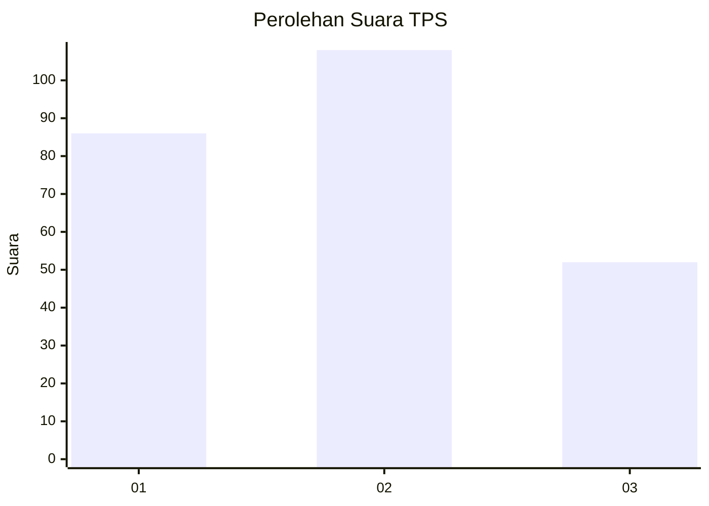
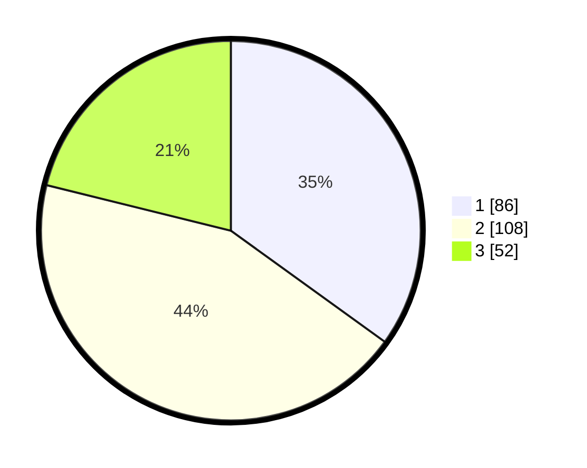

# Hasil

## Grafik

## Tabel

| No. | Nama Paslon    | Suara | Suara (raw) | Persentase |
|:--- |:-------------- | -----:| -----------:| ----------:|
| 1   | ANIES MUHAIMIN | 86    | [86][p-1]   | 34,96      |
| 2   | PRABOWO GIBRAN | 108   | [108][p-2]  | 43,90      |
| 3   | GANJAR MAHFUD  | 52    | [52][p-3]   | 21,14      |

[p-1]: https://github.com/gigit-pemilu/pemilu-2024/blob/main/pilpres/hitung-suara/sub/35-jawa-timur/sub/78-kota-surabaya/sub/09-sukolilo/sub/1001-keputih/sub/011-tps/sub/paslon-1.txt
[p-2]: https://github.com/gigit-pemilu/pemilu-2024/blob/main/pilpres/hitung-suara/sub/35-jawa-timur/sub/78-kota-surabaya/sub/09-sukolilo/sub/1001-keputih/sub/011-tps/sub/paslon-2.txt
[p-3]: https://github.com/gigit-pemilu/pemilu-2024/blob/main/pilpres/hitung-suara/sub/35-jawa-timur/sub/78-kota-surabaya/sub/09-sukolilo/sub/1001-keputih/sub/011-tps/sub/paslon-3.txt

## Foto C Plano

https://sirekap-obj-formc.kpu.go.id/c72d/pemilu/ppwp/35/78/09/10/01/3578091001011-20240215-041836--e0d848c6-564f-4c14-a8d1-2523d680ea94.jpg

https://sirekap-obj-formc.kpu.go.id/c72d/pemilu/ppwp/35/78/09/10/01/3578091001011-20240215-042048--c74d0706-f49e-426e-a52f-7c09bb0fb722.jpg

https://sirekap-obj-formc.kpu.go.id/c72d/pemilu/ppwp/35/78/09/10/01/3578091001011-20240215-042225--e878e947-bbe1-40ac-9b62-968dee3cdbca.jpg

## Metadata

| Key        | Value               |
| ---------- | ------------------- |
| Time Stamp | 2024-02-25 21:00:00 |

