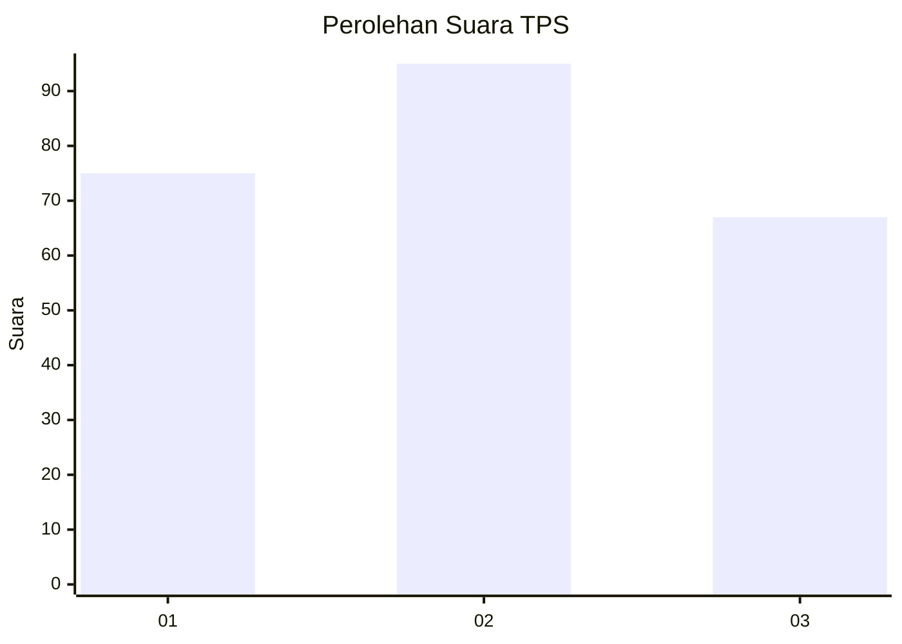
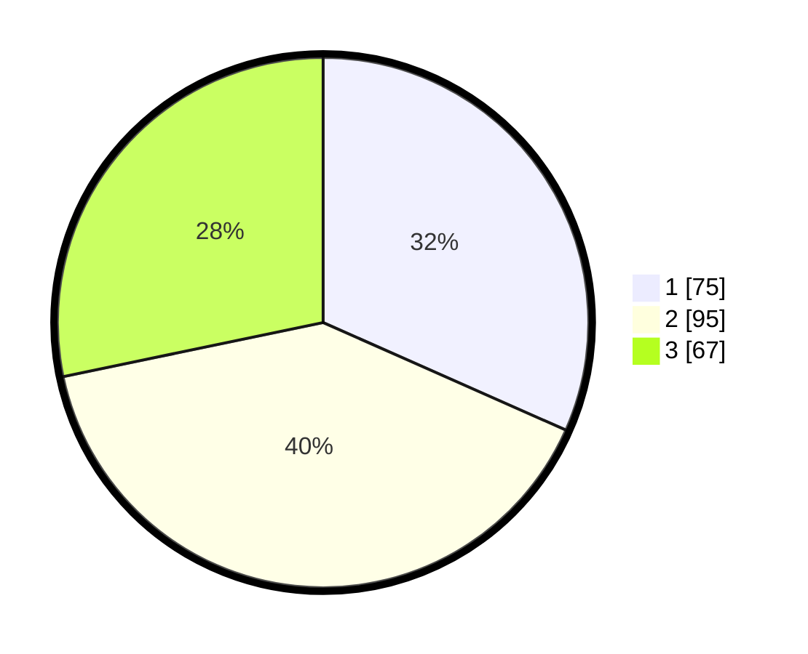

# Hasil

## Grafik

## Tabel

| No. | Nama Paslon    | Suara | Suara (raw) | Persentase |
|:--- |:-------------- | -----:| -----------:| ----------:|
| 1   | ANIES MUHAIMIN | 75    | [75][p-1]   | 31,65      |
| 2   | PRABOWO GIBRAN | 95    | [95][p-2]   | 40,08      |
| 3   | GANJAR MAHFUD  | 67    | [67][p-3]   | 28,27      |

[p-1]: https://github.com/gigit-pemilu/pemilu-2024-35-jawa-timur/blob/main/pilpres/hitung-suara/sub/35-jawa-timur/sub/78-kota-surabaya/sub/09-sukolilo/sub/1001-keputih/sub/012-tps/sub/paslon-1.txt
[p-2]: https://github.com/gigit-pemilu/pemilu-2024-35-jawa-timur/blob/main/pilpres/hitung-suara/sub/35-jawa-timur/sub/78-kota-surabaya/sub/09-sukolilo/sub/1001-keputih/sub/012-tps/sub/paslon-2.txt
[p-3]: https://github.com/gigit-pemilu/pemilu-2024-35-jawa-timur/blob/main/pilpres/hitung-suara/sub/35-jawa-timur/sub/78-kota-surabaya/sub/09-sukolilo/sub/1001-keputih/sub/012-tps/sub/paslon-3.txt

## Foto C Plano

https://sirekap-obj-formc.kpu.go.id/15d1/pemilu/ppwp/35/78/09/10/01/3578091001012-20240214-210521--0f854622-9b2a-4f30-b5da-e6e5a42c7234.jpg

https://sirekap-obj-formc.kpu.go.id/15d1/pemilu/ppwp/35/78/09/10/01/3578091001012-20240214-210844--9185f48a-571e-4b13-8c27-78f0e506fcd7.jpg

https://sirekap-obj-formc.kpu.go.id/15d1/pemilu/ppwp/35/78/09/10/01/3578091001012-20240214-211010--4dcf950a-ce0b-4a27-9e7d-a046994a8491.jpg

## Metadata

| Key        | Value               |
| ---------- | ------------------- |
| Time Stamp | 2024-02-25 15:00:00 |

