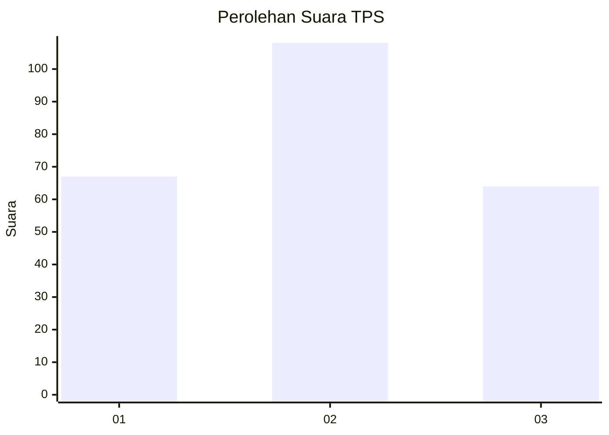
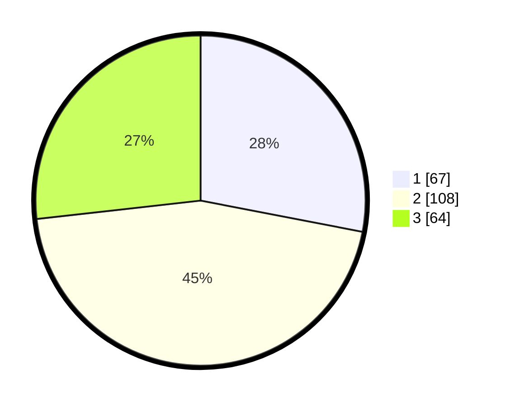

# Hasil

## Grafik

## Tabel

| No. | Nama Paslon    | Suara | Suara (raw) | Persentase |
|:--- |:-------------- | -----:| -----------:| ----------:|
| 1   | ANIES MUHAIMIN | 67    | [67][p-1]   | 28,03      |
| 2   | PRABOWO GIBRAN | 108   | [108][p-2]  | 45,19      |
| 3   | GANJAR MAHFUD  | 64    | [64][p-3]   | 26,78      |

[p-1]: https://github.com/gigit-pemilu/pemilu-2024/blob/main/pilpres/hitung-suara/sub/35-jawa-timur/sub/78-kota-surabaya/sub/09-sukolilo/sub/1001-keputih/sub/019-tps/sub/paslon-1.txt
[p-2]: https://github.com/gigit-pemilu/pemilu-2024/blob/main/pilpres/hitung-suara/sub/35-jawa-timur/sub/78-kota-surabaya/sub/09-sukolilo/sub/1001-keputih/sub/019-tps/sub/paslon-2.txt
[p-3]: https://github.com/gigit-pemilu/pemilu-2024/blob/main/pilpres/hitung-suara/sub/35-jawa-timur/sub/78-kota-surabaya/sub/09-sukolilo/sub/1001-keputih/sub/019-tps/sub/paslon-3.txt

## Foto C Plano

https://sirekap-obj-formc.kpu.go.id/5e5a/pemilu/ppwp/35/78/09/10/01/3578091001019-20240214-233400--5cc5e39f-b31d-4712-b849-448e72fbabb3.jpg

https://sirekap-obj-formc.kpu.go.id/5e5a/pemilu/ppwp/35/78/09/10/01/3578091001019-20240214-233536--5224c5cf-aac4-4f75-bcbf-b6f0c439e0b4.jpg

https://sirekap-obj-formc.kpu.go.id/5e5a/pemilu/ppwp/35/78/09/10/01/3578091001019-20240214-233635--0981eb5b-0030-40f6-92c9-1f603c86633f.jpg

## Metadata

| Key        | Value               |
| ---------- | ------------------- |
| Time Stamp | 2024-02-25 16:00:00 |

