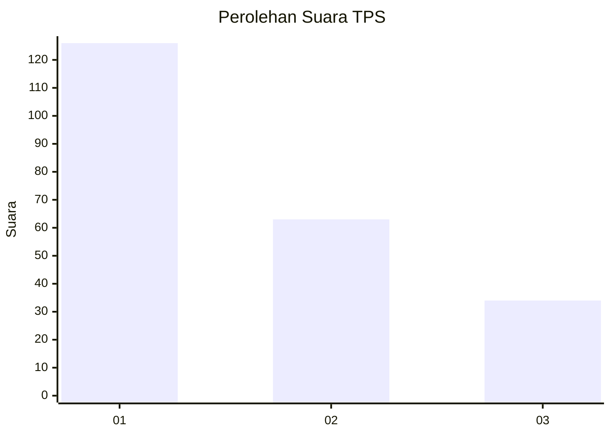
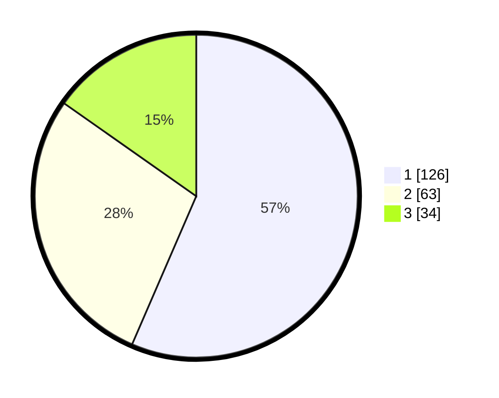

# Hasil

## Grafik

## Tabel

| No. | Nama Paslon    | Suara | Suara (raw) | Persentase |
|:--- |:-------------- | -----:| -----------:| ----------:|
| 1   | ANIES MUHAIMIN | 126   | [126][p-1]  | 56,50      |
| 2   | PRABOWO GIBRAN | 63    | [63][p-2]   | 28,25      |
| 3   | GANJAR MAHFUD  | 34    | [34][p-3]   | 15,25      |

[p-1]: https://github.com/gigit-pemilu/pemilu-2024/blob/main/pilpres/hitung-suara/sub/35-jawa-timur/sub/78-kota-surabaya/sub/09-sukolilo/sub/1001-keputih/sub/028-tps/sub/paslon-1.txt
[p-2]: https://github.com/gigit-pemilu/pemilu-2024/blob/main/pilpres/hitung-suara/sub/35-jawa-timur/sub/78-kota-surabaya/sub/09-sukolilo/sub/1001-keputih/sub/028-tps/sub/paslon-2.txt
[p-3]: https://github.com/gigit-pemilu/pemilu-2024/blob/main/pilpres/hitung-suara/sub/35-jawa-timur/sub/78-kota-surabaya/sub/09-sukolilo/sub/1001-keputih/sub/028-tps/sub/paslon-3.txt

## Foto C Plano

https://sirekap-obj-formc.kpu.go.id/39a1/pemilu/ppwp/35/78/09/10/01/3578091001028-20240215-044307--700759df-c8ce-43f1-af04-6ffee1503cf2.jpg

https://sirekap-obj-formc.kpu.go.id/39a1/pemilu/ppwp/35/78/09/10/01/3578091001028-20240215-044351--95f90d0e-72d3-4568-b480-910431ed5ba7.jpg

https://sirekap-obj-formc.kpu.go.id/39a1/pemilu/ppwp/35/78/09/10/01/3578091001028-20240215-053856--1123b430-00b3-4528-bdba-96c5ae2a74e8.jpg

## Metadata

| Key        | Value               |
| ---------- | ------------------- |
| Time Stamp | 2024-02-25 22:00:00 |

