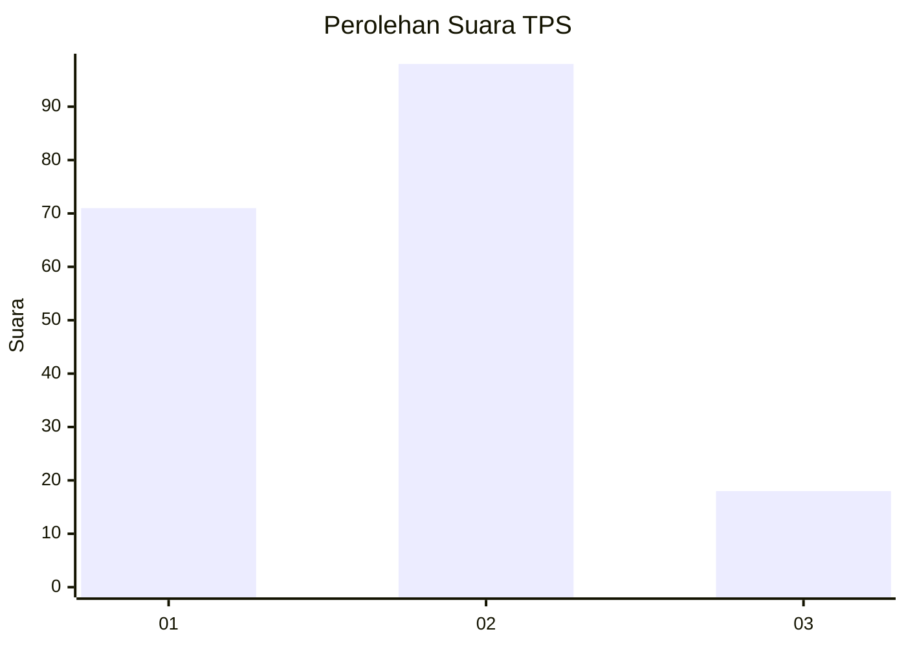
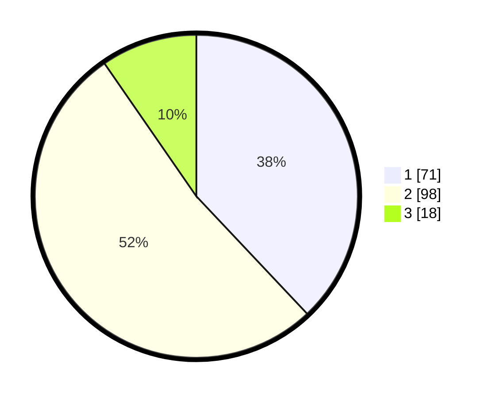

# Hasil

## Grafik

## Tabel

| No. | Nama Paslon    | Suara | Suara (raw) | Persentase |
|:--- |:-------------- | -----:| -----------:| ----------:|
| 1   | ANIES MUHAIMIN | 71    | [71][p-1]   | 37,97      |
| 2   | PRABOWO GIBRAN | 98    | [98][p-2]   | 52,41      |
| 3   | GANJAR MAHFUD  | 18    | [18][p-3]   | 9,63       |

[p-1]: https://github.com/gigit-pemilu/pemilu-2024/blob/main/pilpres/hitung-suara/sub/35-jawa-timur/sub/78-kota-surabaya/sub/09-sukolilo/sub/1001-keputih/sub/034-tps/sub/paslon-1.txt
[p-2]: https://github.com/gigit-pemilu/pemilu-2024/blob/main/pilpres/hitung-suara/sub/35-jawa-timur/sub/78-kota-surabaya/sub/09-sukolilo/sub/1001-keputih/sub/034-tps/sub/paslon-2.txt
[p-3]: https://github.com/gigit-pemilu/pemilu-2024/blob/main/pilpres/hitung-suara/sub/35-jawa-timur/sub/78-kota-surabaya/sub/09-sukolilo/sub/1001-keputih/sub/034-tps/sub/paslon-3.txt

## Foto C Plano

https://sirekap-obj-formc.kpu.go.id/77f2/pemilu/ppwp/35/78/09/10/01/3578091001034-20240215-024652--545a9571-3cc3-4412-8a99-f9fa053113ed.jpg

https://sirekap-obj-formc.kpu.go.id/77f2/pemilu/ppwp/35/78/09/10/01/3578091001034-20240215-024749--3949183f-ae3f-417c-b856-49849a9a0ef3.jpg

https://sirekap-obj-formc.kpu.go.id/77f2/pemilu/ppwp/35/78/09/10/01/3578091001034-20240215-024839--77b943a4-3927-4fe5-ae58-eb4e9b9c63b6.jpg

## Metadata

| Key        | Value               |
| ---------- | ------------------- |
| Time Stamp | 2024-02-25 13:00:00 |

