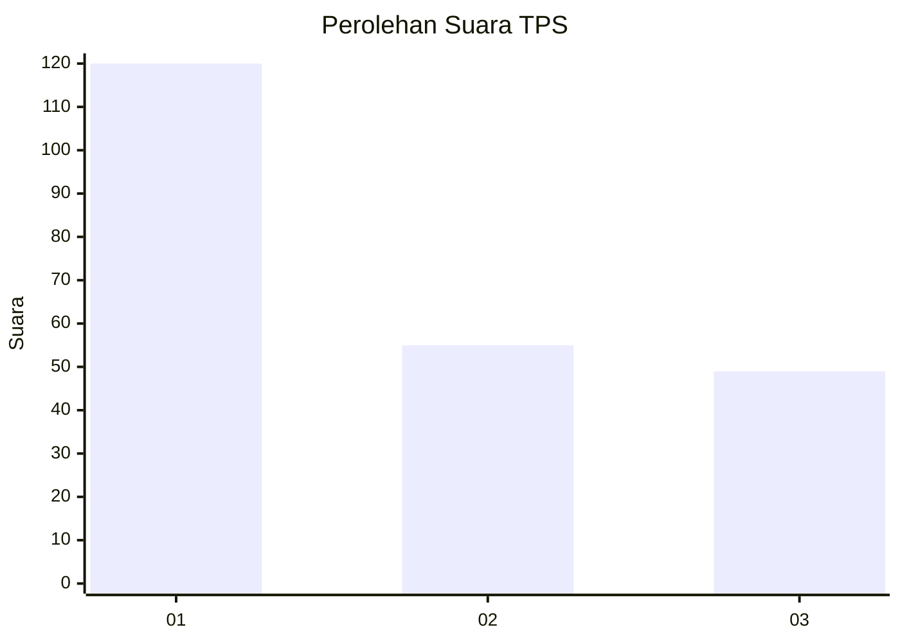
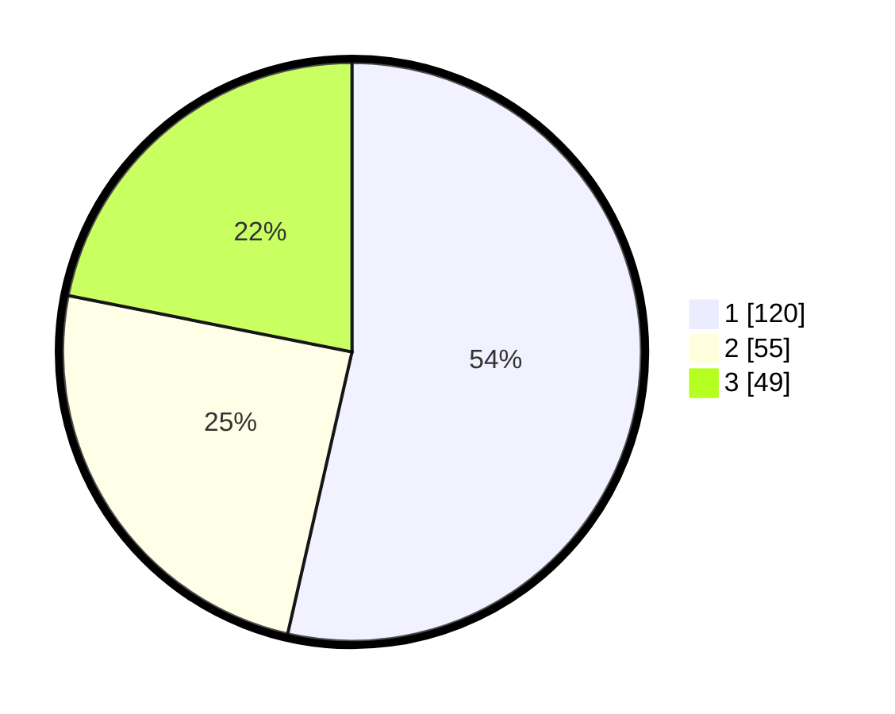

# Hasil

## Grafik

## Tabel

| No. | Nama Paslon    | Suara | Suara (raw) | Persentase |
|:--- |:-------------- | -----:| -----------:| ----------:|
| 1   | ANIES MUHAIMIN | 120   | [120][p-1]  | 53,57      |
| 2   | PRABOWO GIBRAN | 55    | [55][p-2]   | 24,55      |
| 3   | GANJAR MAHFUD  | 49    | [49][p-3]   | 21,88      |

[p-1]: https://github.com/gigit-pemilu/pemilu-2024/blob/main/pilpres/hitung-suara/sub/35-jawa-timur/sub/78-kota-surabaya/sub/09-sukolilo/sub/1001-keputih/sub/046-tps/sub/paslon-1.txt
[p-2]: https://github.com/gigit-pemilu/pemilu-2024/blob/main/pilpres/hitung-suara/sub/35-jawa-timur/sub/78-kota-surabaya/sub/09-sukolilo/sub/1001-keputih/sub/046-tps/sub/paslon-2.txt
[p-3]: https://github.com/gigit-pemilu/pemilu-2024/blob/main/pilpres/hitung-suara/sub/35-jawa-timur/sub/78-kota-surabaya/sub/09-sukolilo/sub/1001-keputih/sub/046-tps/sub/paslon-3.txt

## Foto C Plano

https://sirekap-obj-formc.kpu.go.id/d5aa/pemilu/ppwp/35/78/09/10/01/3578091001046-20240215-020226--b507da95-8f25-4c90-a44a-2e4bae4eca4d.jpg

https://sirekap-obj-formc.kpu.go.id/d5aa/pemilu/ppwp/35/78/09/10/01/3578091001046-20240215-020431--93a77445-153f-46fe-8d3d-37b9492fffb4.jpg

https://sirekap-obj-formc.kpu.go.id/d5aa/pemilu/ppwp/35/78/09/10/01/3578091001046-20240215-015902--c5eb3866-056f-4fed-8175-27a3467187d0.jpg

## Metadata

| Key        | Value               |
| ---------- | ------------------- |
| Time Stamp | 2024-02-24 22:31:28 |

