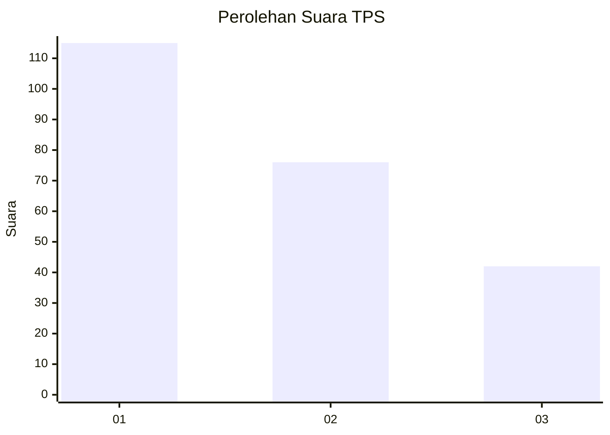
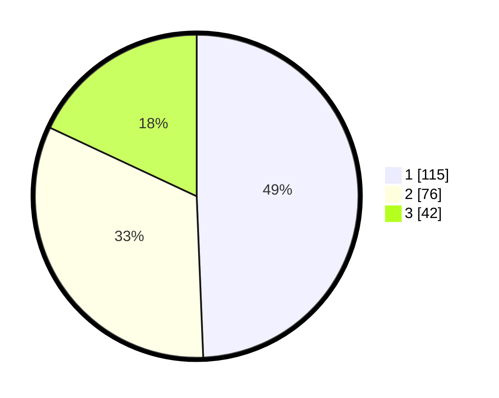

# Hasil

## Grafik

## Tabel

| No. | Nama Paslon    | Suara | Suara (raw) | Persentase |
|:--- |:-------------- | -----:| -----------:| ----------:|
| 1   | ANIES MUHAIMIN | 115   | [115][p-1]  | 49,36      |
| 2   | PRABOWO GIBRAN | 76    | [76][p-2]   | 32,62      |
| 3   | GANJAR MAHFUD  | 42    | [42][p-3]   | 18,03      |

[p-1]: https://github.com/gigit-pemilu/pemilu-2024-35-jawa-timur/blob/main/pilpres/hitung-suara/sub/35-jawa-timur/sub/78-kota-surabaya/sub/09-sukolilo/sub/1001-keputih/sub/049-tps/sub/paslon-1.txt
[p-2]: https://github.com/gigit-pemilu/pemilu-2024-35-jawa-timur/blob/main/pilpres/hitung-suara/sub/35-jawa-timur/sub/78-kota-surabaya/sub/09-sukolilo/sub/1001-keputih/sub/049-tps/sub/paslon-2.txt
[p-3]: https://github.com/gigit-pemilu/pemilu-2024-35-jawa-timur/blob/main/pilpres/hitung-suara/sub/35-jawa-timur/sub/78-kota-surabaya/sub/09-sukolilo/sub/1001-keputih/sub/049-tps/sub/paslon-3.txt

## Foto C Plano

https://sirekap-obj-formc.kpu.go.id/08bf/pemilu/ppwp/35/78/09/10/01/3578091001049-20240215-012834--9930f2dd-3d28-4d19-84e8-a04fd17ede4b.jpg

https://sirekap-obj-formc.kpu.go.id/08bf/pemilu/ppwp/35/78/09/10/01/3578091001049-20240215-012839--e57cd2b1-1902-4688-8cf3-9ee4dfb461d3.jpg

https://sirekap-obj-formc.kpu.go.id/08bf/pemilu/ppwp/35/78/09/10/01/3578091001049-20240215-012846--43ca92a5-df40-4e65-abe4-e582be2fcf5e.jpg

## Metadata

| Key        | Value               |
| ---------- | ------------------- |
| Time Stamp | 2024-02-25 15:00:00 |

